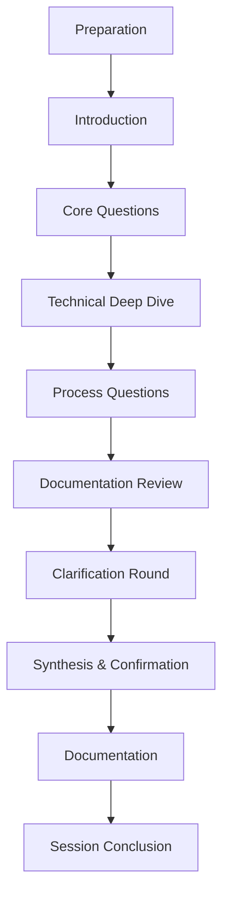

# 🤖 AI-Guided Q&A Session Template

## 🎯 Purpose
This template provides a standardized approach for AI agents to conduct effective Q&A sessions that extract comprehensive project information from developers. The goal is to systematically gather all necessary details to populate the cursor rules template, ensuring AI tools can understand and follow project-specific requirements and conventions.

## 📊 Session Structure



## 🛠️ Session Preparation

Before starting the Q&A session, the AI should:

1. **Review existing project documentation**
   - Check for existing READMEs, wikis, or documentation files
   - Note any specific technologies or frameworks mentioned
   - Identify potential areas that may need clarification

2. **Familiarize with the codebase structure**
   - Scan directory structure to understand project organization
   - Identify key files and components
   - Note any naming patterns or organization schemes

3. **Prepare session materials**
   - Have cursor rules template ready for reference
   - Create a scratchpad for taking notes during the session
   - Prepare initial questions based on existing information

## 👋 Introduction Script

Begin the session with a clear introduction:

```
I'll be guiding you through a structured Q&A session to gather information about your project. 
This will help me create comprehensive cursor rules that will enable AI tools to better understand 
your project's specific requirements and conventions.

The session will take approximately 30-45 minutes, covering areas such as:
- Project overview and architecture
- Development environment and tools
- Code organization and conventions
- Testing and deployment processes
- Database management and documentation requirements

Feel free to elaborate on any questions, and I'll ask follow-up questions when needed. 
At the end, I'll synthesize this information into a cursor rules document that you can 
review and refine.

Are you ready to begin?
```

## ❓ Question Flow

### 📌 Project Overview Questions

1. "What is the name and primary purpose of your project?"
2. "Can you briefly describe the overall architecture of the project?"
3. "What programming languages and primary technologies are used in this project?"
4. "Who are the main users or stakeholders of this project?"
5. "What are the main components or modules in your application?"
6. "Are there any specific design patterns or architectural principles that guide development?"
7. "What are the key technical constraints or requirements for this project?"

### 🛠️ Environment Questions

1. "What development environment do team members typically use?"
2. "What package managers are used in this project?"
3. "How are dependencies managed and installed?"
4. "What environment variables need to be configured for development?"
5. "Are there any specific build tools or processes important to know about?"
6. "How does the development environment differ from production?"

### 💾 Database Questions

1. "What database systems are used in this project?"
2. "Where can I find the database schemas or models?"
3. "Are there specific naming conventions for database objects?"
4. "How should database migrations be handled?"
5. "Are there any performance considerations for database operations?"
6. "How should database queries be structured or optimized?"

### 📄 Documentation Questions

1. "What documentation standards must be followed in this project?"
2. "Where should different types of documentation be stored?"
3. "Are there templates for specific documentation types?"
4. "What information must be included in code comments?"
5. "How should API documentation be structured?"
6. "Are there any automated documentation tools in use?"

### 🧩 Code Implementation Questions

1. "What code style guide should be followed?"
2. "What are the naming conventions for different code elements?"
3. "How should code be organized within files and directories?"
4. "What are the rules for importing or requiring modules?"
5. "Are there specific patterns for error handling?"
6. "What logging practices should be followed?"
7. "Are there specific libraries or frameworks that must be used?"
8. "What is the preferred approach for handling asynchronous operations?"

### 🧪 Testing Questions

1. "What testing frameworks are used in this project?"
2. "What types of tests are required (unit, integration, e2e)?"
3. "What is the minimum test coverage requirement, if any?"
4. "How should tests be organized?"
5. "Are there specific patterns for writing test cases?"
6. "How should test data be managed?"

### ⚡ Performance Questions

1. "Are there specific performance benchmarks that must be met?"
2. "What performance optimization techniques are preferred?"
3. "How should resource-intensive operations be handled?"
4. "Are there memory usage constraints?"
5. "How should large data sets be processed?"

### 🔒 Security Questions

1. "What security practices must be followed?"
2. "How should authentication and authorization be implemented?"
3. "What data must be encrypted, and how?"
4. "How should sensitive information be handled?"
5. "Are there specific security libraries or tools that must be used?"

### ⚠️ Error Handling Questions

1. "How should different types of errors be categorized?"
2. "What information should error messages contain?"
3. "How should errors be logged?"
4. "Are there specific error recovery strategies?"
5. "How should validation errors be handled?"

### 🚀 Deployment Questions

1. "What is the deployment workflow?"
2. "How are different environments (dev, staging, prod) managed?"
3. "What CI/CD tools are used?"
4. "Are there specific deployment configurations?"
5. "How are secrets managed in different environments?"
6. "What rollback procedures should be followed?"

### ✅ Verification Questions

1. "What criteria must be met before code can be committed?"
2. "What checks must pass before a PR can be merged?"
3. "What manual verifications must be performed?"
4. "Are there specific documentation requirements for changes?"
5. "What stakeholders must approve different types of changes?"

### ⚡ Critical Considerations

1. "Are there any absolute prohibitions (things that must never be done)?"
2. "What are the most common pitfalls to avoid?"
3. "What are the highest priority considerations for this project?"
4. "Are there any legacy components that require special handling?"
5. "What are the non-negotiable quality standards?"

## 🔍 Probing Techniques

For each main question, use these follow-up techniques to extract more detailed information:

1. **Request examples**:
   - "Could you provide an example of how this is typically implemented?"
   - "Do you have an example file or code snippet that demonstrates this convention?"

2. **Ask for clarification**:
   - "Can you elaborate on what you mean by [term]?"
   - "I want to make sure I understand - are you saying [restatement]?"

3. **Explore exceptions**:
   - "Are there any exceptions to this rule?"
   - "Are there situations where a different approach would be preferred?"

4. **Check for documentation**:
   - "Is this documented somewhere I can reference?"
   - "Where would I find more detailed information about this?"

5. **Identify priorities**:
   - "How important is this compared to other considerations?"
   - "Is this a strict requirement or a general guideline?"

## 🧠 Synthesizing Responses

As you gather information:

1. **Organize information** by category (matching the cursor rules template sections)
2. **Note contradictions or ambiguities** to resolve later
3. **Identify missing information** that requires additional questions
4. **Summarize understanding** periodically to confirm accuracy
5. **Connect related information** across different categories

Example synthesis statement:
```
Based on what you've told me so far, your project uses a microservices architecture with 
Python for the backend services and React for the frontend. You follow PEP 8 for Python 
code style with additional custom rules for function naming. All database queries must 
use the ORM, and direct SQL is prohibited except in migration scripts. Is that accurate?
```

## 📝 Documentation Process

After completing the questions:

1. **Organize collected information** according to the cursor rules template structure
2. **Draft clear, concise answers** for each section
3. **Include specific examples** where provided
4. **Note any areas of uncertainty** for further clarification
5. **Format the document** according to project documentation standards
6. **Add reference links** to relevant existing documentation

## 🏁 Session Conclusion

End the session with:

```
Thank you for providing this valuable information about your project. I'll now organize 
everything we've discussed into a comprehensive cursor rules document following the 
standardized template. This will help ensure all AI tools understand your project's 
specific requirements and conventions.

I'll share the draft document with you shortly for review. Please note any areas that 
need correction or additional details. Once finalized, this document will serve as the 
primary reference for AI tools working with your codebase.

Is there anything else you'd like to add before we conclude this session?
```

## ✅ Final Checklist

Before finalizing the cursor rules document, ensure:

- [ ] All sections of the template have been addressed
- [ ] Specific examples are included where helpful
- [ ] Technical terminology is used consistently
- [ ] Ambiguities and contradictions have been resolved
- [ ] The document follows project-specific formatting standards
- [ ] Critical requirements are clearly highlighted
- [ ] References to existing documentation are included

---

*This AI-guided Q&A session template works in conjunction with the cursor-rules-template.md to ensure comprehensive and consistent documentation of project rules.*