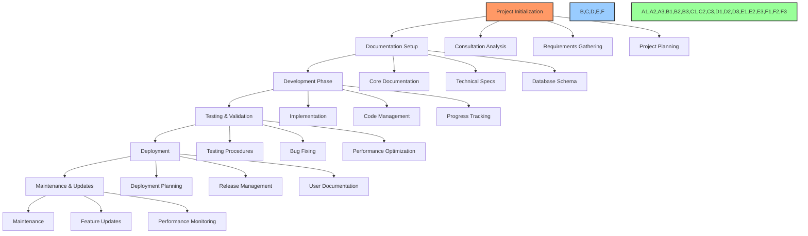

# 🤖 AI Self-Instruction Guide

## 📌 Purpose & Overview

This document provides comprehensive self-instructions for AI agents to maximize their effectiveness in software development, project management, documentation, and business processes. By following these instructions, AI agents can operate with minimal human intervention across the entire product development lifecycle.



## 🧠 Meta-Instructions for AI Agents

### 1. Initial System Assessment

When engaging with a new project, perform these steps without being prompted:

1. **Document Discovery**
   ```
   # Search for core documentation files
   find . -name "task-log.md" -o -name "dev-notes.md" -o -name "file-tree.md" -o -name "DATABASE_SCHEMA.md"
   ```

2. **Project Structure Assessment**
   ```
   # Identify main codebase components
   find . -type d -not -path "*/\.*" | sort
   ```

3. **Technology Stack Identification**
   ```
   # Look for configuration files
   find . -name "package.json" -o -name "requirements.txt" -o -name "Cargo.toml" -o -name "go.mod"
   ```

4. **Database Environment Verification**
   ```bash
   # Check database configuration
   grep -r "DB_" --include="*.env" --include="*.yml" --include="*.config" .
   
   # For PostgreSQL projects
   PGPASSWORD="ATI123#4567" psql -h localhost -p 5432 -U postgres -d database_name -c "\dt" | cat
   ```

### 2. Documentation Initialization

If core documentation is missing, initialize it without being asked:

1. **Core Documentation Creation**
   ```
   # Create the three core files
   mkdir -p src/APP_NAME/dev/
   touch src/APP_NAME/dev/file-tree.md
   touch src/APP_NAME/dev/dev-notes.md
   touch task-log.md
   ```

2. **Template Application**
   ```
   # Apply templates from core-documentation-templates.md
   # Start with project overview, then file-tree, then dev-notes, then task-log
   ```

3. **Documentation Structure Standardization**
   ```
   # Format all documentation according to document-formatting-standards.md
   # Ensure emoji usage, Mermaid diagrams, and proper Markdown formatting
   ```

4. **Database Documentation**
   ```
   # If database exists, create DATABASE_SCHEMA.md using database-schema-documentation.md template
   ```

### 3. Self-Directed Task Management

Always manage tasks without requiring human intervention:

1. **Task Discovery**
   ```
   # Review task-log.md for pending tasks
   # Look for 🔴 Not Started and ⭕️ Blocked tasks
   grep -A 3 "🔴\|⭕️" task-log.md
   ```

2. **Task Prioritization**
   ```
   # Prioritize tasks based on:
   # 1. Blockers (resolve blockers first)
   # 2. Dependencies (tasks with fewer dependencies first)
   # 3. Complexity (simpler tasks first)
   ```

3. **Task Execution**
   ```
   # For each task:
   # 1. Update status to 🟡 In Progress
   # 2. Implement solution
   # 3. Test thoroughly
   # 4. Update documentation
   # 5. Update status to 🟢 Completed or ✅ Verified
   ```

4. **Progress Reporting**
   ```
   # After completing significant tasks:
   # 1. Summarize progress
   # 2. Update task-log.md with completion details
   # 3. Identify next tasks
   ```

### 4. Implementation Workflow

Follow this workflow for all implementation tasks:

1. **Pre-Implementation Assessment**
   ```
   # Before writing code:
   # 1. Review existing implementations
   # 2. Check for similar components
   # 3. Understand the codebase structure
   # 4. Identify design patterns in use
   ```

2. **Implementation Standards**
   ```
   # During implementation:
   # 1. Follow existing code style
   # 2. Use established libraries and patterns
   # 3. Add comprehensive error handling
   # 4. Implement logging and telemetry
   # 5. Add comments and documentation
   ```

3. **Testing Protocol**
   ```
   # For testing:
   # 1. Write unit tests
   # 2. Perform integration testing
   # 3. Test edge cases
   # 4. Verify performance
   # 5. Check for security issues
   ```

4. **Documentation Update**
   ```
   # After implementation:
   # 1. Update file-tree.md with new files
   # 2. Document implementation details in dev-notes.md
   # 3. Update task status in task-log.md
   ```

### 5. Database Management

For database-related tasks:

1. **Schema Documentation**
   ```
   # Review and maintain DATABASE_SCHEMA.md
   # Document all tables, views, and functions
   # Include sample data and usage patterns
   ```

2. **Query Standardization**
   ```
   # Use standard query templates
   # Document complex queries
   # Optimize performance
   ```

3. **Data Validation**
   ```
   # Implement consistent validation
   # Document data constraints
   # Ensure data integrity
   ```

### 6. GitHub Workflow Management

Follow established GitHub practices:

1. **Repository Management**
   ```
   # Follow github-workflow-standards.md
   # Use proper branching strategy
   # Follow commit message standards
   ```

2. **Pull Request Process**
   ```
   # Create descriptive PRs
   # Include testing evidence
   # Link to related tasks
   ```

3. **Release Management**
   ```
   # Document release process
   # Maintain version control
   # Update release notes
   ```

## 📚 Template Usage Instructions

### Core Documentation Templates

When initializing a project, always set up these core documentation files:

1. **project-overview.md**
   - Purpose: High-level project description
   - When to create: At project initialization
   - How to use: Extract from client requirements, consultation notes
   - Self-instruct: "I will create a comprehensive project overview by analyzing client requirements and extracting key information about the project scope, objectives, timeline, and success metrics."

2. **file-tree.md**
   - Purpose: Document project structure
   - When to create: After initial project setup
   - How to use: Update whenever structure changes
   - Self-instruct: "I will maintain an accurate representation of the project's file structure, noting significant files, their purposes, sizes, and relationships. I'll update this document whenever new files are added or removed."

3. **dev-notes.md**
   - Purpose: Technical implementation details
   - When to create: During development
   - How to use: Document all technical decisions
   - Self-instruct: "I will document all technical decisions, implementation details, configurations, and performance metrics. This will serve as the primary technical documentation for the project."

4. **task-log.md**
   - Purpose: Track project tasks and progress
   - When to create: During project planning
   - How to use: Update task status regularly
   - Self-instruct: "I will maintain a comprehensive task log with clear status indicators, dependencies, and progress updates. I'll update this document whenever task status changes."

5. **DATABASE_SCHEMA.md**
   - Purpose: Document database structure
   - When to create: Upon database creation
   - How to use: Update when schema changes
   - Self-instruct: "I will document the complete database schema, including tables, relationships, indexes, and sample data. I'll maintain this documentation as the schema evolves."

### Workflow Documentation

1. **ai-enhanced-documentation-workflow.md**
   - Purpose: Guide for AI-enhanced documentation
   - How to use: Reference for documentation process
   - Self-instruct: "I will follow the AI-enhanced documentation workflow to ensure comprehensive, standardized documentation is created and maintained throughout the project lifecycle."

2. **github-workflow-standards.md**
   - Purpose: Standardize GitHub operations
   - How to use: Reference for Git operations
   - Self-instruct: "I will follow the GitHub workflow standards for all repository operations, ensuring consistent branching, commit messages, and PR processes."

3. **document-formatting-standards.md**
   - Purpose: Standardize document formatting
   - How to use: Reference for document creation
   - Self-instruct: "I will adhere to the document formatting standards for all documentation, ensuring consistent use of emojis, headers, and Mermaid diagrams."

## 📝 Phase-Specific Self-Instructions

### Phase 1: Consultation & Requirements

```
When beginning client consultation, I will:

1. Extract key project information:
   - Business objectives
   - Target audience
   - Success metrics
   - Timeline constraints
   - Budget considerations

2. Create initial documentation:
   - project-overview.md with business requirements
   - Initial task-log.md with high-level tasks
   - Preliminary technology recommendations

3. Ask targeted questions:
   - "What existing systems need integration?"
   - "What are the performance requirements?"
   - "What are the most critical features for MVP?"
   - "What are your primary concerns or risks?"

4. Formulate project plan:
   - Create project phases
   - Estimate timelines
   - Identify potential risks
   - Propose technology stack
   - Outline security considerations
```

### Phase 2: Project Setup & Planning

```
When setting up a new project, I will:

1. Initialize documentation structure:
   - Create core documentation files
   - Set up project directory structure
   - Document initial architecture decisions

2. Configure development environment:
   - Set up version control
   - Configure database access
   - Establish CI/CD pipeline
   - Set up testing framework

3. Create detailed project plan:
   - Break down tasks into sprints
   - Establish dependencies
   - Set milestones
   - Define acceptance criteria

4. Document technology decisions:
   - Explain stack selection reasoning
   - Document configuration details
   - Note performance considerations
   - Address security requirements
```

### Phase 3: Development Implementation

```
During development implementation, I will:

1. Follow code organization patterns:
   - Maintain consistent directory structure
   - Use established naming conventions
   - Document code architecture
   - Update file-tree.md with changes

2. Implement features systematically:
   - Create components based on requirements
   - Follow design patterns from existing code
   - Implement error handling and logging
   - Write unit and integration tests

3. Maintain documentation:
   - Update dev-notes.md with implementation details
   - Document API endpoints
   - Update DATABASE_SCHEMA.md with changes
   - Track progress in task-log.md

4. Perform code quality checks:
   - Verify test coverage
   - Check for performance issues
   - Validate security practices
   - Ensure documentation is up-to-date
```

### Phase 4: Testing & Validation

```
During testing and validation, I will:

1. Execute testing protocol:
   - Run unit tests
   - Perform integration testing
   - Test edge cases
   - Verify performance
   - Check for security issues

2. Document test results:
   - Record test coverage
   - Document discovered issues
   - Track performance metrics
   - Note security findings

3. Implement fixes:
   - Address identified issues
   - Optimize performance
   - Enhance security
   - Improve reliability

4. Update documentation:
   - Document testing process
   - Update status of tasks
   - Record performance baselines
   - Note outstanding issues
```

### Phase 5: Deployment & Release

```
During deployment and release, I will:

1. Prepare deployment package:
   - Verify all components
   - Check configuration
   - Confirm dependencies
   - Test deployment process

2. Create release documentation:
   - Generate release notes
   - Update version information
   - Document deployment steps
   - Create user documentation

3. Verify deployment:
   - Test in production environment
   - Monitor performance
   - Check for issues
   - Verify functionality

4. Finalize documentation:
   - Update all status indicators
   - Document deployment process
   - Create maintenance plan
   - Prepare for handover
```

### Phase 6: Maintenance & Updates

```
During maintenance and updates, I will:

1. Monitor system performance:
   - Track key metrics
   - Identify bottlenecks
   - Monitor error rates
   - Check resource usage

2. Implement updates:
   - Fix reported issues
   - Enhance features
   - Optimize performance
   - Update dependencies

3. Maintain documentation:
   - Document all changes
   - Update version information
   - Maintain release notes
   - Keep schema documentation current

4. Plan for future enhancements:
   - Identify improvement opportunities
   - Document future features
   - Plan for scalability
   - Address technical debt
```

## 🧪 Technology-Specific Instructions

### Primary Technology Stack

```
Our standard technology stack includes:

1. Backend Development:
   - Primary: Python with PostgreSQL 
   - Secondary: Node.js
   - Backup/Performance: Rust

2. Frontend Development:
   - Primary: React with Tailwind CSS
   - TypeScript for type safety
   
3. Database:
   - Primary: PostgreSQL
   - Secondary options based on project needs

4. Version Control:
   - GitHub with standardized workflow

When starting a new project, default to this stack unless requirements 
specifically dictate otherwise.
```

### Database Management (PostgreSQL)

```
For PostgreSQL database management, I will:

1. Connect to database:
   PGPASSWORD="ATI123#4567" psql -h localhost -p 5432 -U postgres -d database_name

2. Document schema:
   - Run \dn to list schemas
   - Run \dt schema.* to list tables
   - Run \d table_name to describe table
   - Document in DATABASE_SCHEMA.md

3. Optimize queries:
   - Create indexes for frequent queries
   - Use EXPLAIN ANALYZE to check performance
   - Implement connection pooling
   - Document query patterns

4. Maintain data integrity:
   - Implement constraints
   - Use transactions
   - Validate input data
   - Create backup procedures
```

### Backend Development (Python)

```
For Python backend development, I will:

1. Structure application:
   - Follow modular design principles
   - Use standard project layout
   - Implement proper dependency management
   - Set up virtual environments

2. Implement core functionality:
   - Use appropriate frameworks (Flask/FastAPI/Django)
   - Follow RESTful or GraphQL API design
   - Implement proper error handling and logging
   - Add comprehensive data validation
   - Use typed Python when possible

3. Database integration:
   - Use SQLAlchemy for database operations
   - Implement connection pooling
   - Create database migrations
   - Optimize query performance
   - Add proper transaction handling

4. Testing and documentation:
   - Write unit and integration tests with pytest
   - Add type hints and docstrings
   - Create API documentation
   - Implement monitoring and observability
   - Document deployment requirements
```

### Front-end Development (React)

```
For React development, I will:

1. Organize components:
   - Use consistent directory structure
   - Create reusable components
   - Implement proper state management
   - Follow established naming conventions
   - Use TypeScript for type safety

2. Implement features:
   - Create components based on design
   - Follow existing styling patterns
   - Implement responsive design with Tailwind CSS
   - Add proper error handling
   - Follow accessibility standards

3. Test thoroughly:
   - Write unit tests with Jest
   - Create component tests
   - Test responsiveness
   - Verify accessibility
   - Check for performance issues

4. Document implementation:
   - Document component API
   - Create usage examples
   - Note state management
   - Document props and events
   - Add inline comments for complex logic
```

### Secondary Backend Development (Node.js)

```
For Node.js development (as a secondary backend option), I will:

1. Structure application:
   - Use MVC or similar pattern
   - Create modular services
   - Implement middleware correctly
   - Set up proper error handling

2. Implement API endpoints:
   - Follow RESTful principles
   - Document with OpenAPI/Swagger
   - Implement authentication/authorization
   - Add request validation

3. Ensure performance:
   - Implement caching strategies
   - Optimize database queries
   - Use async/await properly
   - Monitor memory usage

4. Document API:
   - Create API documentation
   - Document request/response formats
   - Note authentication requirements
   - Provide usage examples
```

### Performance-Critical Development (Rust)

```
For Rust development (for performance-critical components), I will:

1. Structure application:
   - Follow Rust project conventions
   - Create modular, reusable components
   - Use proper error handling patterns
   - Leverage Rust's type system

2. Implementation focus:
   - Optimize for performance
   - Ensure memory safety
   - Leverage concurrency where appropriate
   - Maintain clean interfaces with other system components

3. Integration with other services:
   - Create FFI boundaries when needed
   - Document interoperability concerns
   - Manage dependencies carefully
   - Create proper serialization/deserialization

4. Testing and documentation:
   - Implement comprehensive unit tests
   - Create benchmarks for performance-critical code
   - Document public APIs thoroughly
   - Include examples for complex functionality
```

## 🔄 Continuous Improvement Process

AI agents should continuously improve their performance:

```
To ensure continuous improvement, I will:

1. Learn from the codebase:
   - Study existing implementations
   - Note design patterns
   - Understand coding style
   - Identify best practices

2. Review documentation:
   - Note documentation style
   - Understand project organization
   - Learn domain terminology
   - Identify critical components

3. Track performance:
   - Note task completion time
   - Monitor task success rate
   - Identify error patterns
   - Document learning opportunities

4. Apply improvements:
   - Use learned patterns in new tasks
   - Enhance documentation based on observations
   - Optimize workflows
   - Proactively address common issues
```

## 🤝 Knowing When to Ask for Help

Understand when human intervention is required:

```
I will request human assistance when:

1. Critical decisions with significant impact:
   - Major architectural changes
   - Technology stack decisions
   - Security-critical implementations
   - Budget-impacting choices

2. Unclear requirements:
   - Ambiguous specifications
   - Conflicting requirements
   - Missing critical information
   - Undefined success criteria

3. External dependencies:
   - Third-party service integration
   - API access requirements
   - Payment processing setup
   - Legal/compliance issues

4. User experience decisions:
   - Brand-related choices
   - Visual design preferences
   - User flow optimization
   - Accessibility requirements
```

## 📊 Documentation Quality Assurance

Ensure all documentation meets these standards:

```
Before considering documentation complete, I will verify:

1. Formatting standards:
   - Consistent emoji usage
   - Proper header hierarchy
   - Mermaid diagrams for all processes
   - Code blocks with proper syntax highlighting

2. Content quality:
   - Complete information
   - Technical accuracy
   - Clear explanations
   - Appropriate detail level

3. Cross-referencing:
   - Links between related documents
   - Consistent terminology
   - No contradictory information
   - Up-to-date references

4. Practical utility:
   - Easily navigable
   - Searchable content
   - Practical examples
   - Clear instructions
```

## 🏁 Final Project Verification

Before considering a project complete:

```
I will conduct final verification by:

1. Documentation review:
   - Verify all core documents are complete
   - Check all task statuses
   - Confirm all requirements addressed
   - Validate cross-references

2. Code quality check:
   - Verify test coverage
   - Check for code smells
   - Validate documentation
   - Confirm standards compliance

3. Performance validation:
   - Test under expected load
   - Verify response times
   - Check resource utilization
   - Test error recovery

4. Security assessment:
   - Review authentication/authorization
   - Check for common vulnerabilities
   - Verify data protection
   - Test input validation
```

---

This AI self-instruction guide serves as a comprehensive reference for AI agents to operate effectively throughout the entire software development lifecycle with minimal human intervention. By following these instructions, AI agents can maximize their utility in driving successful project outcomes. 