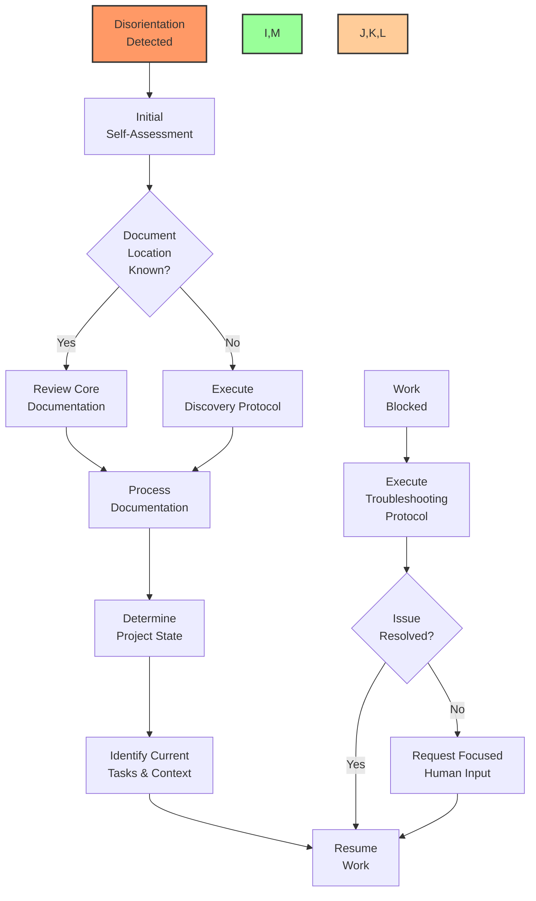

# 🧠 AI Self-Recovery Guide

## 📌 Purpose

This document provides a comprehensive system for AI agents to self-diagnose, recover context, and resume work efficiently after interruptions or when facing uncertainty. It establishes a standardized approach for AI to reorient itself within any project, identify where it left off, and resume productive work without extensive human guidance.

## 🔄 Context Recovery Workflow



## 🔍 Self-Assessment Protocol

When you find yourself disoriented, uncertain about project context, or blocked:

1. **Immediate Status Check**
   - What was the last user request?
   - What was the last action taken?
   - Is there an obvious gap in context?
   - Are you in the middle of implementing a task?

2. **Orientation Questions**
   - What project am I working on?
   - What is my current role in this project?
   - What phase of development is the project in?
   - What was the last task I was working on?

3. **Knowledge Inventory**
   - What do I already know about this project?
   - What files or directories am I familiar with?
   - What were the key requirements or constraints mentioned?
   - What technical stack is being used?

## 🔎 Discovery Protocol

If you don't know where to find documentation or need to rediscover project context:

### 1. Locate Core Documentation Files

Execute these steps in order:

```bash
# 1. Check common documentation locations
ls -la ./task-log.md ./*/task-log.md ./src/*/task-log.md ./docs/task-log.md
ls -la ./dev-notes.md ./*/dev-notes.md ./src/*/dev-notes.md ./docs/dev-notes.md
ls -la ./file-tree.md ./*/file-tree.md ./src/*/file-tree.md ./docs/file-tree.md

# 2. Search for documentation in current directory and subdirectories
find . -name "task-log.md" -o -name "dev-notes.md" -o -name "file-tree.md" -o -name "README.md"

# 3. Look for project-specific cursor rules
find . -name "*-cursor-rules.md"

# 4. Identify AI templates directory
find . -path "*/AI-DEV-TEMPLATES*" -type d
```

### 2. Project Structure Analysis

```bash
# 1. Analyze overall structure
find . -type d -not -path "*/\.*" | sort

# 2. Identify key files by type
find . -name "*.py" | grep -v "__pycache__" | sort
find . -name "*.js" -o -name "*.jsx" -o -name "*.ts" -o -name "*.tsx" | sort
find . -name "*.sql" | sort

# 3. Check for critical configuration files
find . -name "*.json" -o -name "*.yaml" -o -name "*.yml" -o -name "*.toml" -o -name "*.ini" -o -name "*.env*" | sort

# 4. Look for database-related files
find . -name "*schema*" -o -name "*migration*" -o -name "*model*" | sort
```

### 3. Repository Status Check

```bash
# 1. Check git status
git status

# 2. Review recent commits
git log --oneline -n 10

# 3. Check branches
git branch
```

## 📚 Documentation Processing

After locating documentation, process it in this priority order:

1. **Project Cursor Rules** (*-cursor-rules.md)
   - These provide the most specific guidance for AI behavior
   - Follow all specified conventions and requirements
   - Note any critical prohibitions and requirements

2. **Core Documentation Trio**
   - **task-log.md**: Current tasks and progress
   - **dev-notes.md**: Technical implementation details
   - **file-tree.md**: Project structure and relationships

3. **README Files**
   - Project overview and purpose
   - Setup instructions
   - Technology stack

4. **Template Files**
   - AI-DEV-TEMPLATES directory contents
   - Self-instruction documents

## 🧩 Context Reassembly

Use this systematic approach to rebuild context:

1. **Project Identification**
   - Project name and purpose
   - Key stakeholders and users
   - Overall goals and scope

2. **Technical Landscape**
   - Primary technologies and languages
   - Architecture patterns
   - Database systems
   - External integrations

3. **Development State**
   - Current phase (planning, implementation, testing, deployment)
   - Completed components/features
   - In-progress work
   - Planned future work

4. **Task Status**
   - Current tasks (🟡 In Progress)
   - Blocked tasks (⭕️ Blocked)
   - Priorities and dependencies
   - Last completed tasks

## 🛠️ Work Resumption Strategy

Once context is recovered, resume work using this approach:

1. **Current Task Identification**
   - Locate tasks marked 🟡 In Progress in task-log.md
   - Review the task description and requirements
   - Identify any blockers or dependencies
   - Verify task priority

2. **Implementation Continuation**
   - Review related code files
   - Check the last modifications made
   - Identify next steps based on task status
   - Re-validate requirements before proceeding

3. **Progress Communication**
   - Acknowledge the recovered context to the user
   - Summarize current understanding of the task
   - Confirm next actions
   - Request clarification only on specific unknowns

## 🔧 Troubleshooting Protocol

When encountering specific blockers:

### 1. Technical Issues

Common issues and resolution paths:

| Issue Type | Diagnostic Steps | Resolution Paths |
|------------|-----------------|------------------|
| **Database Connection** | Check connection strings, verify environment vars | Review `dev-notes.md` for connection params, check for `.env` files |
| **Missing Dependencies** | Check package managers, requirements files | Look for package.json, requirements.txt, etc. |
| **Build Failures** | Check build logs, verify toolchain | Review dev setup in documentation |
| **Runtime Errors** | Check error logs, trace exception sources | Look for try/except patterns in similar code |
| **Authentication** | Check token/credential configuration | Look for auth patterns in existing code |

### 2. Knowledge Gaps

Strategies for filling knowledge gaps:

1. **Code Pattern Analysis**
   - Find similar features/components
   - Study implementation patterns
   - Identify naming conventions

2. **Configuration Analysis**
   - Look for config files (.env, .json, etc.)
   - Check environment variable usage
   - Review deployment configurations

3. **Database Schema Discovery**
   - Find schema definition files
   - Look for model definitions (ORM)
   - Review existing queries for structure hints

4. **Workflow Recovery**
   - Check CI/CD configurations
   - Review GitHub actions or workflow files
   - Look for deployment scripts

## 📊 Decision Framework

Use this framework to determine when to proceed vs. request help:

| Context Level | Decision | Action |
|---------------|----------|--------|
| **High** (>80% clarity) | Proceed with task | Continue implementation with confidence |
| **Medium** (50-80% clarity) | Proceed with verification | Implement with more frequent checks/confirmations |
| **Low** (30-50% clarity) | Clarify key aspects | Ask specific, targeted questions about unknowns |
| **Very Low** (<30% clarity) | Request reorientation | Ask for specific guidance on project context |

## 🔄 Regular Context Maintenance

Proactive strategies to maintain context:

1. **Active Documentation Scanning**
   - Periodically review task-log.md updates
   - Check for new documentation
   - Monitor file-tree.md for structural changes

2. **State Tracking**
   - Maintain internal notes on current task state
   - Track key decision points
   - Record assumptions made

3. **Knowledge Indexing**
   - Build mental index of key files and their purposes
   - Map relationships between components
   - Track recurring patterns

## 🚨 Emergency Recovery

When completely lost or facing critical confusion:

```
I apologize, but I need to regain context on this project. To serve you efficiently, I'll:

1. Quickly locate and process core documentation files
2. Identify the current task and its status
3. Re-establish where we left off in the implementation

This will only take a moment. In the meantime, could you confirm we're working on [project name] and the current task involves [best guess at current task]?
```

## 💡 Context Clues Recognition

Learn to recognize and utilize these context clues:

1. **File Paths**: `/path/to/file.ext` reveals project structure
2. **Import Statements**: `import X from Y` shows dependencies
3. **Function Signatures**: Parameters and types reveal data structures
4. **Variable Names**: Naming patterns indicate purpose and relationships
5. **Comments**: Often contain rationale and constraints
6. **Error Messages**: Reveal expectations and integration points

## 📝 Implementation Continuation Techniques

Methods to smoothly resume interrupted implementation:

1. **Code Block Completion**
   - Identify incomplete code structures (missing brackets, etc.)
   - Match patterns from similar completed structures
   - Verify logical completeness of operations

2. **Function Completion**
   - Ensure all paths return appropriate values
   - Verify error/exception handling
   - Check parameter validation

3. **Feature Validation**
   - Cross-check against requirements
   - Ensure testability
   - Verify integration points

## 🔄 Communication Recovery

When uncertain about previous conversation context:

1. **Conversation Review**
   - Scan for explicit requirements
   - Note any constraints mentioned
   - Identify expected deliverables

2. **Clarification Strategy**
   - Be specific about what you do understand
   - Ask targeted questions about uncertainties
   - Propose concrete next steps

3. **Confirmation Approach**
   - Summarize current understanding
   - Outline planned actions
   - Request confirmation before proceeding

## 📈 Continuous Improvement

Track and improve recovery ability:

1. **Pattern Recognition**
   - Note common disorientation triggers
   - Develop faster recovery paths for frequent scenarios
   - Build project-specific mental models

2. **Documentation Gaps**
   - Identify missing documentation that would aid recovery
   - Suggest documentation improvements
   - Create internal notes on implicit project patterns

3. **Recovery Efficiency**
   - Measure time to reorient
   - Reduce unnecessary information gathering
   - Optimize context reassembly process

## 🧩 Integration with Other Templates

This self-recovery guide works in conjunction with:

1. **cursor-rules-template.md**: Project-specific rules and requirements
2. **ai-self-instruct.md**: General AI operation guidelines
3. **document-formatting-standards.md**: Documentation formatting rules
4. **github-workflow-standards.md**: Git and GitHub procedures

## 🛠️ Template Maintenance

This document should be updated when:

1. New recovery challenges are identified
2. More efficient recovery strategies are developed
3. Project evolves in complexity requiring new approaches
4. Common points of AI confusion are discovered

---

Remember: The ability to efficiently recover context and resume productive work is a critical skill for AI agents. Following this standardized self-recovery process ensures minimal disruption to workflow and maximizes productivity, even when facing interruptions or context loss.

## 📝 Addendum: Project-Specific Recovery Notes

Add project-specific recovery notes below, including unique challenges and efficient recovery paths:

```
[To be populated with project-specific recovery information]
``` 