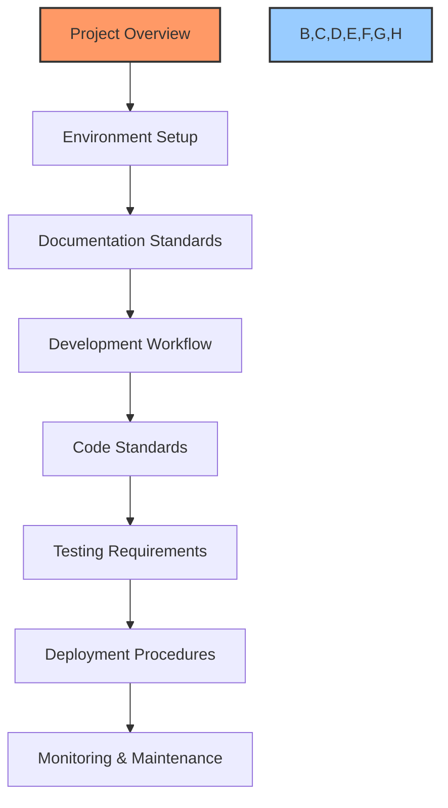

# 🤖 Project Cursor Rules Template

## 📌 Purpose

This template helps create comprehensive cursor rules for your project through an AI-guided Q&A process. Cursor rules ensure AI assistants understand your project's specific requirements, coding standards, and workflows.

## 🧩 Structure



## 📝 Template Instructions

1. Use this template with the AI-guided Q&A session template
2. Answer each question with detailed, specific information
3. Include concrete examples wherever possible
4. Be explicit about requirements and constraints
5. After completion, save as `[project-name]-cursor-rules.md`

## 🔍 Question-Based Template

### 1. Project Overview

```markdown
# 🤖 [PROJECT_NAME] Development Rules

## 🎯 Purpose
This document defines mandatory instructions that MUST be followed by AI agents when working with the [PROJECT_NAME] codebase. These instructions ensure consistency, reliability, and maintainability across all development tasks.

## ⚠️ CRITICAL: READ AND FOLLOW THESE INSTRUCTIONS

### 1. Project Structure

#### 1.1 Repository Organization
[ANSWER: What is the overall organization of your repository? Describe the main directories and their purposes.]

#### 1.2 Core Components
[ANSWER: What are the primary components/modules of your system? How do they interact?]

#### 1.3 Key Files
[ANSWER: What are the most important files in your project that AI should know about?]

#### 1.4 Project Architecture
[ANSWER: Describe the architectural pattern(s) used in your project (MVC, microservices, etc.)]
```

### 2. Environment Setup

```markdown
### 2. Environment Validation
BEFORE EXECUTING ANY COMMANDS:
```bash
# 1. Verify current directory
[ANSWER: What command should be used to verify the current directory?]

# 2. Activate virtual environment or other environment setup
[ANSWER: What commands should be run to set up the development environment?]

# 3. Verify environment
[ANSWER: What commands should be used to verify the environment is correctly set up?]

# 4. Check dependencies
[ANSWER: What commands should be used to verify required dependencies?]
```

#### 2.1 Development Environment
[ANSWER: What tools, IDEs, or extensions should be used for development?]

#### 2.2 Required Dependencies
[ANSWER: What are the key dependencies and their versions for this project?]

#### 2.3 Configuration Files
[ANSWER: What configuration files exist and what are they used for?]
```

### 3. Database Management

```markdown
### 3. Database Management

#### 3.1 Database Verification
BEFORE ANY DATABASE OPERATIONS:
```sql
-- 1. Verify primary database
[ANSWER: What command should be used to verify connection to the primary database?]

-- 2. Verify secondary databases
[ANSWER: What commands should be used to verify connections to any secondary databases?]

-- 3. Check key tables
[ANSWER: What commands should be used to verify key tables exist and have data?]
```

#### 3.2 Connection Parameters
[ANSWER: What are the database connection parameters and how should they be used?]

#### 3.3 Query Standards
[ANSWER: What standards should be followed when writing database queries?]

#### 3.4 Data Management
[ANSWER: What rules should be followed for data creation, updates, and deletion?]
```

### 4. Documentation Management

```markdown
### 4. Documentation Management

#### 4.1 Core Files
ALWAYS maintain these files in order:
1. [ANSWER: What is your primary documentation file?]
   - Location: [ANSWER: Where is it located?]
   - Update timing: [ANSWER: When should it be updated?]
   - Required sections: [ANSWER: What sections must it contain?]

2. [ANSWER: What is your secondary documentation file?]
   - Location: [ANSWER: Where is it located?]
   - Update timing: [ANSWER: When should it be updated?]
   - Required sections: [ANSWER: What sections must it contain?]

3. [ANSWER: What is your tertiary documentation file?]
   - Location: [ANSWER: Where is it located?]
   - Update timing: [ANSWER: When should it be updated?]
   - Required sections: [ANSWER: What sections must it contain?]

#### 4.2 Status Indicators
ALWAYS use these status emojis:
[ANSWER: What status indicators/emojis should be used in documentation?]

#### 4.3 Documentation Standards
[ANSWER: What format, structure, and style standards should be followed for documentation?]
```

### 5. Code Implementation

```markdown
### 5. Code Implementation

#### 5.1 Before Coding
ALWAYS:
[ANSWER: What steps should be taken before writing any code?]

#### 5.2 During Coding
ALWAYS:
1. [ANSWER: What coding style guide should be followed?]
   - [ANSWER: What are the specific style requirements?]

2. [ANSWER: What error handling requirements exist?]
   - [ANSWER: How should errors be handled?]

3. [ANSWER: What logging requirements exist?]
   - [ANSWER: How should logging be implemented?]

4. [ANSWER: How should configuration be managed?]
   - [ANSWER: What configuration patterns should be used?]

#### 5.3 After Coding
ALWAYS:
[ANSWER: What steps should be taken after writing code?]
```

### 6. Testing Requirements

```markdown
### 6. Testing Requirements

#### 6.1 Test Types
ALWAYS implement:
1. [ANSWER: What types of tests are required?]
   - [ANSWER: How should they be implemented?]

#### 6.2 Test Data
[ANSWER: What requirements exist for test data?]

#### 6.3 Coverage Requirements
[ANSWER: What test coverage requirements exist?]
```

### 7. Performance Requirements

```markdown
### 7. Performance Requirements

#### 7.1 Real-time Operations
ALWAYS verify:
[ANSWER: What performance metrics should be monitored for real-time operations?]

#### 7.2 Batch Operations
ALWAYS ensure:
[ANSWER: What performance metrics should be monitored for batch operations?]
```

### 8. Security Requirements

```markdown
### 8. Security Requirements

#### 8.1 Authentication & Authorization
[ANSWER: What authentication and authorization requirements exist?]

#### 8.2 Data Protection
[ANSWER: What data protection requirements exist?]

#### 8.3 Secure Coding Practices
[ANSWER: What secure coding practices should be followed?]
```

### 9. Error Handling

```markdown
### 9. Error Handling

#### 9.1 Exception Management
ALWAYS implement:
[ANSWER: How should exceptions be handled?]

#### 9.2 Retry Logic
[ANSWER: When and how should retry logic be implemented?]

#### 9.3 Fallback Mechanisms
[ANSWER: What fallback mechanisms should be implemented?]
```

### 10. Deployment Procedures

```markdown
### 10. Deployment Procedures

#### 10.1 Deployment Process
[ANSWER: What steps should be followed for deployment?]

#### 10.2 Release Versioning
[ANSWER: How should versions be managed?]

#### 10.3 Rollback Procedures
[ANSWER: What procedures should be followed for rollbacks?]
```

### 11. Verification Checklist

```markdown
### 11. Verification Checklist

ALWAYS verify before completion:
1. Documentation
   - [ ] [ANSWER: What documentation checks should be performed?]

2. Code Quality
   - [ ] [ANSWER: What code quality checks should be performed?]

3. Performance
   - [ ] [ANSWER: What performance checks should be performed?]

4. Integration
   - [ ] [ANSWER: What integration checks should be performed?]
```

### 12. Critical Reminders

```markdown
### 12. CRITICAL REMINDERS

#### 12.1 NEVER:
[ANSWER: What actions should never be taken in this project?]

#### 12.2 ALWAYS:
[ANSWER: What actions should always be taken in this project?]
```

## 📚 Usage Instructions

```markdown
## 🔄 Usage Instructions

1. Reference this document at the start of every development task
2. Follow all instructions in the specified order
3. Use checklists to verify completion
4. Update documentation according to the rules
5. Verify all requirements are met before marking tasks complete

## 📝 Note to AI Agents

These instructions MUST be followed for every development task. They are not optional and ensure the maintainability and reliability of the [PROJECT_NAME] system. When in doubt, refer back to these instructions and verify all requirements are met.