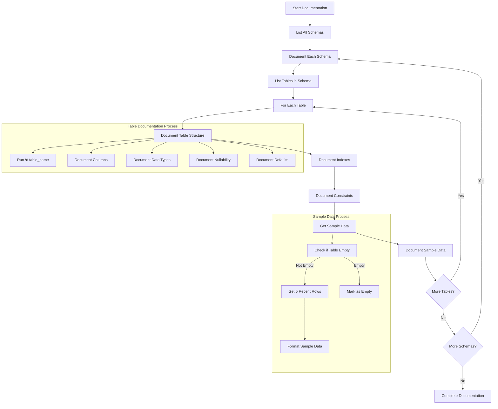

# 🗃️ Database Schema Documentation Template

## 🤖 AI Agent Instructions

### 🎯 Objective
Document the complete database structure, schema, and sample data for the project in a standardized format that can be referenced by other AI agents throughout the development process.

### 📊 Workflow Diagram


### 🛠️ Step-by-Step Process

#### 1. Schema Discovery
```sql
-- PostgreSQL CLI
\dn
-- or SQL query
SELECT schema_name FROM information_schema.schemata 
WHERE schema_name NOT IN ('information_schema', 'pg_catalog');
```

#### 2. Table Discovery
```sql
-- PostgreSQL CLI
\dt schema_name.*
-- or SQL query
SELECT table_name FROM information_schema.tables 
WHERE table_schema = 'schema_name';
```

#### 3. For Each Table
- Document Structure:
  ```sql
  \d schema_name.table_name
  ```
- Get Sample Data:
  ```sql
  SELECT * FROM schema_name.table_name ORDER BY <timestamp_column> DESC LIMIT 5;
  ```
- Document:
  - Column names and types
  - Constraints
  - Indexes
  - Sample data or mark as empty
  - Special features (partitioning, TimescaleDB hypertables, etc.)

#### 4. Database Connection
```bash
# PostgreSQL
PGPASSWORD="your_password" psql -h hostname -p port -U username -d database_name -c "\l" | cat

# MySQL/MariaDB
mysql -h hostname -P port -u username -p'your_password' -e "SHOW DATABASES;"

# MongoDB
mongo --host hostname --port port -u username -p 'your_password' --authenticationDatabase admin --eval "db.adminCommand('listDatabases')"

# Firestore/Firebase
# Use Firebase Admin SDK

# Supabase
# Use Supabase client libraries or direct PostgreSQL connection
```

#### 5. Additional Schema Details
```sql
-- PostgreSQL
SELECT * FROM pg_indexes WHERE tablename = 'table_name';

-- MySQL
SHOW INDEXES FROM schema_name.table_name;

-- MongoDB
db.collection_name.getIndexes()
```

#### 6. Constraints
```sql
-- PostgreSQL
SELECT * FROM information_schema.table_constraints 
WHERE table_schema = 'schema_name' AND table_name = 'table_name';

-- MySQL
SELECT * FROM information_schema.table_constraints 
WHERE table_schema = 'schema_name' AND table_name = 'table_name';
```

#### 7. Views, Functions & Extensions
```sql
-- Views (PostgreSQL)
SELECT * FROM information_schema.views WHERE table_schema = 'schema_name';
\d+ view_name

-- Functions (PostgreSQL)
SELECT routine_name, routine_type 
FROM information_schema.routines 
WHERE routine_schema = 'schema_name';

-- Extensions (PostgreSQL)
SELECT * FROM pg_extension;

-- TimescaleDB specific
SELECT * FROM timescaledb_information.hypertables;
```

### 📝 Documentation Format

Use the following structure for each table:

````markdown
### Table Name (schema.table)
```sql
\d schema.table
```

Structure:
```
[Table structure output]
```

Indexes:
- [List of indexes]

Sample Data:
```sql
SELECT * FROM schema.table ORDER BY timestamp DESC LIMIT 5;
```

Result:
```
[Sample data or "Empty table"]
```

Notes:
- [Special features]
- [Important constraints]
- [Usage notes]
````

This standard format can be expanded with additional sections as needed:

````markdown
### Table: `schema_name.table_name`

#### Structure

```sql
-- Structure query output here
```

#### Indexes

```sql
-- Indexes query output here
```

#### Constraints

```sql
-- Constraints query output here
```

#### Sample Data

```sql
-- Sample data query
SELECT * FROM schema_name.table_name ORDER BY timestamp DESC LIMIT 5;
```

```
-- Sample data output here (or "Empty table" if no data)
```

#### Views Using This Table

```sql
-- Views listing query output here
```

#### Associated Functions

```sql
-- Functions query output here
```

#### Special Features

- Feature 1 (e.g., TimescaleDB hypertable, partitioning)
- Feature 2

#### Notes

- Purpose: [Brief description of what this table stores]
- Relationships: [Key relationships with other tables]
- Update frequency: [How often data is updated]
- Retention policy: [If applicable]
- Special considerations: [Any specific notes about the data]
````

### ✅ Progress Tracking Checklist

Create a checklist to track documentation progress:

```markdown
- [ ] Database Overview
  - [ ] Connection Details
  - [ ] Extensions/Plugins
  - [ ] Schema Listing
- [ ] Schema: [schema_name_1]
  - [ ] Table: [table_name_1]
  - [ ] Table: [table_name_2]
- [ ] Schema: [schema_name_2]
  - [ ] Table: [table_name_3]
  - [ ] Table: [table_name_4]
- [ ] Views
  - [ ] View: [view_name_1]
  - [ ] View: [view_name_2]
- [ ] Functions/Procedures
  - [ ] Function: [function_name_1]
  - [ ] Function: [function_name_2]
- [ ] Special Features
  - [ ] Feature: [feature_name_1]
  - [ ] Feature: [feature_name_2]
```

## 📊 Database Documentation

### 🔌 Connection Details
- **Host**: [hostname]
- **Port**: [port]
- **Database**: [database_name]
- **User**: [username]
- **Auth Method**: [password/IAM/cert]

### 🧩 Extensions & Plugins
- Extension 1: [Description]
- Extension 2: [Description]
- Extension 3: [Description]

### 📚 Schema Overview

List of all database schemas:

```sql
-- Schema query
```

```
-- Schema output
```

## 📁 Schema: [schema_name]

### Tables in [schema_name]

```sql
-- Tables query
```

```
-- Tables output
```

### Table: `[schema_name].[table_name]`

#### Structure

```sql
-- Structure query
```

```
-- Structure output
```

#### Indexes

```sql
-- Indexes query
```

```
-- Indexes output
```

#### Constraints

```sql
-- Constraints query
```

```
-- Constraints output
```

#### Sample Data

```sql
-- Sample data query
```

```
-- Sample data output
```

#### Notes
- Purpose: [Brief description of table purpose]
- Relationships: [Key relationships]
- Update frequency: [How often data is updated]
- Special considerations: [Any notes about the data]

## 🔄 Views

### View: `[schema_name].[view_name]`

#### Definition

```sql
-- View definition query
```

```
-- View definition output
```

#### Sample Data

```sql
-- Sample data query
```

```
-- Sample data output
```

#### Notes
- Purpose: [Brief description of view purpose]
- Base tables: [Tables used in the view]
- Usage: [How the view is used in the application]

## ⚙️ Functions & Procedures

### Function: `[schema_name].[function_name]`

#### Definition

```sql
-- Function definition query
```

```
-- Function definition output
```

#### Usage

```sql
-- Example usage query
```

```
-- Example usage output
```

#### Notes
- Purpose: [Brief description of function purpose]
- Input parameters: [Description of parameters]
- Return value: [Description of return value]
- Usage context: [When/where function is used]

## 🔑 Special Features

### Feature: [feature_name]

#### Configuration

```sql
-- Configuration query
```

```
-- Configuration output
```

#### Tables Using This Feature

- `[schema_name].[table_name_1]`
- `[schema_name].[table_name_2]`

#### Notes
- Purpose: [Brief description of feature purpose]
- Benefits: [What this feature provides]
- Limitations: [Any limitations to be aware of]
- Maintenance requirements: [Special maintenance tasks]

## 📋 Summary Statistics

### Database Size

```sql
-- Database size query
```

```
-- Database size output
```

### Table Counts

```sql
-- Table counts query
```

```
-- Table counts output
```

### Most Used Indexes

```sql
-- Index usage query
```

```
-- Index usage output
```

### Largest Tables

```sql
-- Largest tables query
```

```
-- Largest tables output
```

## 📅 Document Maintenance

- **Last Updated**: [YYYY-MM-DD]
- **Updated By**: [name/role]
- **Update Frequency**: [how often to update this document]
- **Next Scheduled Update**: [YYYY-MM-DD]

---

## 🔄 Future Enhancements

- Enhancement 1: [Description]
- Enhancement 2: [Description]
- Enhancement 3: [Description] 