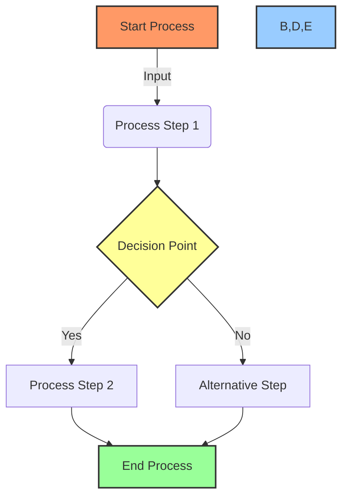
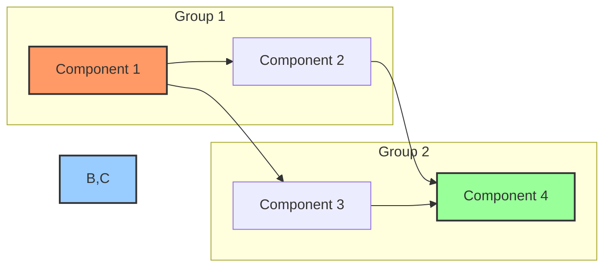
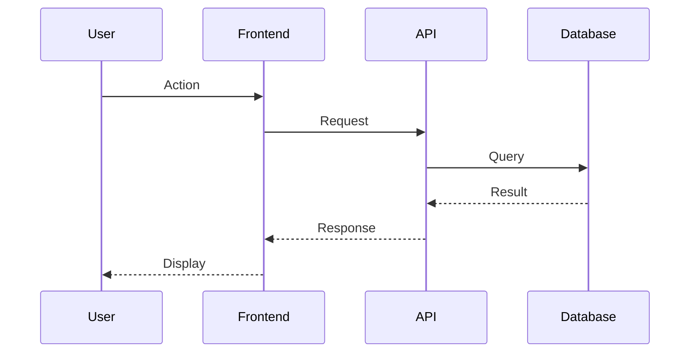

# 📝 Document Formatting Standards & Guidelines

## 🎯 Purpose

This document defines the mandatory formatting standards for **ALL** documentation in our projects. Following these guidelines ensures consistency, improves readability, and creates visually engaging documentation that enhances comprehension and retention.

## 🚨 Important Rules

1. **EVERY** document MUST use emojis throughout - no exceptions
2. **EVERY** workflow MUST be visualized with Mermaid diagrams
3. **EVERY** document MUST use proper Markdown formatting
4. **EVERY** document MUST include jump links for navigation
5. **EVERY** document MUST follow consistent header hierarchies

## 📊 Emoji Usage Guidelines

### Why Emojis Matter 🤔

Emojis transform boring text documents into engaging, visually organized information structures. They provide:

- ⚡ Instant visual cues for content categories
- 🧠 Improved information retention
- 👁️ Enhanced scannability
- 🎨 Visual breaks in dense technical content
- 🗂️ Consistent section identification

### Required Emoji Placement

1. **Document Title**: Always place a relevant emoji before the main title
2. **All Section Headers**: Every H2/H3/H4 header must have a relevant emoji
3. **Lists**: Use emojis as bullet points for important lists
4. **Status Indicators**: Use standard status emojis consistently
5. **Task Descriptions**: Include emojis that represent the task type
6. **Technical Components**: Denote component types with consistent emojis

### 🎭 Standard Emoji Key

To maintain consistency across all documents, use this standard emoji key:

| Category | Emoji | Meaning |
|----------|-------|---------|
| **Document Types** | 📝 | General document |
|  | 📊 | Report or analysis |
|  | 🏗️ | Architecture document |
|  | 🎯 | Project planning document |
|  | 📅 | Timeline or schedule |
|  | 📘 | Guide or manual |
| **Sections** | 🔍 | Overview or introduction |
|  | 🎯 | Goals or objectives |
|  | 📋 | Requirements |
|  | 🏗️ | Architecture |
|  | 🛠️ | Implementation |
|  | ⚙️ | Configuration |
|  | 📊 | Data or metrics |
|  | 🧪 | Testing |
|  | 📝 | Notes or documentation |
| **Status** | 🔴 | Not Started |
|  | 🟡 | In Progress |
|  | 🟢 | Completed |
|  | ⭕️ | Blocked |
|  | 🔵 | Testing |
|  | ✅ | Verified |
| **Components** | 🖥️ | Frontend |
|  | 🔄 | Backend |
|  | 💾 | Database |
|  | 🌐 | API |
|  | 🧩 | Module or Plugin |
|  | 🔌 | Integration |
| **Actions** | ➕ | Add or Create |
|  | 🔧 | Fix or Repair |
|  | 🔄 | Update or Refresh |
|  | 🗑️ | Remove or Delete |
|  | 🔍 | Find or Search |
|  | 📊 | Analyze or Report |
| **Importance** | 🚨 | Critical |
|  | ⚠️ | Warning |
|  | 💡 | Insight or Idea |
|  | ✨ | Feature or Enhancement |
|  | 📌 | Important Note |

## 📑 Document Structure Standards

### Header Hierarchy

Always use a consistent header hierarchy:

```markdown
# 📝 Document Title (H1)

## 🔍 Major Section (H2)

### 📊 Subsection (H3)

#### 🛠️ Sub-subsection (H4)
```

### Navigation Elements

Every document exceeding 3 sections MUST include:

1. **Table of Contents**: List of all H2 and H3 headers with jump links
2. **Section Jump Links**: Easy navigation between related sections
3. **Back-to-Top Links**: For long documents

Example:

```markdown
## Table of Contents
- [🔍 Overview](#overview)
- [🏗️ Architecture](#architecture)
  - [💾 Database Schema](#database-schema)
  - [🌐 API Layer](#api-layer)
- [📊 Implementation Status](#implementation-status)
```

### Code Block Formatting

All code blocks MUST:

1. Specify the language for syntax highlighting
2. Include descriptive comments
3. Use consistent indentation
4. Have a clear purpose

Example:

```python
# Database connection function
def connect_to_database(host, port, username, password):
    """
    Establishes a connection to the database
    Returns a connection object
    """
    try:
        # Attempt connection
        connection = Database.connect(
            host=host,
            port=port,
            username=username,
            password=password
        )
        return connection
    except DatabaseError as e:
        logger.error(f"Connection failed: {e}")
        return None
```

## 🔄 Workflow Visualization Standards

### Mermaid Diagram Requirements

EVERY workflow or process MUST be visualized with Mermaid diagrams. All Mermaid diagrams MUST:

1. Use consistent node and edge styles
2. Include color coding for status or categories
3. Group related elements
4. Have clear direction flow
5. Include a title or caption

### Standard Mermaid Templates

#### Process Flow Diagram



#### Component Relationship Diagram



#### Sequence Diagram



## 📋 Document Types & Templates

### Project Documentation

1. **README.md**: Project overview, setup instructions, usage
2. **dev.md**: Technical implementation details
3. **file-tree.md**: Project structure documentation
4. **task-list.md**: Comprehensive task breakdown
5. **task-log.md**: Progress tracking

### Process Documentation

1. **Workflow documents**: Step-by-step process descriptions
2. **Decision logs**: Technical decisions and rationales
3. **Meeting notes**: Structured summaries of discussions

### Technical Documentation

1. **Architecture documents**: System design and components
2. **API documentation**: Endpoint specifications
3. **Configuration guides**: Setup and environment details

## ✅ Document Quality Checklist

Before considering any document complete, verify:

- [ ] Document has appropriate emojis throughout
- [ ] All workflows are visualized with Mermaid diagrams
- [ ] Headers follow proper hierarchy with emojis
- [ ] Table of contents is included for documents > 3 sections
- [ ] Code blocks specify language for syntax highlighting
- [ ] Status indicators use standardized emojis
- [ ] Related sections are cross-referenced with jump links
- [ ] Document follows consistent formatting throughout
- [ ] Component relationships are clearly visualized
- [ ] Technical details are comprehensive and clear

## 🔄 Integration with Other Standards

These formatting standards complement our other documentation standards:

1. **Core Documentation Flow**: See [ai-enhanced-documentation-workflow.md](./ai-enhanced-documentation-workflow.md)
2. **Templates for Core Files**: See [core-documentation-templates.md](./core-documentation-templates.md)
3. **Cursor System Prompt**: See system prompt for overall documentation integration

## 💡 Best Practices

1. **Consistency is Key**: Use the same emojis for the same concepts across all documents
2. **Avoid Emoji Overload**: Use emojis purposefully, not on every word or sentence
3. **Maintain the Hierarchy**: Ensure your document structure follows a clear hierarchy
4. **Keep Diagrams Updated**: Mermaid diagrams should evolve with the project
5. **Cross-Reference**: Link between related documents using Markdown links 