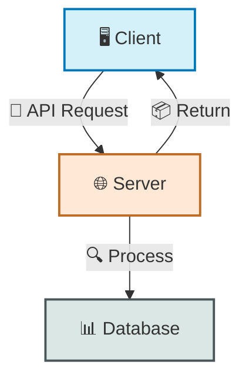
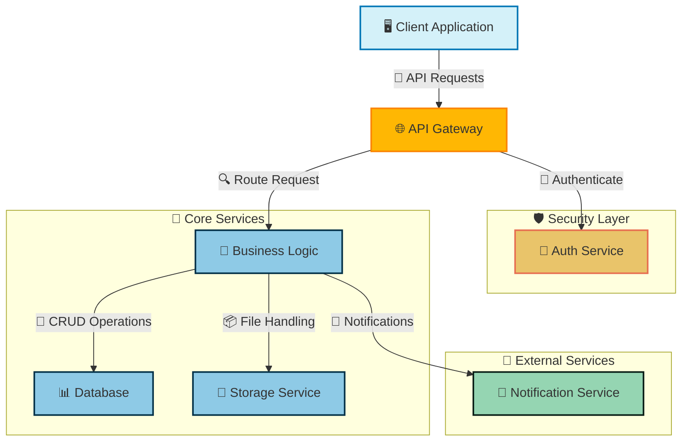
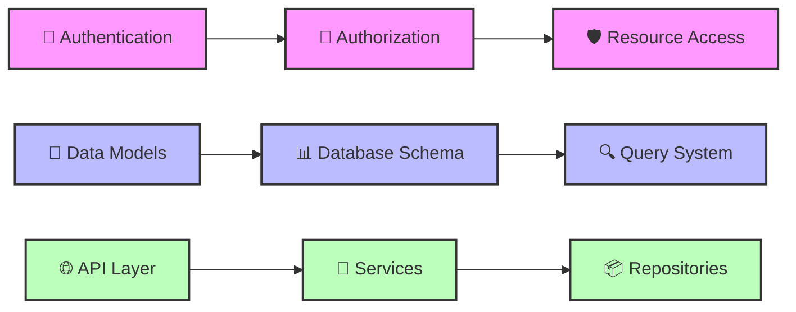
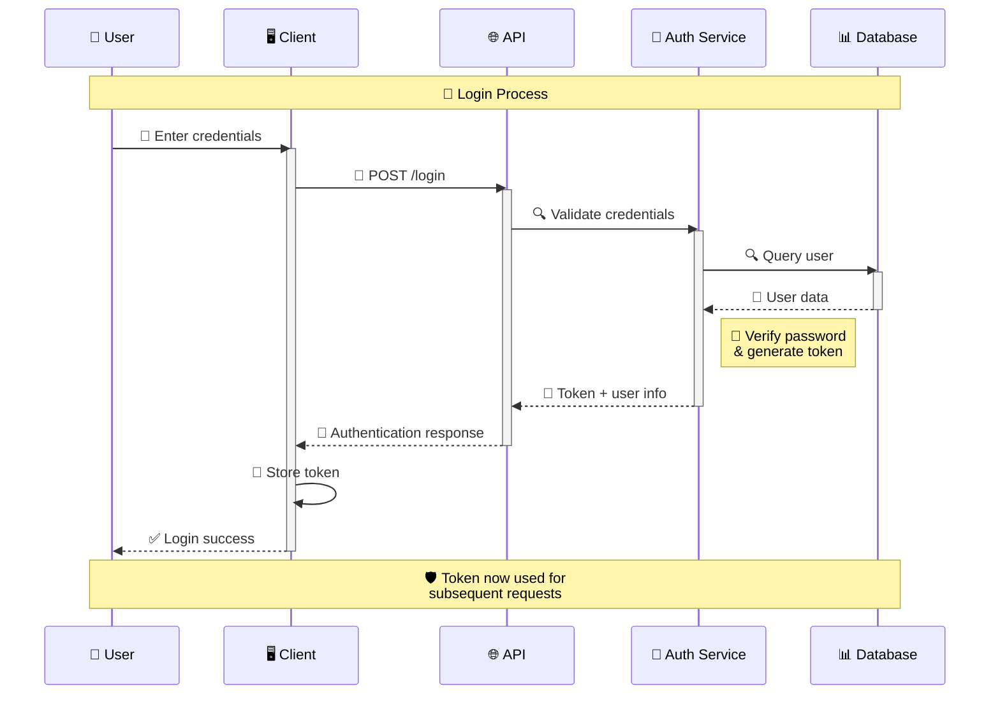
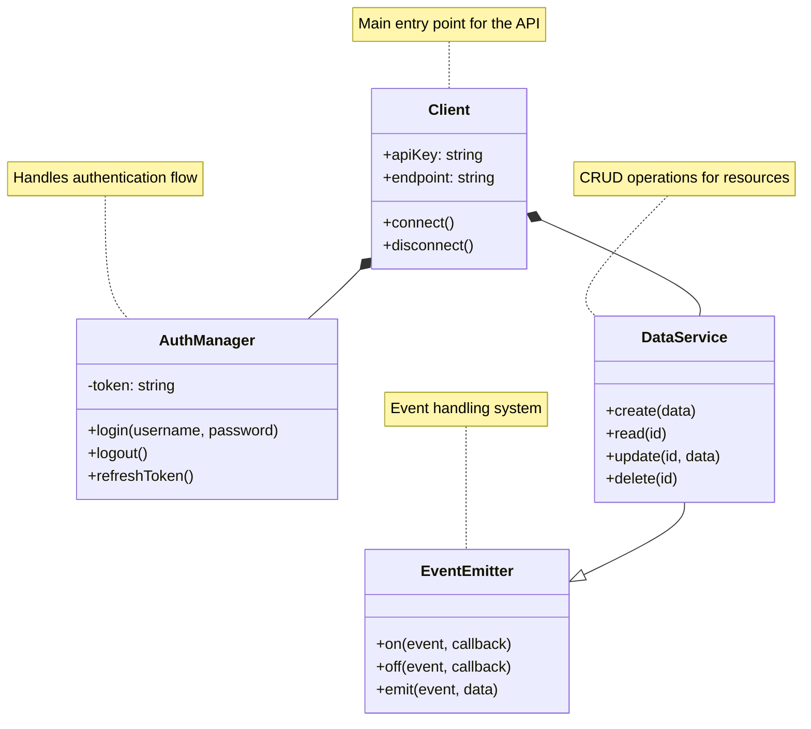
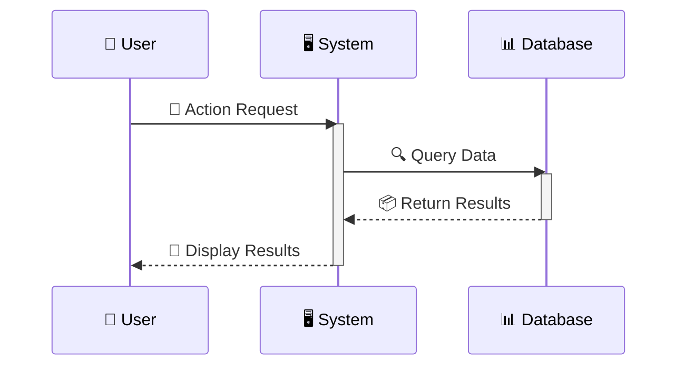
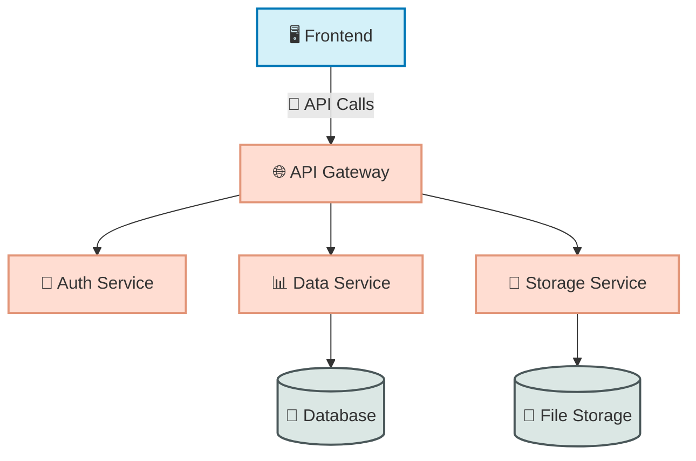
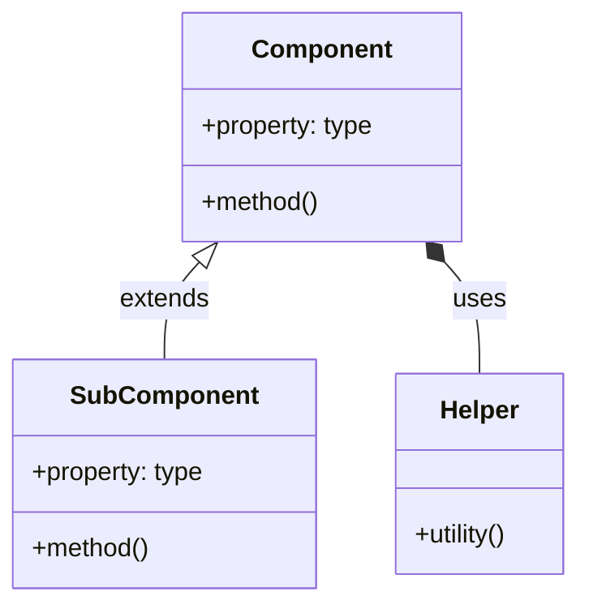
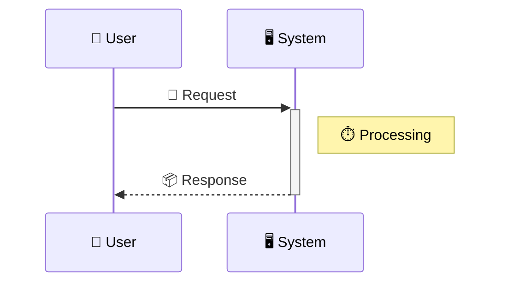

# 📋 Document Formatting Standards

This guide establishes standard formatting for project documentation to ensure consistency, readability, and visual appeal across all POWERBRIDGE.AI projects.

## 📑 Table of Contents

- [🎯 Purpose](#-purpose)
- [📄 README.md Format](#-readmemd-format)
  - [📝 Structure](#-structure)
  - [🔖 Template](#-template)
- [📚 UserGuide.md Format](#-userguidemd-format)
  - [📋 Structure](#-structure-1)
  - [📑 Template](#-template-1)
- [🖼️ Diagram Standards](#-diagram-standards)
  - [🔄 Workflow Diagrams](#-workflow-diagrams)
  - [📊 System Architecture](#-system-architecture)
  - [🗂️ Component Relationships](#-component-relationships)
  - [⏱️ Sequence Diagrams](#-sequence-diagrams)
  - [🎨 Color & Style Guide](#-color--style-guide)
- [🔤 Typography & Formatting](#-typography--formatting)
- [🔣 Emoji Usage Guide](#-emoji-usage-guide)

## 🎯 Purpose [⬆️](#-table-of-contents)

These standards ensure:

1. **Consistency** - Uniform documentation across all projects
2. **Navigability** - Easy movement through documentation with jumplinks
3. **Clarity** - Visual organization with emojis and formatting
4. **Professionalism** - Polished presentation with diagrams and styling
5. **Completeness** - Comprehensive coverage of necessary information

## 📄 README.md Format [⬆️](#-table-of-contents)

### 📝 Structure [⬆️](#-table-of-contents)

1. **🚀 Project Title** - With emoji and brief tagline
2. **📋 Table of Contents** - With emoji jumplinks
3. **🔍 Overview** - Brief project description (2-3 paragraphs)
4. **✨ Key Features** - Bulleted list with emojis for each feature
5. **🛠️ Installation** - Step-by-step instructions with code blocks
6. **🚀 Getting Started** - Quick-start example with code blocks
7. **📊 Architecture** - Simple architecture diagram (if applicable)
8. **⚙️ Configuration** - Configuration options with examples
9. **📚 Documentation** - Links to additional documentation
10. **🤝 Contributing** - Contribution guidelines
11. **📃 License** - License information
12. **👥 Credits** - Acknowledgments and credits
13. **📧 Contact** - Contact information
14. **🔖 Signature** - Standard signature

### 🔖 Template [⬆️](#-table-of-contents)

```markdown
# 🚀 Project Name

> One-line project description or tagline that captures the essence of the project.

## 📋 Table of Contents

- [🔍 Overview](#-overview)
- [✨ Features](#-features)
- [🛠️ Installation](#-installation)
- [🚀 Getting Started](#-getting-started)
- [📊 Architecture](#-architecture)
- [⚙️ Configuration](#-configuration)
- [📚 Documentation](#-documentation)
- [🤝 Contributing](#-contributing)
- [📃 License](#-license)
- [👥 Credits](#-credits)
- [📧 Contact](#-contact)

## 🔍 Overview [⬆️](#-table-of-contents)

Brief description of the project, its purpose, and the problem it solves. 2-3 paragraphs.

## ✨ Features [⬆️](#-table-of-contents)

- 🔄 **Feature One** - Description of feature one
- 🔐 **Feature Two** - Description of feature two
- 📊 **Feature Three** - Description of feature three
- 🔍 **Feature Four** - Description of feature four

## 🛠️ Installation [⬆️](#-table-of-contents)

```bash
# Clone the repository
git clone https://github.com/username/project.git

# Navigate to the project directory
cd project

# Install dependencies
npm install

# Build the project
npm run build
```

## 🚀 Getting Started [⬆️](#-table-of-contents)

```javascript
// Quick start example
import { Component } from 'project';

const instance = new Component();
instance.doSomething();
```

## 📊 Architecture [⬆️](#-table-of-contents)



## ⚙️ Configuration [⬆️](#-table-of-contents)

```javascript
// Configuration options
{
  "port": 3000,
  "debug": true,
  "apiKey": "your-api-key"
}
```

## 📚 Documentation [⬆️](#-table-of-contents)

- [📘 User Guide](./UserGuide.md)
- [🔧 API Reference](./API.md)
- [📋 Examples](./examples/)

## 🤝 Contributing [⬆️](#-table-of-contents)

Contributions are welcome! Please check out our [Contributing Guide](CONTRIBUTING.md).

## 📃 License [⬆️](#-table-of-contents)

This project is licensed under the MIT License - see the [LICENSE](LICENSE) file for details.

## 👥 Credits [⬆️](#-table-of-contents)

- Developer Name - Role/Contribution
- Another Name - Role/Contribution

## 📧 Contact [⬆️](#-table-of-contents)

- 📧 Email: example@email.com
- 🐦 Twitter: [@username](https://twitter.com/username)
- 🌐 Website: [example.com](https://example.com)

---

Made with Power, Love, and AI • ⚡️❤️🤖 •  POWERBRIDGE.AI
```

## 📚 UserGuide.md Format [⬆️](#-table-of-contents)

### 📋 Structure [⬆️](#-table-of-contents)

1. **📘 Guide Title** - With emoji and brief description
2. **📑 Table of Contents** - With emoji jumplinks
3. **🔍 Introduction** - Purpose and scope of the guide
4. **🏗️ Architecture Overview** - Detailed architecture diagram
5. **🚀 Getting Started** - Installation and basic setup
   - **📥 Installation** - Installation instructions
   - **⚙️ Configuration** - Configuration options
   - **🔐 Authentication** - Security setup
6. **💡 Core Concepts** - Key concepts explanation with examples
7. **🛠️ Features** - Detailed feature explanations
8. **📊 Usage Examples** - Code examples and use cases
9. **🔄 Workflows** - Sequence diagrams for common workflows
10. **🧩 Components** - Component diagrams and relationships
11. **📝 API Reference** - API documentation
12. **🔧 Troubleshooting** - Common issues and solutions
13. **📚 Advanced Topics** - Advanced concepts and techniques
14. **📋 FAQ** - Frequently asked questions
15. **🔖 Glossary** - Terms and definitions
16. **🔖 Signature** - Standard signature

### 📑 Template [⬆️](#-table-of-contents)

```markdown
# 📘 User Guide: Project Name

Comprehensive guide for setting up, configuring, and using Project Name effectively.

## 📑 Table of Contents

- [🔍 Introduction](#-introduction)
- [🏗️ Architecture Overview](#-architecture-overview)
- [🚀 Getting Started](#-getting-started)
  - [📥 Installation](#-installation)
  - [⚙️ Configuration](#-configuration)
  - [🔐 Authentication](#-authentication)
- [💡 Core Concepts](#-core-concepts)
- [🛠️ Features](#-features)
- [📊 Usage Examples](#-usage-examples)
- [🔄 Workflows](#-workflows)
- [🧩 Components](#-components)
- [📝 API Reference](#-api-reference)
- [🔧 Troubleshooting](#-troubleshooting)
- [📚 Advanced Topics](#-advanced-topics)
- [📋 FAQ](#-faq)
- [🔖 Glossary](#-glossary)

## 🔍 Introduction [⬆️](#-table-of-contents)

Brief introduction to the project, its purpose, and the value it provides to users. Explain who this guide is for and what they will learn.

## 🏗️ Architecture Overview [⬆️](#-table-of-contents)

Overview of the system architecture with detailed diagrams.



**Key Components:**

1. **🖥️ Client Application** - Frontend interface for user interaction
2. **🌐 API Gateway** - Routes requests and handles initial processing
3. **👤 Auth Service** - Manages authentication and authorization
4. **🧠 Business Logic** - Core application logic and processing
5. **📊 Database** - Data storage and retrieval
6. **📁 Storage Service** - File storage and management
7. **📨 Notification Service** - Handles system notifications

## 🚀 Getting Started [⬆️](#-table-of-contents)

### 📥 Installation [⬆️](#-table-of-contents)

```bash
# Clone the repository
git clone https://github.com/username/project.git

# Navigate to project directory
cd project

# Install dependencies
npm install

# Build the project
npm run build

# Start the application
npm start
```

### ⚙️ Configuration [⬆️](#-table-of-contents)

Create a configuration file named `config.json` with the following structure:

```json
{
  "server": {
    "port": 3000,
    "host": "localhost"
  },
  "database": {
    "url": "mongodb://localhost:27017",
    "name": "project_db"
  },
  "auth": {
    "secret": "your-secret-key",
    "tokenExpiry": "24h"
  }
}
```

### 🔐 Authentication [⬆️](#-table-of-contents)

Authentication is handled via JWT tokens. Here's how to authenticate:

```javascript
// Example authentication request
const response = await fetch('/api/auth/login', {
  method: 'POST',
  headers: {
    'Content-Type': 'application/json'
  },
  body: JSON.stringify({
    username: 'user',
    password: 'password'
  })
});

const { token } = await response.json();

// Use token in subsequent requests
fetch('/api/protected-resource', {
  headers: {
    'Authorization': `Bearer ${token}`
  }
});
```

## 💡 Core Concepts [⬆️](#-table-of-contents)

Explanation of core concepts with diagrams where applicable.



## 🛠️ Features [⬆️](#-table-of-contents)

Detailed explanation of each major feature.

### 🔍 Feature One [⬆️](#-table-of-contents)

Description of feature one, how it works, and how to use it.

```javascript
// Example code for Feature One
const result = featureOne.process({
  input: 'example',
  options: {
    flag: true
  }
});

console.log(result);
```

### 🔄 Feature Two [⬆️](#-table-of-contents)

Description of feature two, how it works, and how to use it.

## 📊 Usage Examples [⬆️](#-table-of-contents)

Complete examples showcasing the system in action.

### 📱 Mobile Application Integration [⬆️](#-table-of-contents)

```javascript
// Example mobile app integration
import { Client } from 'project';

const client = new Client({
  apiKey: 'your-api-key',
  endpoint: 'https://api.example.com'
});

// Fetch user data
const userData = await client.users.get(userId);

// Update user profile
await client.users.update(userId, {
  name: 'New Name',
  email: 'new.email@example.com'
});
```

## 🔄 Workflows [⬆️](#-table-of-contents)

Common workflow diagrams to illustrate processes.

### 🔐 User Authentication Process [⬆️](#-table-of-contents)



## 🧩 Components [⬆️](#-table-of-contents)

Detailed description of system components and their relationships.



## 📝 API Reference [⬆️](#-table-of-contents)

Detailed API documentation with request and response examples.

### 🔐 Authentication API [⬆️](#-table-of-contents)

#### POST /api/auth/login [⬆️](#-table-of-contents)

Authenticates a user and returns a JWT token.

**Request:**

```json
{
  "username": "string",
  "password": "string"
}
```

**Response:**

```json
{
  "token": "string",
  "user": {
    "id": "string",
    "username": "string",
    "email": "string"
  }
}
```

## 🔧 Troubleshooting [⬆️](#-table-of-contents)

Common issues and their solutions.

### 🔍 Common Issues [⬆️](#-table-of-contents)

#### 🚫 Authentication Errors [⬆️](#-table-of-contents)

**Issue**: Unable to authenticate with API.

**Solutions**:
- Verify API key is correct and not expired
- Check that the user has correct permissions
- Ensure request is properly formatted

## 📚 Advanced Topics [⬆️](#-table-of-contents)

In-depth explanations of advanced concepts and techniques.

### 🔄 Custom Workflow Creation [⬆️](#-table-of-contents)

Instructions for creating custom workflows...

## 📋 FAQ [⬆️](#-table-of-contents)

Answers to frequently asked questions.

### ❓ How do I reset my password? [⬆️](#-table-of-contents)

Answer to the question...

## 🔖 Glossary [⬆️](#-table-of-contents)

Definitions of terms used throughout the documentation.

- **API** - Application Programming Interface
- **JWT** - JSON Web Token
- **REST** - Representational State Transfer

---

Made with Power, Love, and AI •  ⚡️❤️🤖 •  POWERBRIDGE.AI
```

## 🖼️ Diagram Standards [⬆️](#-table-of-contents)

### 🔄 Workflow Diagrams [⬆️](#-table-of-contents)

Use sequence diagrams for workflows to illustrate process flows:



**Best Practices:**
- Add emojis to participants and actions
- Use activation/deactivation to show processing
- Include notes to explain complex steps
- Group related actions with notes spanning multiple participants

### 📊 System Architecture [⬆️](#-table-of-contents)

Use graph diagrams (TD or LR) for system architecture:



**Best Practices:**
- Use clear directional flow (top-down or left-right)
- Group related components with subgraphs
- Use color coding to distinguish component types
- Include a legend explaining the color scheme
- Add emojis to make components easily distinguishable

### 🗂️ Component Relationships [⬆️](#-table-of-contents)

Use class diagrams for component relationships:



**Best Practices:**
- Show inheritance with `<|--`
- Show composition with `*--`
- Show aggregation with `o--`
- Add notes to explain complex relationships
- Keep diagrams focused on relevant components

### ⏱️ Sequence Diagrams [⬆️](#-table-of-contents)

Use sequence diagrams for interaction flows with detailed timing:



**Best Practices:**
- Always activate/deactivate to show processing time
- Use notes to explain complex processing steps
- Add emojis to make the flow visually clear
- Keep participants to a manageable number (5-7 max)

### 🎨 Color & Style Guide [⬆️](#-table-of-contents)

#### 🎯 Color Scheme

Use consistent colors for component types:

- **Frontend/UI**: `#d4f1f9` (light blue)
- **Backend/API**: `#ffe8d6` (light orange)
- **Database**: `#dbe7e4` (light gray-green)
- **Security**: `#e9c46a` (yellow/gold)
- **External Services**: `#95d5b2` (light green)

#### 🖋️ Styling

Apply consistent styling to diagrams:

```
classDef frontend fill:#d4f1f9,stroke:#0077b6,stroke-width:2px
classDef backend fill:#ffe8d6,stroke:#bc6c25,stroke-width:2px
classDef database fill:#dbe7e4,stroke:#4a5759,stroke-width:2px
classDef security fill:#e9c46a,stroke:#e76f51,stroke-width:2px
classDef external fill:#95d5b2,stroke:#081c15,stroke-width:2px
```

## 🔤 Typography & Formatting [⬆️](#-table-of-contents)

### 📝 Headers

- **Main Title**: `# 📘 Title`
- **Sections**: `## 🔍 Section`
- **Subsections**: `### 🔧 Subsection`
- **Sub-subsections**: `#### 📌 Sub-subsection`

### 📄 Text Formatting

- **Bold Important Concepts**: `**important concept**`
- **Italicize Emphasis**: `*emphasis*`
- **Code Inline**: `` `code` ``
- **Links**: `[link text](url)`

### 📦 Code Blocks

Use language-specific syntax highlighting:

````
```javascript
// JavaScript code
```

```typescript
// TypeScript code
```

```bash
# Shell commands
```

```json
// JSON configuration
```
````

### 📋 Tables

Use tables for structured data:

```
| Header 1 | Header 2 | Header 3 |
|----------|----------|----------|
| Data 1   | Data 2   | Data 3   |
| Data 4   | Data 5   | Data 6   |
```

## 🔣 Emoji Usage Guide [⬆️](#-table-of-contents)

### 🏷️ Section Markers

- 📋 Table of Contents
- 🔍 Introduction/Overview
- 🏗️ Architecture
- 🚀 Getting Started
- 💾 Storage
- 🔌 API/Integration
- 🛠️ Tools/Features
- 📊 Examples/Data
- 🔧 Troubleshooting
- 📚 References

### 🖼️ Diagram Elements

- 🖥️ Frontend/UI
- 🌐 Server/API
- 📊 Database
- 👤 User
- 🔐 Authentication
- 📡 Network/Communication
- 📁 Storage
- 🧠 Processing/Logic
- 📦 Package/Component
- 🔄 Workflow/Process

### 🔠 Feature Categories

- 🔐 Security
- 📊 Analytics
- 🔄 Synchronization
- 📱 Mobile
- 🌐 Web
- 📡 API
- 💾 Storage
- 🔔 Notifications
- 🔍 Search
- 🧩 Integration

---

Made with Power, Love, and AI •  ⚡️❤️🤖 •  POWERBRIDGE.AI 