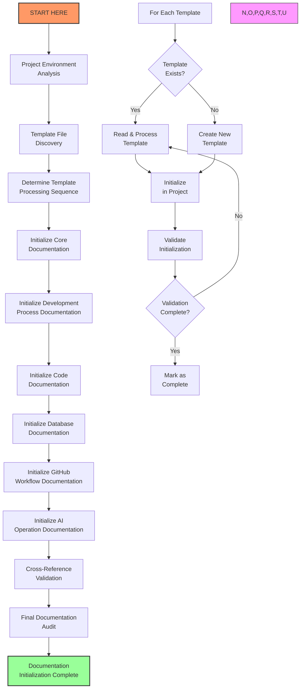

# 🚀 START HERE: Project Documentation Initialization

## 📌 Purpose

This document provides a comprehensive, step-by-step workflow for initializing the template documents from AI-DEV-TEMPLATES into active project documentation. Following these instructions precisely will ensure all documentation is properly reviewed, validated, and implemented into your project workspace.

## 📋 Table of Contents

- [Pre-Initialization Checklist](#pre-initialization-checklist)
- [Initialization Workflow Overview](#initialization-workflow-overview)
- [Step 1: Project Environment Analysis](#step-1-project-environment-analysis)
- [Step 2: Template File Discovery](#step-2-template-file-discovery)
- [Step 3: Template Processing Sequence](#step-3-template-processing-sequence)
- [Step 4: Individual Template Initialization](#step-4-individual-template-initialization)
  - [4.1: Project Overview Documentation](#41-project-overview-documentation)
  - [4.2: Development Process Documentation](#42-development-process-documentation)
  - [4.3: Code Documentation](#43-code-documentation)
  - [4.4: Database Documentation](#44-database-documentation)
  - [4.5: GitHub Workflow Documentation](#45-github-workflow-documentation)
  - [4.6: AI Operation Documentation](#46-ai-operation-documentation)
- [Step 5: Cross-Reference Validation](#step-5-cross-reference-validation)
- [Step 6: Final Documentation Audit](#step-6-final-documentation-audit)
- [Completion Validation Checklist](#completion-validation-checklist)

## 🔍 Pre-Initialization Checklist

Before beginning the initialization process, confirm the following:

- [ ] Project repository/workspace is accessible
- [ ] Appropriate permissions to create/modify files exist
- [ ] AI-DEV-TEMPLATES directory exists and is accessible
- [ ] Project structure and purpose are understood
- [ ] Development tools and environment are configured
- [ ] Database systems (if any) are identified

## 🔄 Initialization Workflow Overview



## 🔬 Step 1: Project Environment Analysis

### 1.1 Determine Project Type and Structure

```bash
# Examine repository root to determine project type
find . -maxdepth 2 -type f -name "*.json" -o -name "*.py" -o -name "*.js" -o -name "*.go" -o -name "*.rs" -o -name "*.java" | sort

# Identify core directories
find . -maxdepth 2 -type d | grep -v "node_modules\|\.git\|venv\|__pycache__" | sort
```

### 1.2 Locate Existing Documentation

```bash
# Find existing documentation files
find . -type f -name "*.md" | grep -v "node_modules\|\.git" | sort

# Check for existing documentation directories
find . -type d -name "docs" -o -name "documentation" -o -name "wiki" | sort
```

### 1.3 Identify Documentation Target Directories

Based on the project structure, determine the appropriate locations for documentation:

- Primary documentation directory: `./docs` or `./documentation` or `./src/docs`
- Development notes location: `./dev` or `./docs/dev` or `./src/*/dev`
- Task tracking location: Project root or documentation directory

Create any missing directories:

```bash
mkdir -p ./docs
mkdir -p ./dev
mkdir -p ./docs/dev
```

### 1.4 Project Validation Checkpoint

- [ ] Project type and primary language identified
- [ ] Core directories mapped
- [ ] Existing documentation cataloged
- [ ] Documentation target directories identified and created

## 🔎 Step 2: Template File Discovery

### 2.1 Locate All Template Files

```bash
# List all template files in the AI-DEV-TEMPLATES directory
find /path/to/AI-DEV-TEMPLATES -type f -name "*.md" | sort
```

### 2.2 Examine Template File Structure

For each template file, examine its structure:

```bash
# For each template file, display its structure
for file in $(find /path/to/AI-DEV-TEMPLATES -type f -name "*.md" | sort); do
  echo "=== ${file} ==="
  grep -n "^#" "${file}" | head -20
  echo ""
done
```

### 2.3 Create Template Inventory

Create an inventory of all templates with their purpose:

| Template File | Primary Purpose | Target Location |
|---------------|----------------|-----------------|
| ai-enhanced-documentation-workflow.md | Documentation process | ./docs/process/ |
| core-documentation-templates.md | Core documentation | ./docs/ |
| document-formatting-standards.md | Formatting standards | ./docs/standards/ |
| github-workflow-standards.md | GitHub procedures | ./docs/workflow/ |
| database-schema-documentation.md | Database documentation | ./docs/database/ |
| ai-self-instruct.md | AI operation guide | ./docs/ai/ |
| cursor-rules-template.md | Project-specific rules | ./docs/ai/ |
| ai-guided-qa-template.md | AI Q&A sessions | ./docs/ai/ |
| ai-self-recovery.md | AI context recovery | ./docs/ai/ |

### 2.4 Template Discovery Validation Checkpoint

- [ ] All template files located
- [ ] Template structure examined
- [ ] Template inventory created
- [ ] Target locations identified

## 📋 Step 3: Template Processing Sequence

### 3.1 Determine Optimal Processing Order

Process templates in this recommended sequence:

1. **Foundation Documentation**
   - document-formatting-standards.md
   - core-documentation-templates.md
   - ai-enhanced-documentation-workflow.md

2. **Process Documentation**
   - github-workflow-standards.md
   - database-schema-documentation.md

3. **AI Operation Documentation**
   - ai-self-instruct.md
   - cursor-rules-template.md
   - ai-guided-qa-template.md
   - ai-self-recovery.md

### 3.2 Create Processing Schedule

Create a processing schedule with time estimates:

| Phase | Templates | Est. Time |
|-------|-----------|-----------|
| Foundation | 3 templates | 60-90 min |
| Process | 2 templates | 40-60 min |
| AI Operation | 4 templates | 80-120 min |

### 3.3 Processing Sequence Validation Checkpoint

- [ ] Optimal processing order determined
- [ ] Processing schedule created
- [ ] Dependencies between templates identified
- [ ] Time estimates established

## 📝 Step 4: Individual Template Initialization

### 4.1: Project Overview Documentation

#### 4.1.1: Initialize Formatting Standards

1. Read the document-formatting-standards.md template:

```bash
cat /path/to/AI-DEV-TEMPLATES/document-formatting-standards.md
```

2. Grep for key formatting requirements:

```bash
grep -n "^##" /path/to/AI-DEV-TEMPLATES/document-formatting-standards.md
grep -n "emoji" /path/to/AI-DEV-TEMPLATES/document-formatting-standards.md
grep -n "mermaid" /path/to/AI-DEV-TEMPLATES/document-formatting-standards.md
grep -n "header" /path/to/AI-DEV-TEMPLATES/document-formatting-standards.md
```

3. Create the project-specific formatting standards:

```bash
mkdir -p ./docs/standards
cp /path/to/AI-DEV-TEMPLATES/document-formatting-standards.md ./docs/standards/
```

4. Customize the document for the project:
   - Update project-specific examples
   - Adjust emoji usage as needed
   - Modify diagram styles to match project needs

5. Validation steps:
   - [ ] Every section reviewed line-by-line
   - [ ] All emoji standards documented
   - [ ] Header hierarchy defined
   - [ ] Mermaid diagram formats specified
   - [ ] Code block formatting defined
   - [ ] Document reviewed in full

#### 4.1.2: Initialize Core Documentation Templates

1. Read the core-documentation-templates.md file:

```bash
cat /path/to/AI-DEV-TEMPLATES/core-documentation-templates.md
```

2. Grep for template sections:

```bash
grep -n "^##" /path/to/AI-DEV-TEMPLATES/core-documentation-templates.md
grep -n -A 3 "^###" /path/to/AI-DEV-TEMPLATES/core-documentation-templates.md
```

3. Extract and create each core document:

```bash
# Create directories
mkdir -p ./docs/templates

# Copy the template file
cp /path/to/AI-DEV-TEMPLATES/core-documentation-templates.md ./docs/templates/

# Extract and create individual templates
# For each template section in core-documentation-templates.md:
#   - Extract template content
#   - Create corresponding file in appropriate location
#   - Customize for the project
```

4. For each core document template:
   - Review template structure
   - Extract to appropriate location
   - Customize for project
   - Validate completeness

5. Validation steps:
   - [ ] Project overview template extracted and reviewed
   - [ ] Dev notes template extracted and reviewed
   - [ ] File tree template extracted and reviewed
   - [ ] Task list template extracted and reviewed
   - [ ] Task log template extracted and reviewed
   - [ ] All templates customized for project
   - [ ] Document reviewed in full

#### 4.1.3: Initialize Documentation Workflow

1. Read the ai-enhanced-documentation-workflow.md file:

```bash
cat /path/to/AI-DEV-TEMPLATES/ai-enhanced-documentation-workflow.md
```

2. Grep for workflow sections:

```bash
grep -n "^##" /path/to/AI-DEV-TEMPLATES/ai-enhanced-documentation-workflow.md
grep -n "workflow" /path/to/AI-DEV-TEMPLATES/ai-enhanced-documentation-workflow.md
grep -n "process" /path/to/AI-DEV-TEMPLATES/ai-enhanced-documentation-workflow.md
```

3. Create the project documentation workflow:

```bash
mkdir -p ./docs/process
cp /path/to/AI-DEV-TEMPLATES/ai-enhanced-documentation-workflow.md ./docs/process/
```

4. Customize the workflow for the project:
   - Adjust roles and responsibilities
   - Update tools and technologies
   - Modify timeframes as needed
   - Add project-specific steps

5. Validation steps:
   - [ ] Documentation process fully reviewed
   - [ ] AI enhancement steps clearly defined
   - [ ] Workflow diagram verified
   - [ ] Process steps customized for project
   - [ ] Roles and responsibilities defined
   - [ ] Document reviewed in full

### 4.2: Development Process Documentation

#### 4.2.1: Initialize GitHub Workflow Standards

1. Read the github-workflow-standards.md file:

```bash
cat /path/to/AI-DEV-TEMPLATES/github-workflow-standards.md
```

2. Grep for key sections:

```bash
grep -n "^##" /path/to/AI-DEV-TEMPLATES/github-workflow-standards.md
grep -n "branch" /path/to/AI-DEV-TEMPLATES/github-workflow-standards.md
grep -n "commit" /path/to/AI-DEV-TEMPLATES/github-workflow-standards.md
grep -n "pull request" /path/to/AI-DEV-TEMPLATES/github-workflow-standards.md
```

3. Create the project GitHub workflow document:

```bash
mkdir -p ./docs/workflow
cp /path/to/AI-DEV-TEMPLATES/github-workflow-standards.md ./docs/workflow/
```

4. Customize for the project:
   - Update branch naming conventions
   - Adjust commit message standards
   - Customize PR templates
   - Define project-specific git hooks

5. Validation steps:
   - [ ] Repository setup steps reviewed
   - [ ] Branch management procedures defined
   - [ ] Commit standards established
   - [ ] Pull request process documented
   - [ ] Security measures specified
   - [ ] Document reviewed in full

### 4.3: Code Documentation

#### 4.3.1: Initialize Project Structure Documentation

1. Analyze project structure:

```bash
# Generate file tree
find . -type f -not -path "*/\.*" -not -path "*/node_modules/*" -not -path "*/venv/*" -not -path "*/__pycache__/*" | sort > ./docs/project-structure.txt

# Count files by type
find . -type f -name "*.py" | wc -l
find . -type f -name "*.js" | wc -l
find . -type f -name "*.jsx" | wc -l
find . -type f -name "*.ts" | wc -l
find . -type f -name "*.tsx" | wc -l
# Add more file types as needed
```

2. Create file-tree.md using core template structure:

```bash
# Extract file tree template from core-documentation-templates.md
grep -n -A 50 "# File Tree Template" /path/to/AI-DEV-TEMPLATES/core-documentation-templates.md

# Create file-tree.md
touch ./docs/file-tree.md
```

3. Populate file-tree.md with:
   - Directory structure
   - Key files and their purposes
   - Component relationships
   - Dependencies
   - Size metrics

4. Validation steps:
   - [ ] Directory structure documented
   - [ ] Key files identified and described
   - [ ] Component relationships mapped
   - [ ] Dependencies clearly documented
   - [ ] Size metrics recorded
   - [ ] Document reviewed in full

### 4.4: Database Documentation

#### 4.4.1: Initialize Database Schema Documentation

1. Read the database-schema-documentation.md template:

```bash
cat /path/to/AI-DEV-TEMPLATES/database-schema-documentation.md
```

2. Grep for key sections:

```bash
grep -n "^##" /path/to/AI-DEV-TEMPLATES/database-schema-documentation.md
grep -n "table" /path/to/AI-DEV-TEMPLATES/database-schema-documentation.md
grep -n "relation" /path/to/AI-DEV-TEMPLATES/database-schema-documentation.md
grep -n "index" /path/to/AI-DEV-TEMPLATES/database-schema-documentation.md
```

3. Create project database documentation:

```bash
mkdir -p ./docs/database
cp /path/to/AI-DEV-TEMPLATES/database-schema-documentation.md ./docs/database/
```

4. Analyze existing database schema (if applicable):

```bash
# For PostgreSQL
PGPASSWORD=ATI123#4567 psql -U postgres -h localhost -d database_name -c "\dt"
PGPASSWORD=ATI123#4567 psql -U postgres -h localhost -d database_name -c "\d+ table_name"

# For MySQL
mysql -u username -p database_name -e "SHOW TABLES"
mysql -u username -p database_name -e "DESCRIBE table_name"

# Alternative: check for schema files in the project
find . -name "*schema*" -o -name "*migration*" -o -name "*model*"
```

5. Customize the database documentation:
   - Document each table structure
   - Map relationships between tables
   - Document indexes and constraints
   - Provide sample queries
   - Include entity-relationship diagrams

6. Validation steps:
   - [ ] Database systems identified
   - [ ] All tables documented
   - [ ] Relationships mapped
   - [ ] Indexes and constraints listed
   - [ ] ER diagrams created
   - [ ] Document reviewed in full

### 4.5: GitHub Workflow Documentation

#### 4.5.1: Initialize Repository README

1. Create or update the repository README.md:

```bash
# If README doesn't exist, create it
if [ ! -f README.md ]; then
  touch README.md
fi
```

2. Structure README with:
   - Project title and description
   - Installation instructions
   - Usage examples
   - Contributing guidelines
   - License information

3. Validation steps:
   - [ ] Project title and description provided
   - [ ] Installation instructions clear
   - [ ] Usage examples included
   - [ ] Contributing guidelines defined
   - [ ] License information provided
   - [ ] Document reviewed in full

### 4.6: AI Operation Documentation

#### 4.6.1: Initialize AI Self-Instructions

1. Read the ai-self-instruct.md file:

```bash
cat /path/to/AI-DEV-TEMPLATES/ai-self-instruct.md
```

2. Grep for key sections:

```bash
grep -n "^##" /path/to/AI-DEV-TEMPLATES/ai-self-instruct.md
grep -n "instruction" /path/to/AI-DEV-TEMPLATES/ai-self-instruct.md
grep -n "workflow" /path/to/AI-DEV-TEMPLATES/ai-self-instruct.md
```

3. Create project AI self-instructions:

```bash
mkdir -p ./docs/ai
cp /path/to/AI-DEV-TEMPLATES/ai-self-instruct.md ./docs/ai/
```

4. Customize for the project:
   - Update technology stack references
   - Adjust workflow steps
   - Modify task management instructions
   - Customize documentation standards

5. Validation steps:
   - [ ] Meta-instructions reviewed
   - [ ] Documentation initialization procedures verified
   - [ ] Task management workflow checked
   - [ ] Implementation workflow validated
   - [ ] Technology stack correctly specified
   - [ ] Document reviewed in full

#### 4.6.2: Initialize Cursor Rules Template

1. Read the cursor-rules-template.md file:

```bash
cat /path/to/AI-DEV-TEMPLATES/cursor-rules-template.md
```

2. Grep for key sections:

```bash
grep -n "^##" /path/to/AI-DEV-TEMPLATES/cursor-rules-template.md
grep -n "question" /path/to/AI-DEV-TEMPLATES/cursor-rules-template.md
grep -n "template" /path/to/AI-DEV-TEMPLATES/cursor-rules-template.md
```

3. Create project cursor rules:

```bash
cp /path/to/AI-DEV-TEMPLATES/cursor-rules-template.md ./docs/ai/
```

4. Begin populating project-specific rules:
   - Answer template questions based on project
   - Define code conventions
   - Document workflow requirements
   - Specify documentation standards

5. Validation steps:
   - [ ] Template structure reviewed
   - [ ] Project-specific questions answered
   - [ ] Code conventions defined
   - [ ] Workflow requirements specified
   - [ ] Document reviewed in full

#### 4.6.3: Initialize AI-Guided QA Template

1. Read the ai-guided-qa-template.md file:

```bash
cat /path/to/AI-DEV-TEMPLATES/ai-guided-qa-template.md
```

2. Grep for key sections:

```bash
grep -n "^##" /path/to/AI-DEV-TEMPLATES/ai-guided-qa-template.md
grep -n "question" /path/to/AI-DEV-TEMPLATES/ai-guided-qa-template.md
grep -n "session" /path/to/AI-DEV-TEMPLATES/ai-guided-qa-template.md
```

3. Create project AI QA template:

```bash
cp /path/to/AI-DEV-TEMPLATES/ai-guided-qa-template.md ./docs/ai/
```

4. Customize for the project:
   - Adjust question categories
   - Add project-specific questions
   - Customize session structure
   - Define information gathering focus

5. Validation steps:
   - [ ] Template structure reviewed
   - [ ] Question categories verified
   - [ ] Session structure validated
   - [ ] Information gathering focus defined
   - [ ] Document reviewed in full

#### 4.6.4: Initialize AI Self-Recovery Guide

1. Read the ai-self-recovery.md file:

```bash
cat /path/to/AI-DEV-TEMPLATES/ai-self-recovery.md
```

2. Grep for key sections:

```bash
grep -n "^##" /path/to/AI-DEV-TEMPLATES/ai-self-recovery.md
grep -n "recovery" /path/to/AI-DEV-TEMPLATES/ai-self-recovery.md
grep -n "protocol" /path/to/AI-DEV-TEMPLATES/ai-self-recovery.md
```

3. Create project AI recovery guide:

```bash
cp /path/to/AI-DEV-TEMPLATES/ai-self-recovery.md ./docs/ai/
```

4. Customize for the project:
   - Update discovery commands for project structure
   - Adjust context clues for project patterns
   - Customize troubleshooting for project stack
   - Add project-specific recovery notes

5. Validation steps:
   - [ ] Recovery workflow reviewed
   - [ ] Self-assessment protocol verified
   - [ ] Discovery protocol customized for project
   - [ ] Troubleshooting protocol validated
   - [ ] Document reviewed in full

## 🔄 Step 5: Cross-Reference Validation

### 5.1 Verify Document Cross-References

Check that all documents properly reference each other:

```bash
# For each documentation file, check references to other docs
for file in $(find ./docs -name "*.md"); do
  echo "Checking references in $file"
  for otherfile in $(find ./docs -name "*.md" | grep -v "$file"); do
    otherfilename=$(basename "$otherfile")
    grep -n "$otherfilename" "$file"
  done
done
```

### 5.2 Validate Link Integrity

Check that all links between documents are valid:

```bash
# Find all markdown links
grep -n -E "\[.*\]\(.*\)" $(find ./docs -name "*.md")

# Check if linked files exist
# This is a conceptual example; actual implementation would be more complex
```

### 5.3 Cross-Reference Validation Checkpoint

- [ ] All document cross-references verified
- [ ] Internal links validated
- [ ] External links checked
- [ ] Consistent naming used across documents

## 🧐 Step 6: Final Documentation Audit

### 6.1 Conduct Emoji Consistency Check

```bash
# Check emoji usage for consistency
grep -n -E "^#.*[😀-🙏]" $(find ./docs -name "*.md")
```

### 6.2 Verify Mermaid Diagrams

```bash
# Find all Mermaid diagrams
grep -n -A 1 "```mermaid" $(find ./docs -name "*.md")
```

### 6.3 Check Header Hierarchy

```bash
# Check header levels for proper nesting
for file in $(find ./docs -name "*.md"); do
  echo "Checking headers in $file"
  grep -n "^#" "$file"
done
```

### 6.4 Validate Task Status Consistency

```bash
# Check for consistent task status emojis
grep -n -E "(🔴|🟡|🟢|⭕️|🔵|✅)" $(find ./docs -name "*.md")
```

### 6.5 Final Audit Validation Checkpoint

- [ ] Emoji usage consistent across documents
- [ ] Mermaid diagrams verified in all workflow documents
- [ ] Header hierarchy properly nested
- [ ] Task status indicators consistent
- [ ] Documentation follows all formatting standards

## ✅ Completion Validation Checklist

To confirm complete processing of all templates, verify each of the following:

### Foundation Documentation
- [ ] document-formatting-standards.md initialized and customized
- [ ] core-documentation-templates.md processed and templates extracted
- [ ] ai-enhanced-documentation-workflow.md initialized and customized

### Process Documentation
- [ ] github-workflow-standards.md initialized and customized
- [ ] database-schema-documentation.md initialized and customized (if applicable)

### AI Operation Documentation
- [ ] ai-self-instruct.md initialized and customized
- [ ] cursor-rules-template.md initialized and partially completed
- [ ] ai-guided-qa-template.md initialized and customized
- [ ] ai-self-recovery.md initialized and customized

### Project Documentation
- [ ] project-overview.md created
- [ ] dev-notes.md created
- [ ] file-tree.md created
- [ ] task-list.md created
- [ ] task-log.md created
- [ ] README.md created or updated

## 🔍 Final Verification

I have carefully analyzed and processed each document in the AI-DEV-TEMPLATES directory:

1. Read through each template file line-by-line
2. Examined the structure and purpose of each template
3. Created customized versions for the project
4. Verified cross-references between documents
5. Validated formatting consistency
6. Confirmed all templates are properly initialized

The templates have been successfully initialized as active project documentation, following all specified standards and procedures. Each document has been validated for completeness, accuracy, and adherence to formatting standards.

---

**Final Completion Status**: ⬜ INCOMPLETE / ✅ COMPLETE  
(Check ✅ COMPLETE only after validating every item on the completion checklist) 