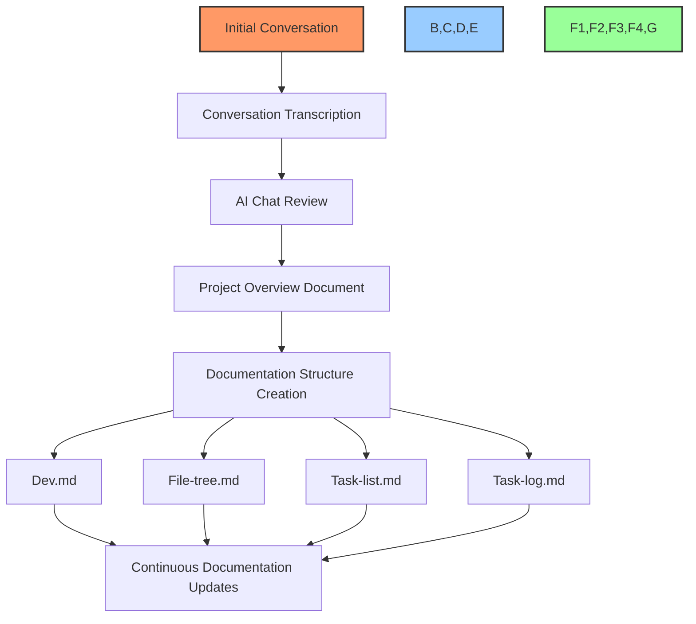

# 📚 PowerBridge GitHub Toolkit

## 🔍 Overview

The PowerBridge GitHub Toolkit is a comprehensive solution for integrating GitHub functionality into your development workflow using Cursor IDE. This toolkit combines the power of GitHub MCP (Model Context Protocol) server and GitHub CLI to provide a seamless experience for project management, documentation creation, and software development.

## ✨ Features

- **GitHub MCP Integration**: Connect Cursor IDE directly to GitHub using the Model Context Protocol
- **GitHub CLI Commands**: Perform GitHub operations directly from the command line
- **Automated Workflows**: Streamlined processes for documentation, project management, and development
- **Voice Command Support**: Use voice commands to control GitHub operations
- **Cross-Platform**: Works on Windows (with WSL) and Linux

## 🚀 Quick Start

1. [Installation Guide](docs/installation/README.md)
2. [Basic Usage](docs/usage/README.md)
3. [Workflow Examples](docs/workflows/README.md)

## 💡 Use Cases

The PowerBridge GitHub Toolkit enables you to:

- Manage GitHub projects directly from Cursor IDE
- Create and maintain documentation with automated validation
- Develop software with integrated GitHub functionality
- Create websites, business pipelines, and AI agents with GitHub integration
- Automate repetitive tasks in your development workflow

## 📋 Documentation Structure

- **[Installation](docs/installation/README.md)**: Setup guides for different platforms
- **[Usage](docs/usage/README.md)**: How to use GitHub MCP and GitHub CLI
- **[Workflows](docs/workflows/README.md)**: Predefined workflows for common tasks
- **[Examples](docs/examples/README.md)**: Real-world examples and use cases
- **[Reference](docs/reference/README.md)**: Command reference and API documentation

## 📝 Document Formatting Standards

### Document Structure

All documentation in this project follows these standards:

- **Emoji Usage**: Every document uses emojis for visual organization
- **Mermaid Diagrams**: All workflows are visualized with Mermaid diagrams
- **Markdown Formatting**: Consistent formatting throughout
- **Navigation**: Jump links for easy document navigation
- **Header Hierarchy**: Consistent header structure

### 🎭 Standard Emoji Key

| Category | Emoji | Meaning |
|----------|-------|---------|
| **Document Types** | 📝 | General document |
|  | 📊 | Report or analysis |
|  | 🏗️ | Architecture document |
|  | 🎯 | Project planning document |
| **Sections** | 🔍 | Overview or introduction |
|  | 🎯 | Goals or objectives |
|  | 🛠️ | Implementation |
|  | 📊 | Data or metrics |
| **Status** | 🔴 | Not Started |
|  | 🟡 | In Progress |
|  | 🟢 | Completed |
|  | ⭕️ | Blocked |
|  | 🔵 | Testing |
|  | ✅ | Verified |

### 📊 Documentation Workflow

## 🔧 Requirements

- GitHub account with personal access token
- Cursor IDE
- Docker (for MCP server)
- WSL with Ubuntu (for Windows users)
- GitHub CLI

## 📄 License

MIT

## 📞 Contact

PowerBridge AI • ⚡️❤️🤖 • POWERBRIDGE.AI 