# 🤖 AI-Driven Project Management

> A comprehensive guide for managing projects with AI assistance using Cursor and GitHub integration.

## 📋 Table of Contents
- [Overview](#overview)
- [Project Setup](#project-setup)
- [Task Management Workflow](#task-management-workflow)
- [Sprint Planning & Execution](#sprint-planning--execution)
- [Documentation Automation](#documentation-automation)
- [Progress Tracking & Reporting](#progress-tracking--reporting)
- [Integration with Development Workflow](#integration-with-development-workflow)
- [Best Practices](#best-practices)

## 🔍 Overview

This guide details how to implement AI-driven project management using Cursor AI and GitHub integration. The approach combines automated task management, documentation, and progress tracking to create a seamless development workflow with minimal manual overhead.

## 🚀 Project Setup

### 1. Repository Structure

Create a well-organized repository structure to support AI-driven project management:

```
project-root/
├── .github/
│   ├── workflows/          # GitHub Actions workflows
│   └── ISSUE_TEMPLATE/     # Issue templates
├── docs/
│   ├── dev-notes.md        # Technical documentation
│   └── project-plan.md     # Project overview and plan
├── task-log.md             # Task tracking document
├── file-tree.md            # Project structure documentation
└── README.md               # Project overview
```

### 2. Issue Templates

Create standardized issue templates for different task types:

```bash
# Create feature request template
mcp_github_create_or_update_file({
  "owner": "user",
  "repo": "project",
  "path": ".github/ISSUE_TEMPLATE/feature_request.md",
  "content": `---
name: Feature request
about: Suggest a feature for this project
title: '[FEATURE] '
labels: enhancement
assignees: ''
---

## Description
A clear description of the feature.

## Requirements
- [ ] Requirement 1
- [ ] Requirement 2

## Acceptance Criteria
- [ ] Criterion 1
- [ ] Criterion 2

## Implementation Notes
Any technical details or suggestions.
`,
  "message": "Add feature request template",
  "branch": "main"
})
```

### 3. Project Board Setup

Create a GitHub project board with automated workflows:

```bash
# Set up project board columns
gh api graphql -f query='
mutation {
  createProjectV2(input: {ownerId: "OWNER_ID", title: "Project Development"}) {
    projectV2 {
      id
    }
  }
}'

# Add standard columns
gh api graphql -f query='
mutation {
  createProjectV2Field(input: {projectId: "PROJECT_ID", dataType: SINGLE_SELECT, name: "Status", options: ["Todo", "In Progress", "Review", "Done"]}) {
    projectV2Field {
      id
    }
  }
}'
```

### 4. Automation Workflow Setup

Create GitHub Actions workflow for automation:

```yaml
# .github/workflows/project-automation.yml
name: Project Automation

on:
  issues:
    types: [opened, edited, closed, reopened, labeled, unlabeled]
  pull_request:
    types: [opened, edited, closed, reopened]

jobs:
  automate_project:
    runs-on: ubuntu-latest
    steps:
      - uses: actions/checkout@v2
      - name: Update Project Board
        uses: actions/github-script@v6
        with:
          github-token: ${{ secrets.GITHUB_TOKEN }}
          script: |
            // Automation script
            const issue = context.payload.issue || context.payload.pull_request;
            // Add to project board
            // Update status based on labels
```

## 📊 Task Management Workflow

### 1. Task Creation Process

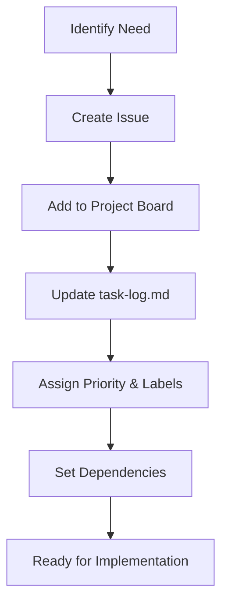

#### Implementation Steps:

1. **Create Issue via MCP**:
   ```bash
   mcp_github_create_issue({
     "owner": "user",
     "repo": "project",
     "title": "[TASK-001] Implement Feature X",
     "body": "## Description\nImplement feature X to allow users to...\n\n## Requirements\n- [ ] Requirement 1\n- [ ] Requirement 2\n\n## Acceptance Criteria\n- [ ] Criterion 1\n- [ ] Criterion 2",
     "labels": ["enhancement", "priority:medium"]
   })
   ```

2. **Update Task Log**:
   ```bash
   # Add task to task-log.md
   edit_file task-log.md
   
   # Add content
   ```markdown
   ## Current Tasks
   
   - 🔴 [TASK-001] Implement Feature X
     - Priority: Medium
     - Assigned: Unassigned
     - Dependencies: None
   ```
   ```

3. **Set Dependencies**:
   ```bash
   # Add dependency relationship
   mcp_github_add_issue_comment({
     "owner": "user",
     "repo": "project",
     "issue_number": 1,
     "body": "Depends on #2"
   })
   ```

### 2. Task Assignment Process

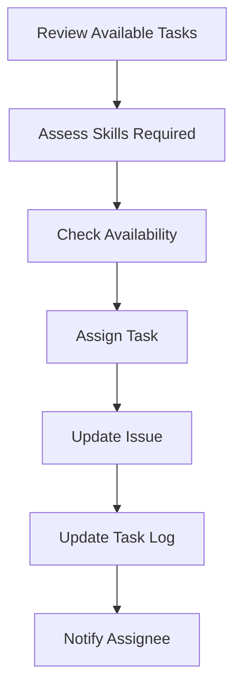

#### Implementation Steps:

1. **Assign Task**:
   ```bash
   # Assign task to developer or AI
   mcp_github_update_issue({
     "owner": "user",
     "repo": "project",
     "issue_number": 1,
     "assignees": ["developer"]
   })
   ```

2. **Update Task Log**:
   ```bash
   # Update task assignment in task-log.md
   search_replace task-log.md "- 🔴 [TASK-001] Implement Feature X\n  - Priority: Medium\n  - Assigned: Unassigned" "- 🔴 [TASK-001] Implement Feature X\n  - Priority: Medium\n  - Assigned: @developer"
   ```

3. **Notify Assignee**:
   ```bash
   # Add comment to notify assignee
   mcp_github_add_issue_comment({
     "owner": "user",
     "repo": "project",
     "issue_number": 1,
     "body": "@developer This task has been assigned to you. Please review the requirements and update the status when you start working on it."
   })
   ```

### 3. Task Status Management

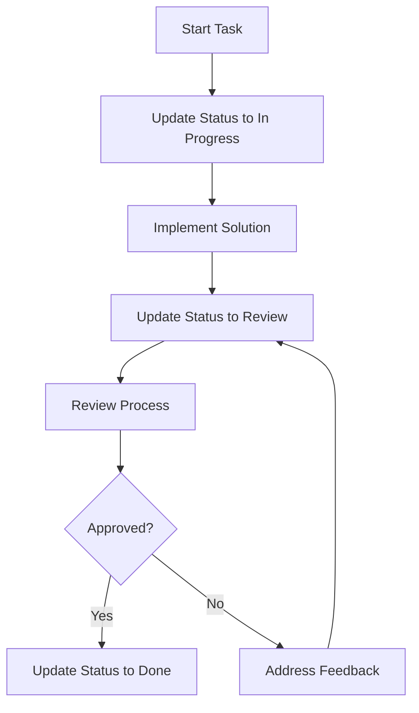

#### Implementation Steps:

1. **Update Status to In Progress**:
   ```bash
   # Update GitHub issue
   mcp_github_update_issue({
     "owner": "user",
     "repo": "project",
     "issue_number": 1,
     "labels": ["status:in-progress"]
   })
   
   # Update task log
   search_replace task-log.md "- 🔴 [TASK-001]" "- 🟡 [TASK-001]"
   ```

2. **Update Status to Review**:
   ```bash
   # Update GitHub issue
   mcp_github_update_issue({
     "owner": "user",
     "repo": "project",
     "issue_number": 1,
     "labels": ["status:review"]
   })
   
   # Update task log
   search_replace task-log.md "- 🟡 [TASK-001]" "- 🔵 [TASK-001]"
   ```

3. **Update Status to Done**:
   ```bash
   # Update GitHub issue
   mcp_github_update_issue({
     "owner": "user",
     "repo": "project",
     "issue_number": 1,
     "labels": ["status:done"],
     "state": "closed"
   })
   
   # Update task log
   search_replace task-log.md "- 🔵 [TASK-001]" "- ✅ [TASK-001]"
   ```

## 🏃 Sprint Planning & Execution

### 1. Sprint Planning Process

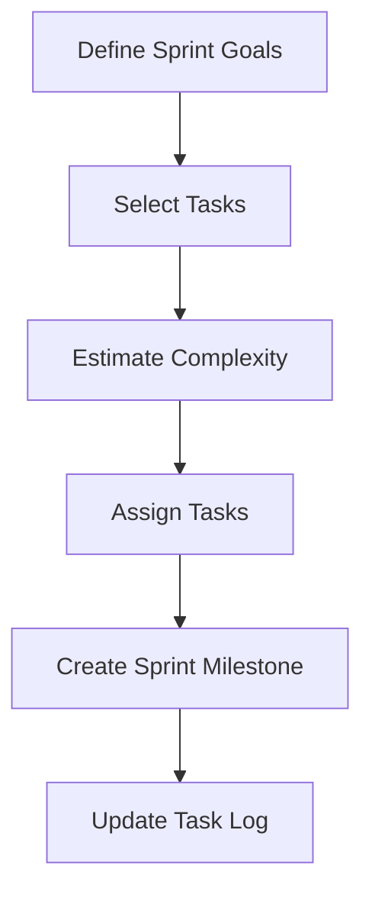

#### Implementation Steps:

1. **Create Sprint Milestone**:
   ```bash
   # Create milestone via GitHub API
   gh api --method POST /repos/user/project/milestones \
     -f title="Sprint 1" \
     -f state="open" \
     -f description="Sprint goals: Implement core authentication features" \
     -f due_on="2023-07-15T00:00:00Z"
   ```

2. **Add Tasks to Sprint**:
   ```bash
   # Add issues to milestone
   mcp_github_update_issue({
     "owner": "user",
     "repo": "project",
     "issue_number": 1,
     "milestone": 1
   })
   ```

3. **Update Task Log with Sprint Info**:
   ```bash
   # Add sprint section to task-log.md
   edit_file task-log.md
   
   # Add content
   ```markdown
   ## Sprint 1 (June 15 - July 15)
   
   **Goals**: Implement core authentication features
   
   **Tasks**:
   - 🔴 [TASK-001] Implement Feature X
   - 🔴 [TASK-002] Implement Feature Y
   
   **Progress**: 0%
   ```
   ```

### 2. Sprint Execution Tracking

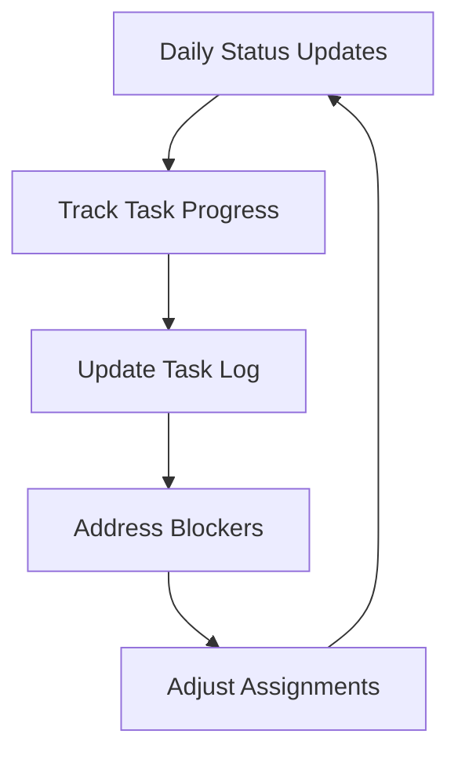

#### Implementation Steps:

1. **Daily Status Updates**:
   ```bash
   # Create daily status comment
   mcp_github_add_issue_comment({
     "owner": "user",
     "repo": "project",
     "issue_number": 1,
     "body": "## Daily Update\n\n- Progress: Implemented user model\n- Next: Implement authentication controller\n- Blockers: None"
   })
   ```

2. **Update Sprint Progress**:
   ```bash
   # Update sprint progress in task-log.md
   search_replace task-log.md "**Progress**: 0%" "**Progress**: 25%"
   ```

### 3. Sprint Review & Retrospective

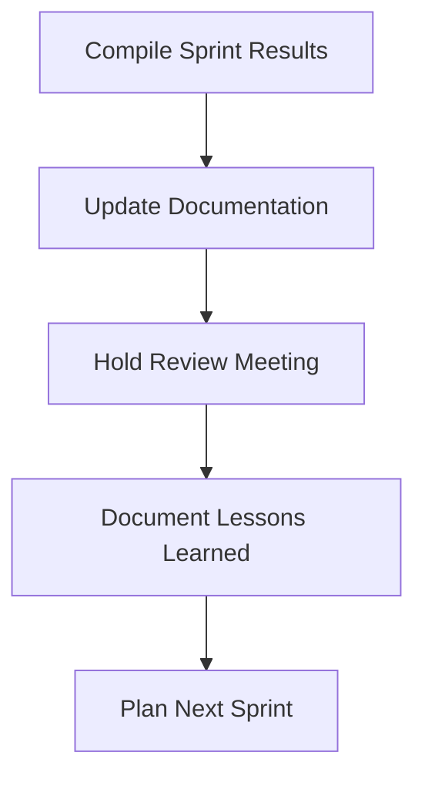

#### Implementation Steps:

1. **Compile Sprint Results**:
   ```bash
   # Generate sprint report
   gh api /repos/user/project/milestones/1/issues
   ```

2. **Update Documentation**:
   ```bash
   # Update dev-notes.md with sprint summary
   edit_file dev-notes.md
   
   # Add content
   ```markdown
   ## Sprint 1 Summary
   
   **Completed Tasks**:
   - ✅ [TASK-001] Implement Feature X
   - ✅ [TASK-002] Implement Feature Y
   
   **Technical Achievements**:
   - Implemented authentication system
   - Set up testing framework
   
   **Lessons Learned**:
   - Need more detailed requirements
   - Testing should start earlier
   ```
   ```

## 📝 Documentation Automation

### 1. Automated Documentation Updates

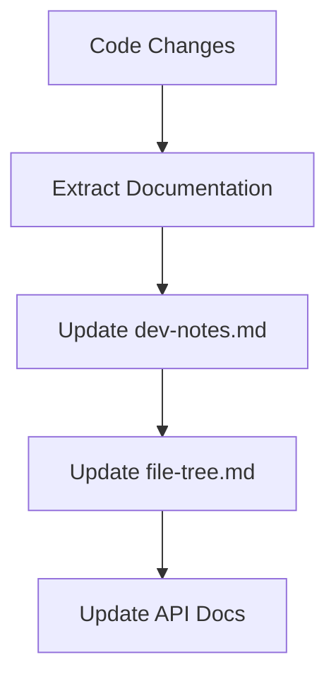

#### Implementation Steps:

1. **Extract Documentation from Code**:
   ```bash
   # Parse code comments for documentation
   grep_search "\/\*\*.*\*\/" --include_pattern "src/**/*.js"
   ```

2. **Update Technical Documentation**:
   ```bash
   # Update dev-notes.md with new technical details
   edit_file dev-notes.md
   ```

3. **Update File Tree**:
   ```bash
   # Generate updated file tree
   run_terminal_cmd "find src -type f | sort > temp-tree.txt"
   
   # Update file-tree.md
   edit_file file-tree.md
   ```

### 2. Automated Progress Reporting

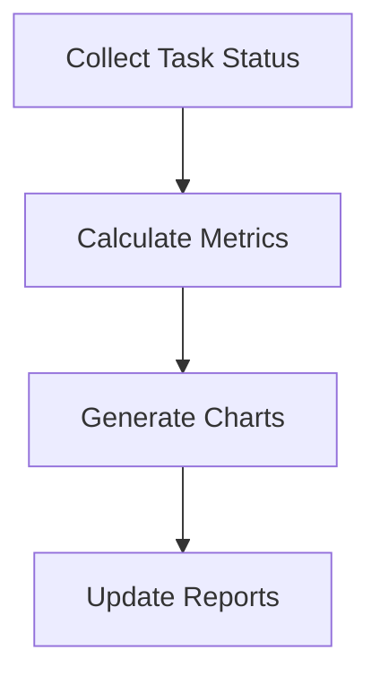

#### Implementation Steps:

1. **Collect Task Status**:
   ```bash
   # Get all issues with status
   mcp_github_list_issues({
     "owner": "user",
     "repo": "project",
     "state": "all"
   })
   ```

2. **Generate Progress Report**:
   ```bash
   # Create progress chart
   create_diagram({
     "content": `
     pie title Task Status
       "Completed" : 5
       "In Progress" : 3
       "Not Started" : 7
       "Blocked" : 1
     `
   })
   ```

3. **Update Progress Documentation**:
   ```bash
   # Update task-log.md with progress report
   edit_file task-log.md
   ```

## 📊 Progress Tracking & Reporting

### 1. Metrics Collection

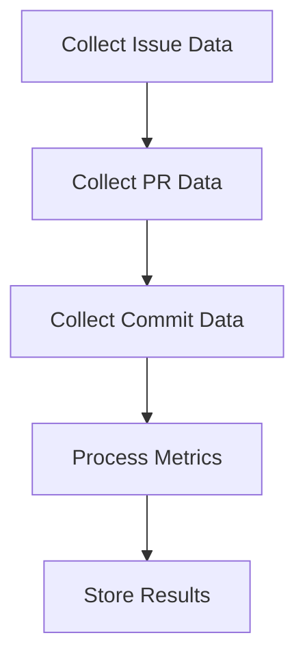

#### Implementation Steps:

1. **Collect Issue Data**:
   ```bash
   # Get issues created/closed in last week
   mcp_github_list_issues({
     "owner": "user",
     "repo": "project",
     "state": "all",
     "since": "2023-06-18T00:00:00Z"
   })
   ```

2. **Collect PR Data**:
   ```bash
   # Get PRs merged in last week
   mcp_github_list_pull_requests({
     "owner": "user",
     "repo": "project",
     "state": "closed"
   })
   ```

3. **Process and Store Metrics**:
   ```bash
   # Update metrics in task-log.md
   edit_file task-log.md
   
   # Add content
   ```markdown
   ## Weekly Metrics (June 18-25)
   
   - Issues Created: 5
   - Issues Closed: 3
   - PRs Merged: 4
   - Commits: 27
   - Code Changes: +1,245 / -523
   ```
   ```

### 2. Automated Reporting

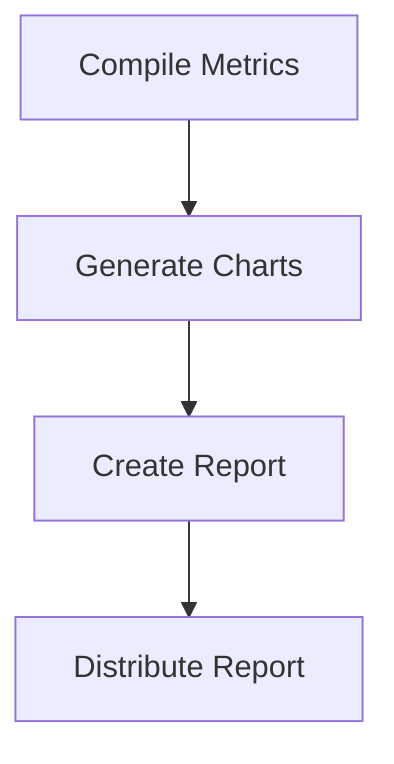

#### Implementation Steps:

1. **Generate Charts**:
   ```bash
   # Create burndown chart
   create_diagram({
     "content": `
     graph TD
       title Sprint Burndown
       xlabel Days
       ylabel Tasks Remaining
       1 --> 10
       2 --> 9
       3 --> 8
       4 --> 7
       5 --> 5
     `
   })
   ```

2. **Create and Distribute Report**:
   ```bash
   # Create weekly report issue
   mcp_github_create_issue({
     "owner": "user",
     "repo": "project",
     "title": "Weekly Progress Report: June 18-25",
     "body": "## Summary\n\n- Sprint Progress: 60%\n- Velocity: 15 points\n- Burndown: On track\n\n## Completed Tasks\n- [TASK-001] Feature X\n- [TASK-002] Feature Y\n\n## In Progress\n- [TASK-003] Feature Z\n\n## Blockers\n- None\n\n## Next Week\n- Complete Feature Z\n- Start Feature A",
     "labels": ["report"]
   })
   ```

## 🔄 Integration with Development Workflow

### 1. Code Review Integration

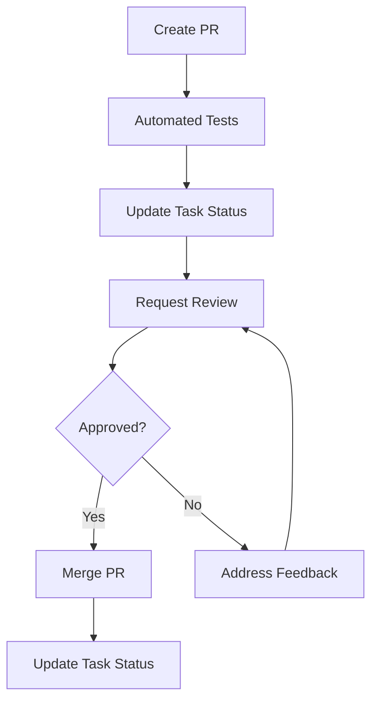

#### Implementation Steps:

1. **Create PR with Task Reference**:
   ```bash
   # Create PR that references issue
   mcp_github_create_pull_request({
     "owner": "user",
     "repo": "project",
     "title": "Implement Feature X",
     "body": "Closes #1\n\n## Changes\n- Added user model\n- Implemented authentication\n\n## Testing\n- Added unit tests\n- Tested login flow",
     "head": "feature/task-001",
     "base": "main"
   })
   ```

2. **Update Task Status on PR Creation**:
   ```bash
   # Update issue status to review
   mcp_github_update_issue({
     "owner": "user",
     "repo": "project",
     "issue_number": 1,
     "labels": ["status:review"]
   })
   ```

3. **Update Task Status on PR Merge**:
   ```bash
   # Update issue status to done on PR merge
   mcp_github_update_issue({
     "owner": "user",
     "repo": "project",
     "issue_number": 1,
     "labels": ["status:done"],
     "state": "closed"
   })
   ```

### 2. Continuous Documentation

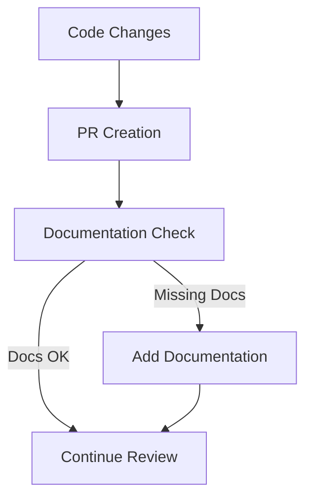

#### Implementation Steps:

1. **Check for Documentation**:
   ```bash
   # Check for documentation updates in PR
   mcp_github_get_pull_request_files({
     "owner": "user",
     "repo": "project",
     "pullNumber": 1
   })
   
   # Check if docs were updated
   grep_search "docs/" --include_pattern "*.md"
   ```

2. **Request Documentation Updates**:
   ```bash
   # Add comment requesting documentation
   mcp_github_add_issue_comment({
     "owner": "user",
     "repo": "project",
     "issue_number": 1,
     "body": "Please update the documentation to reflect these changes."
   })
   ```

## ✅ Best Practices

### 1. Project Management

- **Consistent Task Format**: Use standardized formats for all tasks
- **Regular Updates**: Update task status at least daily
- **Clear Ownership**: Assign every task to a specific owner
- **Visible Progress**: Make progress visible to all team members
- **Dependency Tracking**: Clearly document and track task dependencies

### 2. Documentation

- **Documentation as Code**: Treat documentation like code with reviews and versioning
- **Automated Updates**: Automate documentation updates where possible
- **Central Source of Truth**: Maintain task-log.md as the central record
- **Technical Documentation**: Keep detailed technical notes in dev-notes.md
- **Structure Documentation**: Maintain file-tree.md for project structure

### 3. AI Integration

- **Clear Instructions**: Provide clear instructions for AI agents
- **Consistent Formats**: Use consistent formats that AI can parse
- **Regular Validation**: Regularly validate AI-generated content
- **Feedback Loop**: Implement feedback mechanism for AI improvements
- **Human Oversight**: Maintain human oversight for critical decisions

### 4. Workflow Optimization

- **Minimize Handoffs**: Reduce the number of task handoffs
- **Automate Repetitive Tasks**: Use automation for status updates and reporting
- **Standardize Processes**: Create standard processes for common tasks
- **Continuous Improvement**: Regularly review and improve workflows
- **Measure Progress**: Use metrics to track and improve productivity

---

Made with Power, Love, and AI •  ⚡️❤️🤖 •  POWERBRIDGE.AI 