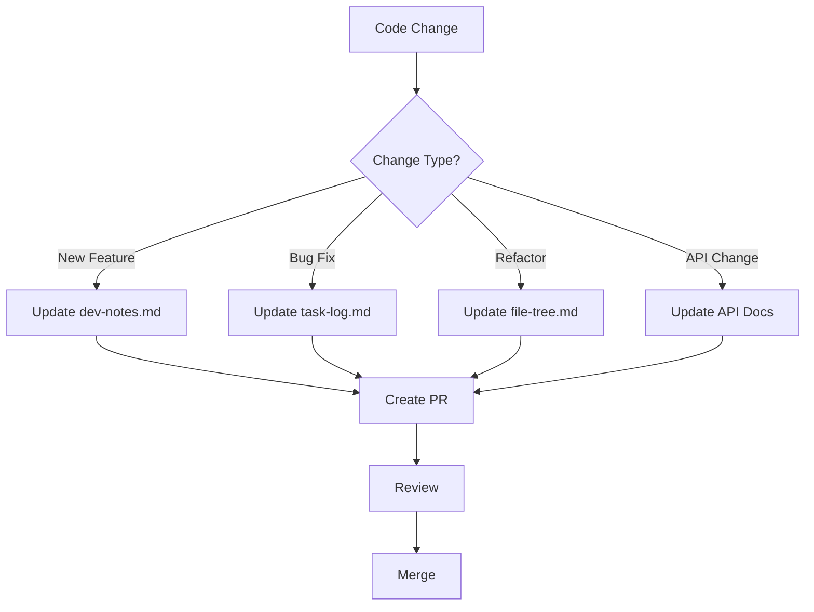
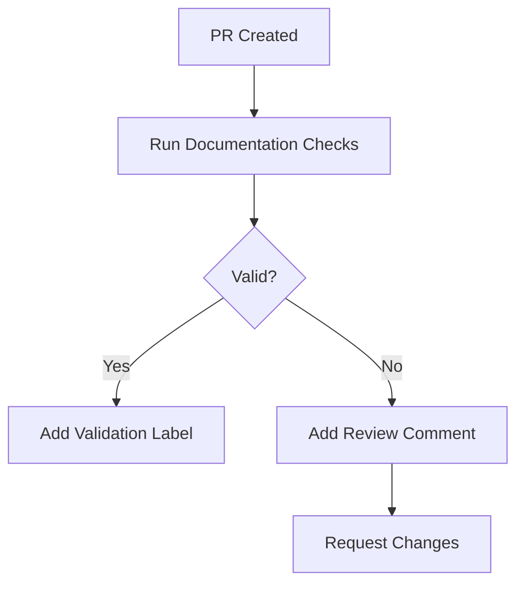
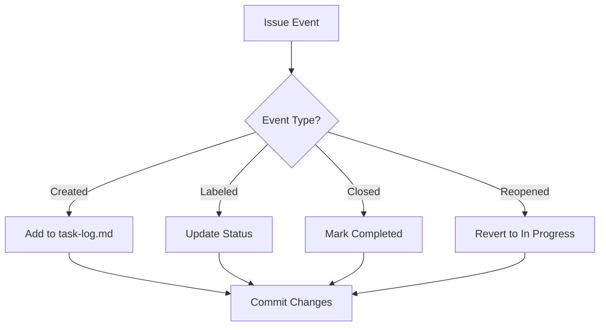
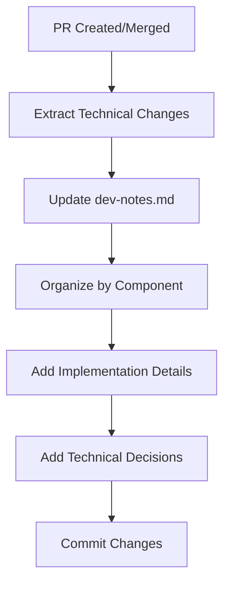
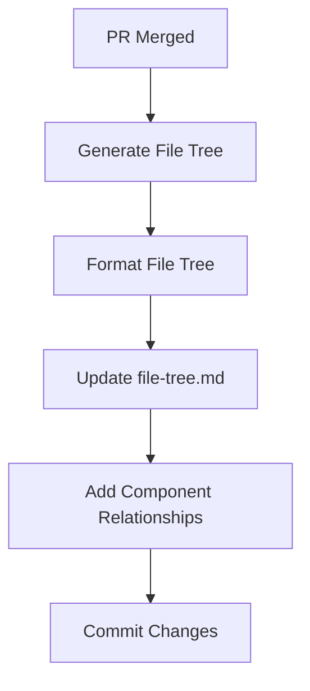
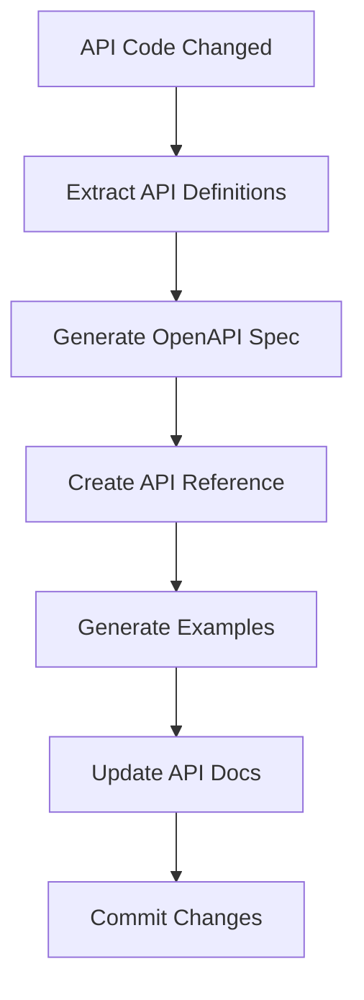
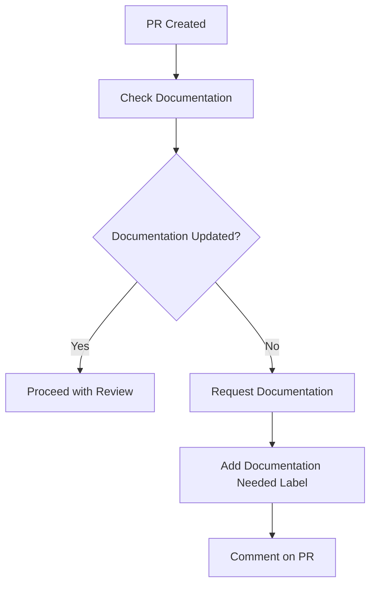

# 📄 Automated Documentation Management

> A comprehensive guide for automating documentation workflows using Cursor AI and GitHub integration.

## 📋 Table of Contents
- [Overview](#overview)
- [Documentation Structure](#documentation-structure)
- [Documentation Automation Workflows](#documentation-automation-workflows)
- [Task Log Management](#task-log-management)
- [Technical Documentation](#technical-documentation)
- [Project Structure Documentation](#project-structure-documentation)
- [API Documentation](#api-documentation)
- [Integration with Development Workflow](#integration-with-development-workflow)
- [Best Practices](#best-practices)
- [Troubleshooting](#troubleshooting)

## 🔍 Overview

This guide details how to implement automated documentation workflows using Cursor AI and GitHub integration. The approach ensures documentation stays current with code changes, maintains consistency across documents, and reduces manual documentation overhead.

## 📚 Documentation Structure

### 1. Core Documentation Files

Establish a consistent documentation structure with these core files:

```
project-root/
├── task-log.md           # Task tracking and progress
├── dev-notes.md          # Technical implementation details
├── file-tree.md          # Project structure documentation
├── docs/
│   ├── api/              # API documentation
│   ├── guides/           # User and developer guides
│   ├── tutorials/        # Step-by-step tutorials
│   └── reference/        # Reference documentation
└── README.md             # Project overview
```

### 2. Documentation File Purposes

Each documentation file serves a specific purpose:

1. **task-log.md**: Tracks tasks, their status, dependencies, and progress
2. **dev-notes.md**: Contains technical implementation details, decisions, and architecture
3. **file-tree.md**: Documents project structure, component relationships, and organization
4. **API Documentation**: Documents endpoints, parameters, responses, and examples
5. **Guides and Tutorials**: Provides user and developer instructions

### 3. Documentation Templates

Create standardized templates for consistency:

```bash
# Create task log template
mcp_github_create_or_update_file({
  "owner": "user",
  "repo": "project",
  "path": "templates/task-log-template.md",
  "content": `# Task Log

## Current Tasks

- 🔴 [TASK-XXX] Task Title
  - Priority: [High/Medium/Low]
  - Assigned: [@username]
  - Dependencies: [None/TASK-XXX]
  
## Completed Tasks

- ✅ [TASK-XXX] Task Title
  - Completed: YYYY-MM-DD
  - PR: #XX
  
## Task Status Legend
- 🔴 Not Started
- 🟡 In Progress
- 🔵 Testing
- 🟢 Completed
- ⭕️ Blocked
- ✅ Verified
`,
  "message": "Add task log template",
  "branch": "main"
})
```

## 🔄 Documentation Automation Workflows

### 1. Automated Documentation Updates



#### Implementation Steps:

1. **Configure GitHub Actions Workflow**:
   ```yaml
   # .github/workflows/documentation.yml
   name: Documentation
   
   on:
     push:
       branches: [main]
       paths:
         - 'src/**'
         - 'api/**'
     pull_request:
       types: [opened, synchronize]
   
   jobs:
     update_docs:
       runs-on: ubuntu-latest
       steps:
         - uses: actions/checkout@v2
         - name: Update Documentation
           uses: actions/github-script@v6
           with:
             github-token: ${{ secrets.GITHUB_TOKEN }}
             script: |
               // Documentation update script
               const changedFiles = await getChangedFiles();
               await updateDocumentation(changedFiles);
   ```

2. **Create Documentation Update Script**:
   ```javascript
   // scripts/update-docs.js
   async function updateDocumentation(changedFiles) {
     // Categorize changes
     const changes = categorizeChanges(changedFiles);
     
     // Update appropriate documentation
     if (changes.features.length > 0) {
       await updateDevNotes(changes.features);
     }
     
     if (changes.bugfixes.length > 0) {
       await updateTaskLog(changes.bugfixes);
     }
     
     if (changes.structure.length > 0) {
       await updateFileTree();
     }
     
     if (changes.api.length > 0) {
       await updateApiDocs(changes.api);
     }
   }
   ```

### 2. Documentation Validation



#### Implementation Steps:

1. **Create Documentation Validation Workflow**:
   ```yaml
   # .github/workflows/validate-docs.yml
   name: Validate Documentation
   
   on:
     pull_request:
       types: [opened, synchronize]
   
   jobs:
     validate:
       runs-on: ubuntu-latest
       steps:
         - uses: actions/checkout@v2
         - name: Validate Documentation
           uses: actions/github-script@v6
           with:
             github-token: ${{ secrets.GITHUB_TOKEN }}
             script: |
               // Documentation validation script
               const result = await validateDocumentation();
               if (!result.valid) {
                 core.setFailed(`Documentation validation failed: ${result.errors.join(', ')}`);
               }
   ```

2. **Create Documentation Validation Script**:
   ```javascript
   // scripts/validate-docs.js
   async function validateDocumentation() {
     const errors = [];
     
     // Check task log format
     const taskLogValid = await validateTaskLog();
     if (!taskLogValid.valid) {
       errors.push(...taskLogValid.errors);
     }
     
     // Check dev notes format
     const devNotesValid = await validateDevNotes();
     if (!devNotesValid.valid) {
       errors.push(...devNotesValid.errors);
     }
     
     // Check file tree format
     const fileTreeValid = await validateFileTree();
     if (!fileTreeValid.valid) {
       errors.push(...fileTreeValid.errors);
     }
     
     return {
       valid: errors.length === 0,
       errors
     };
   }
   ```

## 📝 Task Log Management

### 1. Automated Task Status Updates



#### Implementation Steps:

1. **Configure Issue Event Handler**:
   ```javascript
   // scripts/task-log-updater.js
   async function handleIssueEvent(event) {
     const issue = event.issue;
     const action = event.action;
     
     // Get current task log content
     const taskLog = await getFileContent('task-log.md');
     
     // Update task log based on event
     let updatedTaskLog = taskLog;
     
     if (action === 'opened') {
       updatedTaskLog = addTaskToTaskLog(taskLog, issue);
     } else if (action === 'labeled') {
       updatedTaskLog = updateTaskStatus(taskLog, issue);
     } else if (action === 'closed') {
       updatedTaskLog = markTaskCompleted(taskLog, issue);
     } else if (action === 'reopened') {
       updatedTaskLog = markTaskInProgress(taskLog, issue);
     }
     
     // Commit updated task log
     if (updatedTaskLog !== taskLog) {
       await commitFile('task-log.md', updatedTaskLog, `Update task log for #${issue.number}`);
     }
   }
   ```

2. **Task Status Mapping Functions**:
   ```javascript
   function getTaskStatus(issue) {
     // Map GitHub labels to task status
     const labels = issue.labels.map(label => label.name);
     
     if (labels.includes('status:completed')) return '🟢';
     if (labels.includes('status:in-progress')) return '🟡';
     if (labels.includes('status:testing')) return '🔵';
     if (labels.includes('status:blocked')) return '⭕️';
     if (issue.state === 'closed') return '✅';
     
     return '🔴'; // Default to Not Started
   }
   ```

### 2. Task Log Formatting

Ensure consistent task log formatting:

```javascript
function formatTaskEntry(issue) {
  const status = getTaskStatus(issue);
  const taskId = getTaskId(issue);
  const assignee = issue.assignee ? `@${issue.assignee.login}` : 'Unassigned';
  const priority = getIssuePriority(issue);
  
  return `- ${status} [${taskId}] ${issue.title}
  - Priority: ${priority}
  - Assigned: ${assignee}
  - Dependencies: ${getDependencies(issue)}`;
}
```

## 🔧 Technical Documentation

### 1. Automated Dev Notes Updates



#### Implementation Steps:

1. **Extract Technical Changes**:
   ```javascript
   async function extractTechnicalChanges(pr) {
     // Get PR diff
     const diff = await mcp_github_get_pull_request_diff({
       owner: currentRepo.owner,
       repo: currentRepo.name,
       pullNumber: pr.number
     });
     
     // Parse diff to extract technical changes
     const changes = parseDiff(diff);
     
     // Group changes by component
     const componentChanges = groupByComponent(changes);
     
     return componentChanges;
   }
   ```

2. **Update Dev Notes**:
   ```javascript
   async function updateDevNotes(componentChanges) {
     // Get current dev notes
     const devNotes = await getFileContent('dev-notes.md');
     
     // Update dev notes with changes
     let updatedDevNotes = devNotes;
     
     for (const [component, changes] of Object.entries(componentChanges)) {
       const componentSection = getComponentSection(devNotes, component);
       const updatedSection = updateComponentSection(componentSection, changes);
       updatedDevNotes = replaceComponentSection(updatedDevNotes, component, updatedSection);
     }
     
     // Commit updated dev notes
     if (updatedDevNotes !== devNotes) {
       await commitFile('dev-notes.md', updatedDevNotes, 'Update dev notes with technical changes');
     }
   }
   ```

### 2. Technical Documentation Templates

Create templates for different types of technical documentation:

```javascript
function generateComponentDocTemplate(component) {
  return `## ${component}

### Overview
[Brief description of the component]

### Implementation Details
- [Key implementation detail 1]
- [Key implementation detail 2]

### Technical Decisions
- [Decision 1]: [Rationale]
- [Decision 2]: [Rationale]

### Dependencies
- [Dependency 1]
- [Dependency 2]
`;
}
```

## 🌳 Project Structure Documentation

### 1. Automated File Tree Updates



#### Implementation Steps:

1. **Generate File Tree**:
   ```javascript
   async function generateFileTree() {
     // Use git ls-files to get all tracked files
     const result = await execCommand('git ls-files');
     const files = result.stdout.split('\n').filter(Boolean);
     
     // Build tree structure
     const tree = buildTreeStructure(files);
     
     // Format tree for markdown
     const formattedTree = formatTreeForMarkdown(tree);
     
     return formattedTree;
   }
   ```

2. **Update File Tree Document**:
   ```javascript
   async function updateFileTree() {
     // Generate file tree
     const fileTree = await generateFileTree();
     
     // Get component relationships
     const relationships = await generateComponentRelationships();
     
     // Create file tree document content
     const content = `# Project Structure

## File Tree
\`\`\`
${fileTree}
\`\`\`

## Component Relationships
${relationships}

## Directory Purposes
${generateDirectoryPurposes()}
`;
     
     // Commit updated file tree
     await commitFile('file-tree.md', content, 'Update project file tree');
   }
   ```

### 2. Component Relationship Documentation

Generate and document component relationships:

```javascript
async function generateComponentRelationships() {
  // Analyze import statements to determine relationships
  const imports = await analyzeImports();
  
  // Generate mermaid diagram
  const diagram = `\`\`\`mermaid
graph TD
${imports.map(imp => `    ${imp.from} --> ${imp.to}`).join('\n')}
\`\`\``;
  
  return diagram;
}
```

## 📚 API Documentation

### 1. Automated API Documentation Generation



#### Implementation Steps:

1. **Extract API Definitions**:
   ```javascript
   async function extractApiDefinitions() {
     // Find API definition files
     const apiFiles = await findApiFiles();
     
     // Extract API definitions from files
     const definitions = [];
     
     for (const file of apiFiles) {
       const content = await getFileContent(file);
       const fileDefinitions = parseApiDefinitions(content, file);
       definitions.push(...fileDefinitions);
     }
     
     return definitions;
   }
   ```

2. **Generate OpenAPI Specification**:
   ```javascript
   async function generateOpenApiSpec(definitions) {
     // Create OpenAPI structure
     const openapi = {
       openapi: '3.0.0',
       info: {
         title: 'API Documentation',
         version: '1.0.0'
       },
       paths: {}
     };
     
     // Add paths from definitions
     for (const def of definitions) {
       if (!openapi.paths[def.path]) {
         openapi.paths[def.path] = {};
       }
       
       openapi.paths[def.path][def.method.toLowerCase()] = {
         summary: def.summary,
         description: def.description,
         parameters: def.parameters,
         responses: def.responses
       };
     }
     
     return openapi;
   }
   ```

3. **Update API Documentation**:
   ```javascript
   async function updateApiDocs(openapi) {
     // Convert OpenAPI spec to markdown
     const markdown = convertOpenApiToMarkdown(openapi);
     
     // Update API documentation files
     await commitFile('docs/api/reference.md', markdown, 'Update API documentation');
   }
   ```

### 2. API Documentation Templates

Create templates for API documentation:

```javascript
function generateApiEndpointTemplate(endpoint) {
  return `## ${endpoint.method} ${endpoint.path}

### Description
${endpoint.description}

### Parameters
${formatParameters(endpoint.parameters)}

### Request Example
\`\`\`json
${JSON.stringify(endpoint.requestExample, null, 2)}
\`\`\`

### Response
${formatResponses(endpoint.responses)}

### Response Example
\`\`\`json
${JSON.stringify(endpoint.responseExample, null, 2)}
\`\`\`
`;
}
```

## 🔄 Integration with Development Workflow

### 1. PR Documentation Requirements



#### Implementation Steps:

1. **Check Documentation Updates**:
   ```javascript
   async function checkDocumentationUpdates(pr) {
     // Get changed files in PR
     const files = await mcp_github_get_pull_request_files({
       owner: currentRepo.owner,
       repo: currentRepo.name,
       pullNumber: pr.number
     });
     
     // Check if documentation files are included
     const docFiles = files.filter(file => isDocumentationFile(file.filename));
     
     // Check if documentation is needed based on changed files
     const needsDocs = needsDocumentation(files);
     
     return {
       hasDocChanges: docFiles.length > 0,
       needsDocs
     };
   }
   ```

2. **Request Documentation Updates**:
   ```javascript
   async function requestDocumentationUpdates(pr, checkResult) {
     if (checkResult.needsDocs && !checkResult.hasDocChanges) {
       // Add documentation needed label
       await mcp_github_update_issue({
         owner: currentRepo.owner,
         repo: currentRepo.name,
         issue_number: pr.number,
         labels: ['documentation-needed']
       });
       
       // Add comment requesting documentation
       await mcp_github_add_issue_comment({
         owner: currentRepo.owner,
         repo: currentRepo.name,
         issue_number: pr.number,
         body: 'This PR requires documentation updates. Please update the following documentation:\n\n' +
               getDocumentationRequirements(checkResult.needsDocs)
       });
     }
   }
   ```

### 2. Documentation Review Process

Implement a documentation review process:

```javascript
async function reviewDocumentation(pr) {
  // Get documentation files in PR
  const files = await mcp_github_get_pull_request_files({
    owner: currentRepo.owner,
    repo: currentRepo.name,
    pullNumber: pr.number
  });
  
  const docFiles = files.filter(file => isDocumentationFile(file.filename));
  
  // Review each documentation file
  const comments = [];
  
  for (const file of docFiles) {
    const content = await getFileContent(file.filename);
    const fileComments = reviewDocumentationFile(file.filename, content);
    comments.push(...fileComments);
  }
  
  // Add review comments
  if (comments.length > 0) {
    await addReviewComments(pr.number, comments);
  }
}
```

## ✅ Best Practices

### 1. Documentation Organization

- **Consistent Structure**: Maintain consistent documentation structure
- **Clear Separation**: Separate user, developer, and API documentation
- **Logical Grouping**: Group related documentation together
- **Progressive Disclosure**: Present information in layers of increasing detail
- **Cross-References**: Use cross-references between related documentation

### 2. Documentation Automation

- **Automate Repetitive Updates**: Automate status updates and formatting
- **Generate from Code**: Generate technical documentation from code
- **Validate Automatically**: Automatically validate documentation format
- **Link to Source**: Link documentation to source code
- **Version Documentation**: Keep documentation versioned with code

### 3. Documentation Quality

- **Clear Language**: Use clear, concise language
- **Consistent Formatting**: Maintain consistent formatting
- **Complete Information**: Provide complete information
- **Current Content**: Keep documentation up to date
- **Practical Examples**: Include practical examples

### 4. Documentation Workflow

- **Documentation First**: Write documentation before implementation
- **Review Documentation**: Include documentation in code reviews
- **Update with Code**: Update documentation with code changes
- **Regular Audits**: Regularly audit documentation for accuracy
- **User Feedback**: Incorporate user feedback into documentation

## ❗ Troubleshooting

### Common Issues

1. **Documentation Drift**:
   - **Issue**: Documentation becomes outdated
   - **Solution**: Implement automated checks to detect and flag outdated documentation

2. **Inconsistent Formatting**:
   - **Issue**: Documentation formatting varies across files
   - **Solution**: Use templates and automated formatting tools

3. **Missing Documentation**:
   - **Issue**: New features lack documentation
   - **Solution**: Enforce documentation requirements in PR reviews

4. **Documentation Conflicts**:
   - **Issue**: Conflicting information in documentation
   - **Solution**: Centralize documentation and implement cross-reference checks

### Resolution Process

1. Identify documentation issues
2. Prioritize based on impact
3. Update documentation
4. Implement preventive measures
5. Validate changes

---

Made with Power, Love, and AI •  ⚡️❤️�� •  POWERBRIDGE.AI
