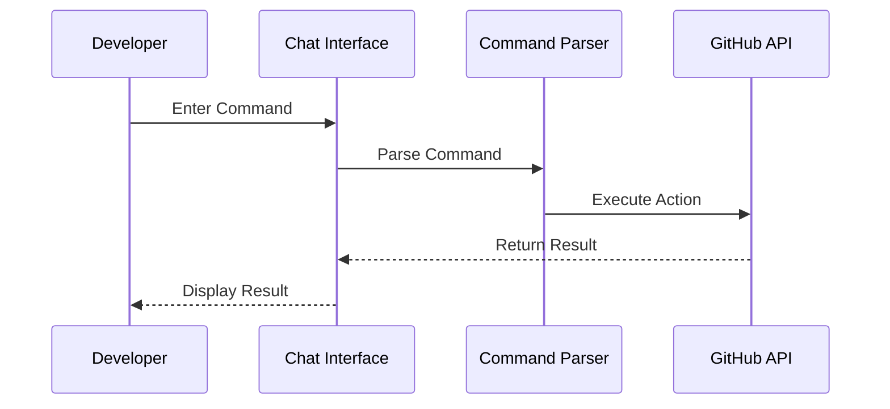

# 💬 Chat Command Automation

> A comprehensive guide for automating GitHub workflows using chat commands in Cursor AI.

## 📋 Table of Contents
- [Overview](#overview)
- [Chat Command Setup](#chat-command-setup)
- [Command Structure](#command-structure)
- [Task Management Commands](#task-management-commands)
- [Project Management Commands](#project-management-commands)
- [Code Management Commands](#code-management-commands)
- [Documentation Commands](#documentation-commands)
- [Advanced Chat Workflows](#advanced-chat-workflows)
- [Best Practices](#best-practices)
- [Troubleshooting](#troubleshooting)

## 🔍 Overview

This guide details how to use chat commands with Cursor AI to automate GitHub workflows. Chat commands provide a text-based interface for project management, offering precise control and advanced options for task management, code operations, and documentation.

## 🛠️ Chat Command Setup

### 1. Prerequisites

Before using chat commands, ensure you have:

1. **Cursor AI** with chat interface enabled
2. **GitHub MCP Server** properly configured
3. **GitHub Personal Access Token** with appropriate permissions
4. **Repository Access** to the target repositories

### 2. Chat Interface Configuration

Configure Cursor AI for optimal chat command processing:

1. **Enable Chat Interface**:
   ```bash
   # Open Cursor AI settings
   cursor --settings chat
   
   # Or use keyboard shortcut
   Ctrl+Shift+P > "Chat Settings"
   ```

2. **Configure Command Prefix** (if applicable):
   ```bash
   # Set custom command prefix
   cursor --set-command-prefix "/"
   ```

3. **Test Chat Command**:
   ```bash
   # Test basic chat command
   /help
   ```

### 3. GitHub Integration Setup

Ensure GitHub integration is properly configured:

```bash
# Check GitHub MCP connection
/github status

# Expected response
"GitHub connection is active with token for user: username"
```

## 🎯 Command Structure

### 1. Basic Command Pattern

Chat commands follow this general structure:

```
/command [subcommand] [target] [--options]
```

Examples:
- `/task create "Implement authentication" --priority high`
- `/issue update 42 --status "in progress"`
- `/pr list --state open`

### 2. Command Flow



### 3. Command Processing

Cursor AI processes chat commands through these steps:

1. **Command Parsing**: Identifies command, subcommand, and options
2. **Parameter Validation**: Validates required and optional parameters
3. **API Call Generation**: Converts to appropriate MCP calls
4. **Result Formatting**: Formats and displays results

## 📝 Task Management Commands

### 1. Task Creation Commands

```bash
# Create basic task
/task create "Implement user authentication"

# Create detailed task
/task create "Implement JWT authentication" --description "Add secure JWT-based authentication with refresh tokens" --priority high --assignee @security-team

# Create task with labels
/task create "Fix login issue" --type bug --labels frontend,critical
```

#### Implementation Details:

```javascript
// Chat command processing for task creation
function processTaskCreation(command, options) {
  // Extract task details
  const title = command.args[0];
  const description = options.description || '';
  const priority = options.priority || 'medium';
  const labels = options.labels ? options.labels.split(',') : [];
  const assignees = options.assignee ? [options.assignee.replace('@', '')] : [];
  
  if (options.type) {
    labels.push(options.type);
  }
  
  // Create GitHub issue
  return mcp_github_create_issue({
    owner: currentRepo.owner,
    repo: currentRepo.name,
    title: formatTaskTitle(title, priority),
    body: formatTaskDescription(description),
    labels: labels,
    assignees: assignees
  });
}
```

### 2. Task Update Commands

```bash
# Update task status
/task update 42 --status "in progress"

# Add comment to task
/task comment 42 "Implemented user model and started on authentication controller"

# Assign task
/task assign 42 --to @developer

# Add labels
/task label 42 --add security,backend
```

#### Implementation Details:

```javascript
// Chat command processing for task updates
function processTaskUpdate(command, options) {
  // Extract task details
  const issueNumber = parseInt(command.args[0]);
  const status = options.status;
  
  // Update task status
  if (status) {
    return mcp_github_update_issue({
      owner: currentRepo.owner,
      repo: currentRepo.name,
      issue_number: issueNumber,
      labels: [`status:${status.replace(/\s/g, '-')}`]
    });
  }
}

function processTaskComment(command, options) {
  // Extract comment details
  const issueNumber = parseInt(command.args[0]);
  const comment = command.args[1];
  
  // Add comment
  return mcp_github_add_issue_comment({
    owner: currentRepo.owner,
    repo: currentRepo.name,
    issue_number: issueNumber,
    body: comment
  });
}
```

### 3. Task Query Commands

```bash
# List tasks
/task list

# List tasks by status
/task list --status "in progress"

# List tasks by assignee
/task list --assignee @me

# Get task details
/task show 42
```

#### Implementation Details:

```javascript
// Chat command processing for task queries
function processTaskQuery(command, options) {
  // Extract query parameters
  const status = options.status;
  const assignee = options.assignee ? options.assignee.replace('@', '') : undefined;
  
  // List tasks with filters
  return mcp_github_list_issues({
    owner: currentRepo.owner,
    repo: currentRepo.name,
    state: options.state || "open",
    labels: status ? [`status:${status.replace(/\s/g, '-')}`] : undefined,
    assignee: assignee
  });
}

function processTaskShow(command) {
  // Get issue details
  const issueNumber = parseInt(command.args[0]);
  
  return mcp_github_get_issue({
    owner: currentRepo.owner,
    repo: currentRepo.name,
    issue_number: issueNumber
  });
}
```

## 📊 Project Management Commands

### 1. Sprint Management Commands

```bash
# Create sprint
/sprint create "Sprint 1" --duration 2w --goal "Implement authentication system"

# Add task to sprint
/sprint add 42 --sprint 1

# Start sprint
/sprint start 1

# End sprint
/sprint end 1 --report
```

#### Implementation Details:

```javascript
// Chat command processing for sprint management
function processSprintCreate(command, options) {
  // Extract sprint details
  const name = command.args[0];
  const duration = options.duration || '2w';
  const goal = options.goal || '';
  
  // Calculate due date
  const dueDate = calculateDueDate(duration);
  
  // Create milestone
  return createMilestone(name, goal, dueDate);
}

function processSprintAdd(command, options) {
  // Extract details
  const issueNumber = parseInt(command.args[0]);
  const sprintNumber = parseInt(options.sprint);
  
  // Get milestone number
  const milestoneNumber = getMilestoneNumberFromSprint(sprintNumber);
  
  // Add issue to milestone
  return mcp_github_update_issue({
    owner: currentRepo.owner,
    repo: currentRepo.name,
    issue_number: issueNumber,
    milestone: milestoneNumber
  });
}
```

### 2. Project Board Commands

```bash
# Create project board
/project create "Authentication System" --template kanban

# Add task to board
/project add 42 --board "Authentication System" --column "To Do"

# Move task between columns
/project move 42 --column "In Progress"

# Show board status
/project status "Authentication System"
```

#### Implementation Details:

```javascript
// Chat command processing for project board management
function processProjectCreate(command, options) {
  // Extract board details
  const name = command.args[0];
  const template = options.template || 'basic';
  
  // Create project board
  return createProjectBoard(name, template);
}

function processProjectAdd(command, options) {
  // Extract details
  const issueNumber = parseInt(command.args[0]);
  const boardName = options.board;
  const column = options.column;
  
  // Add to project board
  return addTaskToProjectBoard(issueNumber, boardName, column);
}
```

## 💻 Code Management Commands

### 1. Branch Management Commands

```bash
# Create branch
/branch create "feature/authentication" --from main

# Switch branch
/branch switch "feature/authentication"

# List branches
/branch list

# Delete branch
/branch delete "feature/old-feature"
```

#### Implementation Details:

```javascript
// Chat command processing for branch management
function processBranchCreate(command, options) {
  // Extract branch details
  const branchName = command.args[0];
  const baseBranch = options.from || 'main';
  
  // Create branch
  return mcp_github_create_branch({
    owner: currentRepo.owner,
    repo: currentRepo.name,
    branch: branchName,
    from_branch: baseBranch
  });
}

function processBranchList() {
  // List branches
  return mcp_github_list_branches({
    owner: currentRepo.owner,
    repo: currentRepo.name
  });
}
```

### 2. Pull Request Commands

```bash
# Create pull request
/pr create --title "Implement authentication system" --head feature/authentication --base main

# Review pull request
/pr review 42

# Merge pull request
/pr merge 42 --method squash

# List pull requests
/pr list --state open
```

#### Implementation Details:

```javascript
// Chat command processing for pull request management
function processPRCreate(command, options) {
  // Extract PR details
  const title = options.title;
  const headBranch = options.head;
  const baseBranch = options.base || 'main';
  
  // Create pull request
  return mcp_github_create_pull_request({
    owner: currentRepo.owner,
    repo: currentRepo.name,
    title: title,
    head: headBranch,
    base: baseBranch,
    body: options.body || generatePRDescription(title)
  });
}

function processPRMerge(command, options) {
  // Extract PR details
  const prNumber = parseInt(command.args[0]);
  const method = options.method || 'squash';
  
  // Merge pull request
  return mcp_github_merge_pull_request({
    owner: currentRepo.owner,
    repo: currentRepo.name,
    pullNumber: prNumber,
    merge_method: method
  });
}
```

### 3. Code Review Commands

```bash
# Start code review
/review start 42

# Add review comment
/review comment 42 --file src/auth.js --line 15 --body "Consider using async/await here"

# Approve pull request
/review approve 42 --comment "Looks good"

# Request changes
/review request-changes 42 --comment "Needs more tests"
```

#### Implementation Details:

```javascript
// Chat command processing for code review
function processReviewApprove(command, options) {
  // Extract review details
  const prNumber = parseInt(command.args[0]);
  const comment = options.comment || '';
  
  // Submit review
  return mcp_github_create_and_submit_pull_request_review({
    owner: currentRepo.owner,
    repo: currentRepo.name,
    pullNumber: prNumber,
    event: "APPROVE",
    body: comment
  });
}

function processReviewRequestChanges(command, options) {
  // Extract review details
  const prNumber = parseInt(command.args[0]);
  const comment = options.comment || '';
  
  // Submit review
  return mcp_github_create_and_submit_pull_request_review({
    owner: currentRepo.owner,
    repo: currentRepo.name,
    pullNumber: prNumber,
    event: "REQUEST_CHANGES",
    body: comment
  });
}
```

## 📄 Documentation Commands

### 1. Documentation Creation Commands

```bash
# Create documentation file
/docs create "Authentication API" --template api

# Generate API documentation
/docs generate-api "Authentication Endpoints"

# Create README
/docs create-readme --title "Authentication Service"

# Update documentation
/docs update "Authentication" --content "Added refresh token information"
```

#### Implementation Details:

```javascript
// Chat command processing for documentation creation
function processDocsCreate(command, options) {
  // Extract documentation details
  const component = command.args[0];
  const template = options.template || 'default';
  
  // Generate file name
  const fileName = `docs/${component.toLowerCase().replace(/\s/g, '-')}.md`;
  
  // Generate content
  const fileContent = generateDocumentationTemplate(component, template);
  
  // Create documentation file
  return mcp_github_create_or_update_file({
    owner: currentRepo.owner,
    repo: currentRepo.name,
    path: fileName,
    content: fileContent,
    message: `Add documentation for ${component}`,
    branch: 'main'
  });
}
```

### 2. Documentation Update Commands

```bash
# Update task log
/docs update-task-log --task 42 --status completed

# Update dev notes
/docs update-dev-notes --section "Authentication" --content "Implementation details..."

# Update file tree
/docs update-file-tree

# Generate release notes
/docs release-notes --version 1.0
```

#### Implementation Details:

```javascript
// Chat command processing for documentation updates
function processDocsUpdateTaskLog(command, options) {
  // Extract update details
  const taskId = options.task;
  const status = options.status;
  
  // Update task log
  return updateTaskLog(taskId, status);
}

function processDocsUpdateDevNotes(command, options) {
  // Extract update details
  const section = options.section;
  const content = options.content;
  
  // Update dev notes
  return updateDevNotes(section, content);
}
```

## 🔄 Advanced Chat Workflows

### 1. Command Chaining

Chain multiple commands together for complex operations:

```bash
# Task creation and assignment workflow
/task create "Implement user authentication" && /task assign latest --to @security-team && /sprint add latest --sprint 1

# Branch and PR workflow
/branch create "feature/authentication" --from main && /pr create --title "Implement authentication" --head feature/authentication --base main

# Documentation workflow
/task update 42 --status completed && /docs update-task-log --task 42 --status completed
```

#### Implementation Details:

```javascript
// Processing chained commands
function processChainedCommands(commandString) {
  // Split into individual commands
  const commands = commandString.split('&&').map(cmd => cmd.trim());
  
  // Execute commands in sequence
  return executeCommandSequence(commands);
}
```

### 2. Command Aliases

Create shortcuts for commonly used commands:

```bash
# Define aliases
/alias define "new-task" "/task create"
/alias define "done" "/task update --status completed"
/alias define "pr" "/pr create --head $1 --base main --title $2"

# Use aliases
/new-task "Implement authentication"
/done 42
/pr feature/authentication "Add authentication system"
```

#### Implementation Details:

```javascript
// Alias management
const aliases = {};

function processAliasDefine(command) {
  // Extract alias details
  const name = command.args[0];
  const definition = command.args[1];
  
  // Store alias
  aliases[name] = definition;
  
  return `Alias ${name} defined successfully.`;
}

function processAliasCommand(command) {
  // Get alias definition
  const aliasName = command.name;
  const aliasDefinition = aliases[aliasName];
  
  if (!aliasDefinition) {
    return `Alias ${aliasName} not found.`;
  }
  
  // Replace parameters
  const processedCommand = replaceAliasParameters(aliasDefinition, command.args);
  
  // Execute command
  return processCommand(processedCommand);
}
```

### 3. Bulk Operations

Perform operations on multiple items at once:

```bash
# Bulk task update
/task bulk-update --ids 42,43,44 --status "in progress"

# Bulk task creation
/task bulk-create --file tasks.json

# Bulk labeling
/task bulk-label --query "is:open is:issue" --add feature --remove bug
```

#### Implementation Details:

```javascript
// Bulk operations processing
function processBulkUpdate(command, options) {
  // Extract details
  const ids = options.ids.split(',').map(id => parseInt(id.trim()));
  const status = options.status;
  
  // Process each ID
  return Promise.all(ids.map(id => {
    return mcp_github_update_issue({
      owner: currentRepo.owner,
      repo: currentRepo.name,
      issue_number: id,
      labels: [`status:${status.replace(/\s/g, '-')}`]
    });
  }));
}
```

### 4. Interactive Workflows

Create interactive workflows with prompts:

```bash
# Interactive task creation
/task create-interactive

# Interactive PR workflow
/pr workflow

# Interactive sprint planning
/sprint plan
```

#### Implementation Details:

```javascript
// Interactive workflow processing
async function processInteractiveTaskCreation() {
  // Prompt for title
  const title = await promptUser("Enter task title:");
  
  // Prompt for description
  const description = await promptUser("Enter task description (optional):");
  
  // Prompt for priority
  const priority = await promptUser("Enter priority (high/medium/low):", "medium");
  
  // Create task
  return mcp_github_create_issue({
    owner: currentRepo.owner,
    repo: currentRepo.name,
    title: title,
    body: description,
    labels: [`priority:${priority}`]
  });
}
```

## ✅ Best Practices

### 1. Command Structure

- **Use Consistent Formats**: Maintain consistent command structure
- **Follow Command Conventions**: Use standard command/subcommand pattern
- **Use Clear Option Names**: Make option names descriptive
- **Include Help Text**: Provide help for complex commands
- **Group Related Options**: Keep related options together

### 2. Command Organization

- **Create Command Groups**: Organize commands by function
- **Use Subcommands**: Break complex commands into subcommands
- **Provide Shortcuts**: Create aliases for common commands
- **Document Commands**: Maintain command documentation
- **Use Consistent Naming**: Follow naming conventions

### 3. Error Handling

- **Validate Input**: Check parameters before execution
- **Provide Clear Errors**: Return descriptive error messages
- **Suggest Corrections**: Offer suggestions for invalid commands
- **Handle API Errors**: Process and display API errors clearly
- **Support Retries**: Allow command retry after failure

### 4. Workflow Optimization

- **Create Command Chains**: Chain commands for complex workflows
- **Use Templates**: Create templates for common operations
- **Support Bulk Operations**: Enable operations on multiple items
- **Implement Interactive Modes**: Add interactive workflows
- **Maintain Command History**: Access and reuse previous commands

## ❗ Troubleshooting

### Common Issues

1. **Command Syntax Errors**:
   - **Issue**: Incorrect command syntax
   - **Solution**: Check command format, use help command

2. **Parameter Validation Errors**:
   - **Issue**: Missing or invalid parameters
   - **Solution**: Verify required parameters, check parameter format

3. **API Permission Issues**:
   - **Issue**: Insufficient permissions for operation
   - **Solution**: Check GitHub token permissions

4. **Rate Limiting**:
   - **Issue**: GitHub API rate limit exceeded
   - **Solution**: Reduce command frequency, optimize API calls

### Resolution Process

1. Check command syntax
2. Verify parameters
3. Check GitHub connection
4. Review error messages
5. Consult command documentation

---

Made with Power, Love, and AI •  ⚡️❤️�� •  POWERBRIDGE.AI