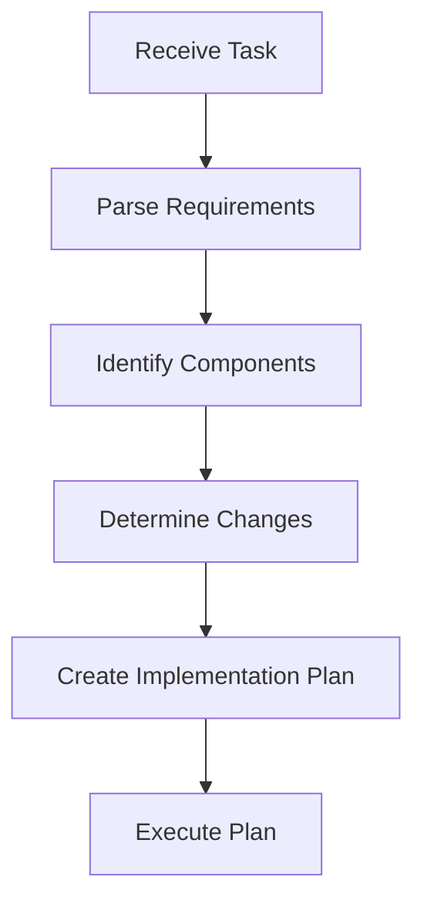
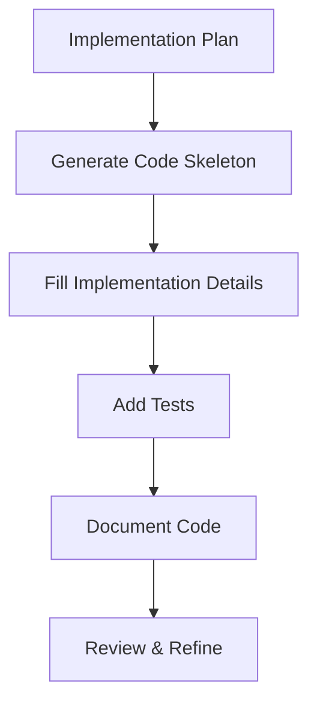
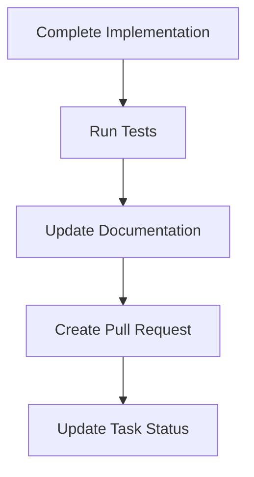

# 🤖 Cursor AI Automation Guide

> A comprehensive guide for leveraging Cursor AI to automate development tasks in the PowerBridge-GitHub-Toolkit project.

## 📋 Table of Contents
- [Overview](#overview)
- [Getting Started with Cursor AI](#getting-started-with-cursor-ai)
- [Development Task Automation](#development-task-automation)
- [Code Generation & Refactoring](#code-generation--refactoring)
- [Documentation Generation](#documentation-generation)
- [Testing & Quality Assurance](#testing--quality-assurance)
- [Integration with GitHub Workflows](#integration-with-github-workflows)
- [Advanced Cursor AI Techniques](#advanced-cursor-ai-techniques)
- [Best Practices](#best-practices)
- [Troubleshooting](#troubleshooting)

## 🔍 Overview

This guide details how to leverage Cursor AI to automate various development tasks within the PowerBridge-GitHub-Toolkit project. Cursor AI combines powerful code understanding with natural language processing to help developers automate repetitive tasks, generate code, create documentation, and integrate with GitHub workflows.

## 🚀 Getting Started with Cursor AI

### 1. Setting Up Cursor AI

Before using Cursor AI for automation, ensure you have:

1. **Cursor AI** installed and configured
2. **GitHub MCP Server** properly configured
3. **PowerBridge-GitHub-Toolkit** repository cloned
4. **Appropriate permissions** for repository access

```bash
# Clone the PowerBridge-GitHub-Toolkit repository
git clone https://github.com/user/PowerBridge-GitHub-Toolkit.git
cd PowerBridge-GitHub-Toolkit

# Install dependencies
npm install

# Configure Cursor AI integration
cursor --configure-github
```

### 2. Understanding Cursor AI Capabilities

Cursor AI offers several key capabilities for development automation:

1. **Code Understanding**: Analyzes existing code to understand structure and patterns
2. **Code Generation**: Creates new code based on natural language descriptions
3. **Documentation**: Generates and updates documentation from code
4. **Testing**: Creates test cases and validates code
5. **GitHub Integration**: Interacts with GitHub issues, PRs, and workflows

### 3. Communication Methods

Interact with Cursor AI through:

1. **Chat Interface**: Text-based commands and responses
2. **Voice Commands**: Natural language voice instructions
3. **Code Comments**: Special comments that trigger AI actions
4. **Keyboard Shortcuts**: Quick access to common AI functions

## 💻 Development Task Automation

### 1. Task Analysis Workflow



#### Implementation Steps:

1. **Parse Task Requirements**:
   ```bash
   # Ask Cursor AI to analyze a GitHub issue
   "Analyze GitHub issue #42 and identify key requirements"
   ```

2. **Identify Affected Components**:
   ```bash
   # Ask Cursor AI to identify components
   "Identify components affected by implementing user authentication"
   ```

3. **Create Implementation Plan**:
   ```bash
   # Ask Cursor AI to create a plan
   "Create implementation plan for adding JWT authentication"
   ```

### 2. Code Implementation Workflow



#### Implementation Steps:

1. **Generate Code Skeleton**:
   ```bash
   # Ask Cursor AI to generate code structure
   "Generate code structure for JWT authentication service"
   ```

2. **Fill Implementation Details**:
   ```bash
   # Ask Cursor AI to implement specific functionality
   "Implement token generation and validation methods"
   ```

3. **Add Tests**:
   ```bash
   # Ask Cursor AI to create tests
   "Create unit tests for JWT authentication service"
   ```

### 3. Task Completion Workflow



#### Implementation Steps:

1. **Create Pull Request**:
   ```bash
   # Ask Cursor AI to create a PR
   "Create pull request for JWT authentication implementation"
   ```

2. **Update Task Status**:
   ```bash
   # Ask Cursor AI to update task status
   "Update status of task AUTH-001 to completed"
   ```

## 🧩 Code Generation & Refactoring

### 1. Code Generation Patterns

Cursor AI can generate code based on natural language descriptions:

```bash
# Generate a React component
"Generate a React component for a user profile page with avatar, name, bio, and stats"

# Generate an API endpoint
"Create an Express route for user authentication with login and register endpoints"

# Generate a database model
"Create a Mongoose schema for user model with fields: username, email, password, profile"
```

#### Implementation Example:

```javascript
// Generated React component
function UserProfile({ user }) {
  return (
    <div className="user-profile">
      <div className="profile-header">
        
        <h2>{user.name}</h2>
      </div>
      <p className="bio">{user.bio}</p>
      <div className="stats">
        <div className="stat">
          <span className="stat-value">{user.followers}</span>
          <span className="stat-label">Followers</span>
        </div>
        <div className="stat">
          <span className="stat-value">{user.following}</span>
          <span className="stat-label">Following</span>
        </div>
        <div className="stat">
          <span className="stat-value">{user.repositories}</span>
          <span className="stat-label">Repositories</span>
        </div>
      </div>
    </div>
  );
}
```

### 2. Code Refactoring Techniques

Cursor AI can help refactor existing code:

```bash
# Refactor for performance
"Refactor the getUserData function to improve performance"

# Refactor for readability
"Refactor the authentication middleware for better readability"

# Extract component
"Extract the user stats section into a separate component"
```

#### Implementation Example:

```javascript
// Before refactoring
function getUserData(userId) {
  return new Promise((resolve, reject) => {
    db.query('SELECT * FROM users WHERE id = ?', [userId], (err, results) => {
      if (err) {
        reject(err);
      } else {
        if (results.length > 0) {
          const user = results[0];
          db.query('SELECT * FROM posts WHERE user_id = ?', [userId], (err, posts) => {
            if (err) {
              reject(err);
            } else {
              user.posts = posts;
              resolve(user);
            }
          });
        } else {
          resolve(null);
        }
      }
    });
  });
}

// After refactoring by Cursor AI
async function getUserData(userId) {
  try {
    const [users] = await db.promise().query('SELECT * FROM users WHERE id = ?', [userId]);
    
    if (users.length === 0) {
      return null;
    }
    
    const user = users[0];
    const [posts] = await db.promise().query('SELECT * FROM posts WHERE user_id = ?', [userId]);
    
    user.posts = posts;
    return user;
  } catch (error) {
    throw error;
  }
}
```

### 3. Code Optimization

Cursor AI can optimize code for various factors:

```bash
# Optimize for performance
"Optimize the image processing function for better performance"

# Optimize for memory usage
"Optimize the data processing pipeline to reduce memory usage"

# Optimize for readability
"Optimize the configuration parser for better readability"
```

## 📝 Documentation Generation

### 1. Code Documentation

Cursor AI can generate documentation from code:

```bash
# Generate JSDoc comments
"Add JSDoc comments to the authentication service"

# Generate README
"Create a README for the utils module"

# Generate API documentation
"Generate API documentation for the user routes"
```

#### Implementation Example:

```javascript
// Before: Code without documentation
function authenticateUser(email, password) {
  const user = findUserByEmail(email);
  if (!user) return null;
  
  const passwordMatch = comparePassword(password, user.passwordHash);
  if (!passwordMatch) return null;
  
  const token = generateToken(user);
  return { user, token };
}

// After: Code with Cursor AI generated documentation
/**
 * Authenticates a user with email and password
 * 
 * @param {string} email - The user's email address
 * @param {string} password - The user's plain text password
 * @returns {Object|null} Object containing user data and authentication token if successful, null otherwise
 * 
 * @example
 * const auth = authenticateUser('user@example.com', 'password123');
 * if (auth) {
 *   const { user, token } = auth;
 *   // Use user data and token
 * }
 */
function authenticateUser(email, password) {
  const user = findUserByEmail(email);
  if (!user) return null;
  
  const passwordMatch = comparePassword(password, user.passwordHash);
  if (!passwordMatch) return null;
  
  const token = generateToken(user);
  return { user, token };
}
```

### 2. Project Documentation

Cursor AI can generate and update project documentation:

```bash
# Generate architecture documentation
"Create architecture documentation for the authentication system"

# Update project README
"Update README with new authentication features"

# Generate user guide
"Create user guide for the admin dashboard"
```

### 3. Documentation Maintenance

Cursor AI can help maintain documentation:

```bash
# Update documentation for changed API
"Update API documentation for the updated user endpoints"

# Check documentation consistency
"Check consistency between code and documentation for the auth module"

# Generate changelog
"Generate changelog for version 1.2.0"
```

## 🧪 Testing & Quality Assurance

### 1. Test Generation

Cursor AI can generate various types of tests:

```bash
# Generate unit tests
"Create unit tests for the JWT service"

# Generate integration tests
"Create integration tests for the user registration flow"

# Generate end-to-end tests
"Create E2E tests for the authentication process"
```

#### Implementation Example:

```javascript
// Cursor AI generated test
describe('JWT Service', () => {
  describe('generateToken', () => {
    it('should generate a valid token with user data', () => {
      // Arrange
      const user = { id: 1, email: 'test@example.com', role: 'user' };
      
      // Act
      const token = jwtService.generateToken(user);
      
      // Assert
      expect(token).toBeDefined();
      expect(typeof token).toBe('string');
      
      const decoded = jwt.verify(token, process.env.JWT_SECRET);
      expect(decoded.userId).toBe(user.id);
      expect(decoded.email).toBe(user.email);
      expect(decoded.role).toBe(user.role);
    });
    
    it('should set token expiration correctly', () => {
      // Arrange
      const user = { id: 1 };
      
      // Act
      const token = jwtService.generateToken(user);
      const decoded = jwt.verify(token, process.env.JWT_SECRET);
      
      // Assert
      const expectedExpiry = Math.floor(Date.now() / 1000) + 3600; // 1 hour
      expect(decoded.exp).toBeCloseTo(expectedExpiry, -2); // Within 100 seconds
    });
  });
  
  describe('verifyToken', () => {
    it('should verify a valid token', () => {
      // Arrange
      const user = { id: 1 };
      const token = jwtService.generateToken(user);
      
      // Act
      const result = jwtService.verifyToken(token);
      
      // Assert
      expect(result).toBeDefined();
      expect(result.userId).toBe(user.id);
    });
    
    it('should throw on invalid token', () => {
      // Arrange
      const invalidToken = 'invalid.token.string';
      
      // Act & Assert
      expect(() => jwtService.verifyToken(invalidToken)).toThrow();
    });
  });
});
```

### 2. Code Quality Checks

Cursor AI can perform code quality checks:

```bash
# Check code style
"Check code style for the auth module"

# Find potential bugs
"Analyze the data processing pipeline for potential bugs"

# Identify security issues
"Check the authentication system for security vulnerabilities"
```

### 3. Performance Testing

Cursor AI can help with performance testing:

```bash
# Identify bottlenecks
"Analyze the API performance to identify bottlenecks"

# Suggest optimizations
"Suggest optimizations for the database queries in the user service"

# Create performance tests
"Create performance tests for the file upload feature"
```

## 🔄 Integration with GitHub Workflows

### 1. Issue Management

Cursor AI can help manage GitHub issues:

```bash
# Create issue from code
"Create an issue for the TODO in authentication service"

# Update issue status
"Update issue #42 status to in progress"

# Link PR to issue
"Link the current PR to issue #42"
```

#### Implementation Example:

```bash
# Cursor AI creating an issue from a code TODO
mcp_github_create_issue({
  "owner": "user",
  "repo": "PowerBridge-GitHub-Toolkit",
  "title": "Implement refresh token functionality in authentication service",
  "body": "## Description\nImplement refresh token functionality to allow token renewal without requiring users to log in again.\n\n## Source\nFound in `src/services/authService.js` line 42:\n```javascript\n// TODO: Implement refresh token functionality\n```\n\n## Requirements\n- Create refresh token generation\n- Store refresh tokens securely\n- Implement token refresh endpoint\n- Add token invalidation on logout",
  "labels": ["enhancement", "authentication"]
})
```

### 2. Pull Request Workflow

Cursor AI can automate pull request workflows:

```bash
# Create PR
"Create a pull request for the authentication feature"

# Review PR
"Review pull request #42"

# Address PR feedback
"Address the feedback in pull request #42"
```

#### Implementation Example:

```bash
# Cursor AI creating a pull request
mcp_github_create_pull_request({
  "owner": "user",
  "repo": "PowerBridge-GitHub-Toolkit",
  "title": "Implement JWT authentication",
  "body": "## Changes\n- Added JWT authentication service\n- Implemented token generation and validation\n- Added authentication middleware\n- Created login and register endpoints\n- Added unit tests\n\n## Related Issues\nCloses #42\n\n## Testing\nAll tests passing. Manually verified login and protected routes.",
  "head": "feature/jwt-auth",
  "base": "main"
})
```

### 3. CI/CD Integration

Cursor AI can help with CI/CD workflows:

```bash
# Create GitHub Action
"Create a GitHub Action for running tests"

# Fix CI failure
"Fix the failing test in CI pipeline"

# Automate deployment
"Create deployment script for the API"
```

## 🧠 Advanced Cursor AI Techniques

### 1. Contextual Code Understanding

Cursor AI can understand code in context:

```bash
# Explain code
"Explain how the authentication middleware works"

# Trace data flow
"Trace the data flow in the user registration process"

# Identify patterns
"Identify design patterns used in the project"
```

### 2. Predictive Coding

Cursor AI can predict code needs:

```bash
# Suggest next steps
"What should I implement next for the authentication system?"

# Identify missing components
"What's missing from the user profile feature?"

# Predict edge cases
"What edge cases should I handle in the file upload feature?"
```

### 3. Collaborative Development

Cursor AI can assist in collaborative development:

```bash
# Explain changes
"Explain the changes in pull request #42"

# Summarize discussions
"Summarize the discussion in issue #42"

# Generate code review
"Review the authentication service code"
```

## ✅ Best Practices

### 1. Effective AI Prompting

- **Be Specific**: Provide clear, detailed instructions
- **Include Context**: Reference relevant files and requirements
- **Use Consistent Terminology**: Maintain consistent naming conventions
- **Break Down Complex Tasks**: Split large tasks into smaller steps
- **Provide Examples**: Give examples for desired output format

### 2. Code Quality Maintenance

- **Review AI-Generated Code**: Always review code before committing
- **Maintain Consistency**: Ensure AI-generated code matches project style
- **Test Thoroughly**: Always test AI-generated code
- **Document Decisions**: Record why certain approaches were chosen
- **Incremental Changes**: Make small, testable changes

### 3. Workflow Integration

- **Standardize Commands**: Create standard commands for common tasks
- **Document Workflows**: Document AI-assisted workflows
- **Share Knowledge**: Share effective prompts with team members
- **Continuous Improvement**: Refine prompts based on results
- **Balance Automation**: Know when to use AI vs. manual coding

## ❗ Troubleshooting

### Common Issues

1. **Incorrect Code Generation**:
   - **Issue**: AI generates code that doesn't meet requirements
   - **Solution**: Refine prompt with more specific details and constraints

2. **Context Limitations**:
   - **Issue**: AI lacks full context for complex tasks
   - **Solution**: Break down tasks and provide necessary context files

3. **Style Inconsistencies**:
   - **Issue**: AI-generated code doesn't match project style
   - **Solution**: Provide style examples and explicit style requirements

4. **Integration Problems**:
   - **Issue**: AI-generated code doesn't integrate with existing code
   - **Solution**: Provide interface definitions and integration requirements

### Resolution Process

1. Identify the specific issue with AI output
2. Refine your prompt with more details or constraints
3. Provide examples of desired output
4. Break complex tasks into smaller, manageable steps
5. Review and iterate on AI-generated solutions

---

Made with Power, Love, and AI •  ⚡️❤️�� •  POWERBRIDGE.AI
