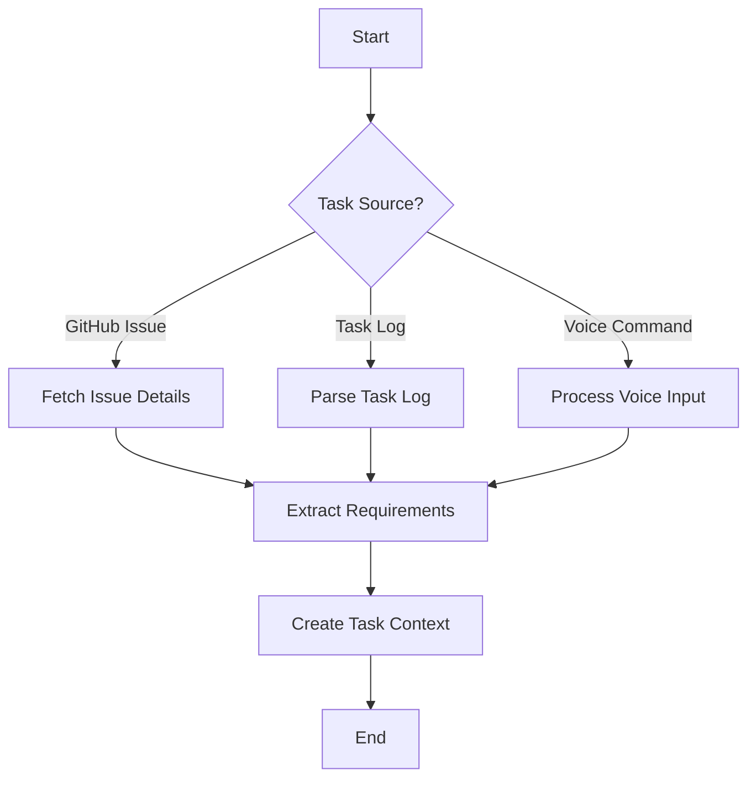
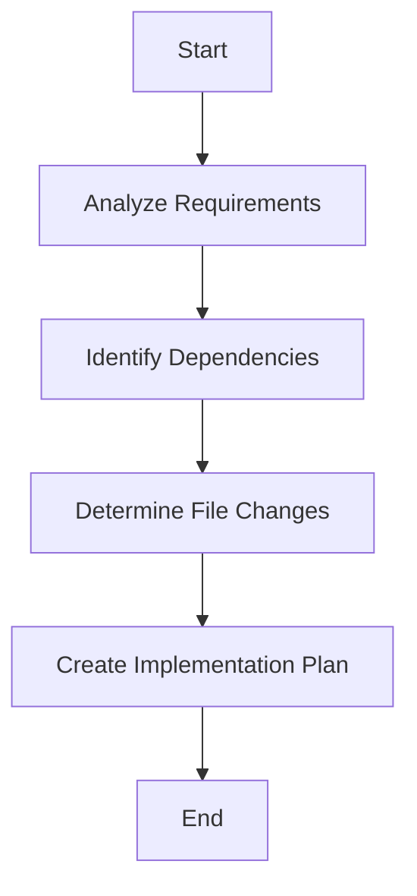
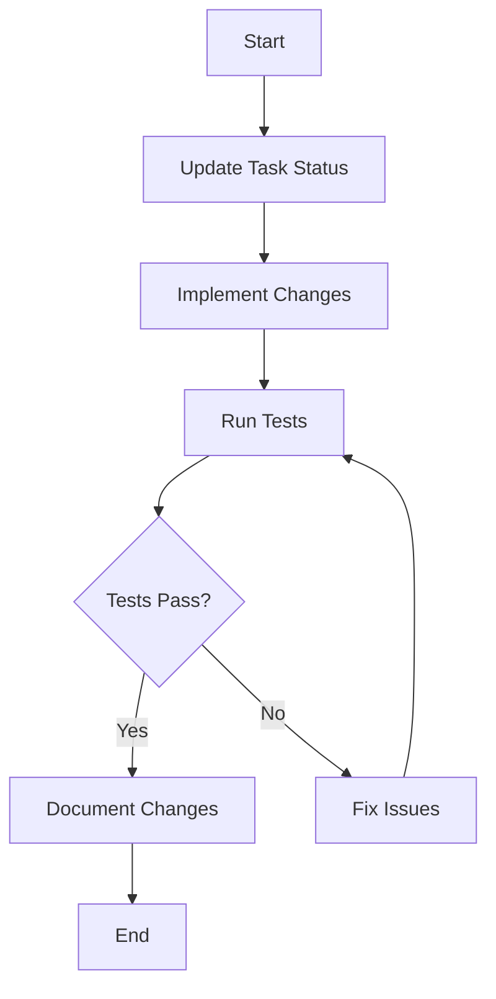
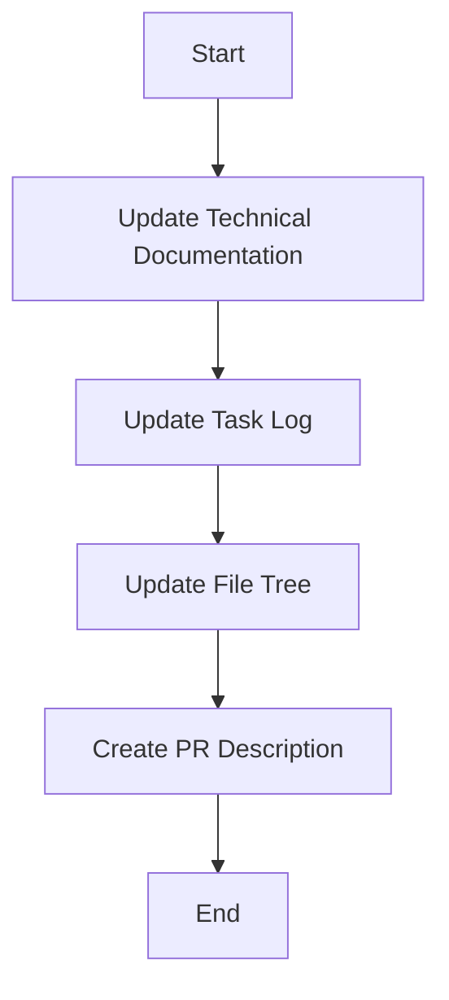
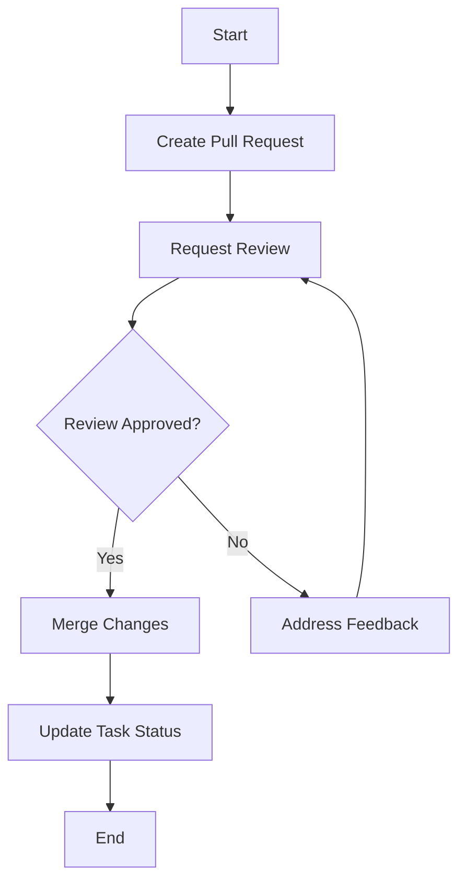

# 🤖 Task Automation Workflow

> A comprehensive guide for automating development tasks using Cursor AI and GitHub integration.

## 📋 Table of Contents
- [Overview](#overview)
- [Prerequisites](#prerequisites)
- [Workflow Phases](#workflow-phases)
- [Task Iteration Process](#task-iteration-process)
- [Automation Commands](#automation-commands)
- [Integration with Task Log](#integration-with-task-log)
- [Best Practices](#best-practices)
- [Troubleshooting](#troubleshooting)

## 🔍 Overview

This workflow guide details how to configure Cursor AI to autonomously iterate through development tasks, from task identification to completion and documentation. The process integrates with GitHub issues, project boards, and documentation files to maintain a cohesive development workflow.

## 🛠️ Prerequisites

Before implementing this workflow, ensure you have:

1. **GitHub MCP Server** properly configured
2. **Cursor AI** with appropriate permissions
3. **Task Log** (`task-log.md`) file in your repository
4. **Development Notes** (`dev-notes.md`) file for technical documentation
5. **File Tree** (`file-tree.md`) for project structure tracking

## 🔄 Workflow Phases

### 1. 📋 Task Identification Phase



#### Implementation Steps:

1. **Fetch Open Tasks**:
   ```bash
   # Using MCP commands to fetch open issues
   mcp_github_list_issues({
     "owner": "user",
     "repo": "project",
     "state": "open",
     "labels": ["next"]
   })
   ```

2. **Parse Task Log**:
   ```bash
   # Read task log file
   read_file task-log.md
   
   # Extract tasks marked as 🟡 In Progress or 🔴 Not Started
   ```

3. **Create Task Context**:
   ```javascript
   // Task context structure
   const taskContext = {
     id: "TASK-001",
     title: "Implement Feature X",
     description: "Detailed description...",
     requirements: ["Req 1", "Req 2"],
     acceptance: ["Criterion 1", "Criterion 2"],
     priority: "high",
     dependencies: ["TASK-000"]
   };
   ```

### 2. 🧠 Task Analysis Phase



#### Implementation Steps:

1. **Analyze Requirements**:
   ```bash
   # Search codebase for relevant components
   codebase_search "feature X implementation"
   ```

2. **Identify Dependencies**:
   ```bash
   # Check if dependencies are completed
   grep_search "TASK-000.*✅ Verified" --include_pattern "task-log.md"
   ```

3. **Create Implementation Plan**:
   ```javascript
   // Implementation plan structure
   const implementationPlan = {
     steps: [
       { description: "Update model", files: ["src/models/user.js"] },
       { description: "Add controller", files: ["src/controllers/auth.js"] },
       { description: "Update routes", files: ["src/routes/index.js"] },
       { description: "Add tests", files: ["tests/auth.test.js"] }
     ],
     estimatedComplexity: "medium",
     technicalApproach: "Will use JWT for authentication"
   };
   ```

### 3. 💻 Implementation Phase



#### Implementation Steps:

1. **Update Task Status**:
   ```bash
   # Update task log to In Progress
   search_replace task-log.md "- 🔴 TASK-001" "- 🟡 TASK-001"
   
   # Update GitHub issue status
   mcp_github_update_issue({
     "owner": "user",
     "repo": "project",
     "issue_number": 1,
     "labels": ["in-progress"]
   })
   ```

2. **Implement Changes**:
   ```bash
   # For each file in the implementation plan
   edit_file src/models/user.js
   edit_file src/controllers/auth.js
   edit_file src/routes/index.js
   ```

3. **Run Tests**:
   ```bash
   # Run tests for the changes
   run_terminal_cmd "npm test tests/auth.test.js"
   ```

### 4. 📝 Documentation Phase



#### Implementation Steps:

1. **Update Technical Documentation**:
   ```bash
   # Update dev-notes.md with implementation details
   edit_file dev-notes.md
   ```

2. **Update Task Log**:
   ```bash
   # Update task status to Completed
   search_replace task-log.md "- 🟡 TASK-001" "- 🟢 TASK-001"
   ```

3. **Update File Tree**:
   ```bash
   # Update file-tree.md with new files or changes
   edit_file file-tree.md
   ```

### 5. 🔄 Review & Integration Phase



#### Implementation Steps:

1. **Create Pull Request**:
   ```bash
   # Create PR with implementation details
   mcp_github_create_pull_request({
     "owner": "user",
     "repo": "project",
     "title": "Implement TASK-001: Feature X",
     "body": "Closes #1\n\n## Changes\n- Added user model\n- Implemented authentication\n- Updated routes\n\n## Testing\n- All tests passing",
     "head": "feature/task-001",
     "base": "main"
   })
   ```

2. **Update Task Status**:
   ```bash
   # Update task status to Verified after merge
   search_replace task-log.md "- 🟢 TASK-001" "- ✅ TASK-001"
   
   # Close GitHub issue
   mcp_github_update_issue({
     "owner": "user",
     "repo": "project",
     "issue_number": 1,
     "state": "closed"
   })
   ```

## 🔄 Task Iteration Process

The Cursor AI agent should follow this process to iterate through multiple tasks:

1. **Task Selection**:
   - Prioritize tasks based on dependencies and priority
   - Select unblocked tasks first
   - Verify prerequisites are met

2. **Context Switching**:
   - Document current state before switching
   - Update task-log.md with progress
   - Create checkpoint in dev-notes.md

3. **Progress Tracking**:
   - Update task status after each major step
   - Document blockers and dependencies
   - Track time spent on each task

4. **Completion Verification**:
   - Verify all requirements are met
   - Run all tests to ensure quality
   - Update documentation to reflect changes

## 🛠️ Automation Commands

### Task Management Commands

```bash
# Create new task
mcp_github_create_issue({
  "owner": "user",
  "repo": "project",
  "title": "[TASK-XXX] Task Title",
  "body": "Task description and requirements",
  "labels": ["enhancement"]
})

# Update task status
mcp_github_update_issue({
  "owner": "user",
  "repo": "project",
  "issue_number": 123,
  "labels": ["in-progress"]
})

# Add task comment
mcp_github_add_issue_comment({
  "owner": "user",
  "repo": "project",
  "issue_number": 123,
  "body": "Implementation progress update"
})
```

### Code Management Commands

```bash
# Create feature branch
mcp_github_create_branch({
  "owner": "user",
  "repo": "project",
  "branch": "feature/task-xxx",
  "from_branch": "main"
})

# Create pull request
mcp_github_create_pull_request({
  "owner": "user",
  "repo": "project",
  "title": "Implement TASK-XXX",
  "body": "Implementation details",
  "head": "feature/task-xxx",
  "base": "main"
})

# Merge pull request
mcp_github_merge_pull_request({
  "owner": "user",
  "repo": "project",
  "pullNumber": 456,
  "merge_method": "squash"
})
```

## 📊 Integration with Task Log

The task-log.md file serves as the central record of all tasks and their status. The Cursor AI agent should:

1. **Read task status**:
   ```markdown
   ## Current Tasks
   
   - 🔴 [TASK-001] Implement user authentication
   - 🟡 [TASK-002] Create admin dashboard
   - 🟢 [TASK-003] Fix login bug
   - ✅ [TASK-004] Update documentation
   ```

2. **Update task status**:
   ```bash
   # Update task status in task-log.md
   search_replace task-log.md "- 🔴 [TASK-001]" "- 🟡 [TASK-001]"
   ```

3. **Add task details**:
   ```markdown
   ### [TASK-001] Implement user authentication
   
   **Status**: 🟡 In Progress
   **Assigned**: AI Agent
   **Started**: 2023-06-25
   
   #### Progress
   - Created user model
   - Implementing JWT authentication
   
   #### Next Steps
   - Add refresh token functionality
   - Update routes
   ```

## ✅ Best Practices

1. **Task Granularity**:
   - Break large tasks into smaller, manageable subtasks
   - Each task should have clear completion criteria
   - Avoid tasks that span multiple domains

2. **Documentation First**:
   - Document the plan before implementation
   - Update documentation during implementation
   - Ensure documentation reflects final state

3. **Incremental Progress**:
   - Make small, testable changes
   - Commit frequently with clear messages
   - Run tests after each significant change

4. **Status Communication**:
   - Update task status in real-time
   - Document blockers immediately
   - Provide clear progress updates

5. **Code Quality**:
   - Follow project coding standards
   - Write tests for all new functionality
   - Refactor as needed for maintainability

## ❗ Troubleshooting

### Common Issues

1. **Task Dependency Blockers**:
   - **Issue**: Task blocked by incomplete dependency
   - **Solution**: Update task status to ⭕️ Blocked, document dependency, and switch to another task

2. **Integration Conflicts**:
   - **Issue**: Code conflicts with recent changes
   - **Solution**: Rebase branch on latest main, resolve conflicts, update implementation

3. **Requirement Ambiguity**:
   - **Issue**: Unclear or conflicting requirements
   - **Solution**: Document ambiguity in task-log.md, propose clarification, continue with other tasks

4. **Test Failures**:
   - **Issue**: Implemented code fails tests
   - **Solution**: Document failure details, fix issues, re-run tests before proceeding

### Resolution Process

1. Identify and document the issue
2. Determine if the task can proceed or needs to be blocked
3. Update task status accordingly
4. If blocked, switch to another task
5. Return to blocked tasks when dependencies are resolved

---

Made with Power, Love, and AI •  ⚡️❤️🤖 •  POWERBRIDGE.AI 