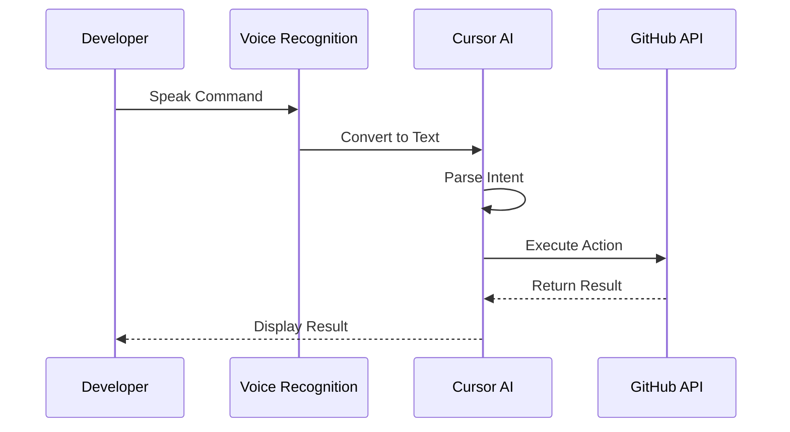

# 🎤 Voice Command Automation

> A comprehensive guide for automating GitHub workflows using voice commands in Cursor AI.

## 📋 Table of Contents
- [Overview](#overview)
- [Voice Command Setup](#voice-command-setup)
- [Command Structure](#command-structure)
- [Task Management Commands](#task-management-commands)
- [Project Management Commands](#project-management-commands)
- [Code Management Commands](#code-management-commands)
- [Documentation Commands](#documentation-commands)
- [Advanced Voice Workflows](#advanced-voice-workflows)
- [Best Practices](#best-practices)
- [Troubleshooting](#troubleshooting)

## 🔍 Overview

This guide details how to use voice commands with Cursor AI to automate GitHub workflows. Voice commands provide a natural and efficient way to manage projects, create tasks, update status, and perform code operations without leaving your development environment or typing commands manually.

## 🛠️ Voice Command Setup

### 1. Prerequisites

Before using voice commands, ensure you have:

1. **Cursor AI** with voice recognition enabled
2. **GitHub MCP Server** properly configured
3. **GitHub Personal Access Token** with appropriate permissions
4. **Repository Access** to the target repositories

### 2. Voice Recognition Configuration

Configure Cursor AI for optimal voice recognition:

1. **Enable Voice Recognition**:
   ```bash
   # Open Cursor AI settings
   cursor --settings voice
   
   # Or use keyboard shortcut
   Ctrl+Shift+P > "Voice Settings"
   ```

2. **Configure Wake Word** (if applicable):
   ```bash
   # Set custom wake word
   cursor --set-wake-word "Hey Cursor"
   ```

3. **Test Voice Recognition**:
   ```bash
   # Test basic voice command
   "Hey Cursor, what time is it?"
   ```

### 3. GitHub Integration Setup

Ensure GitHub integration is properly configured:

```bash
# Check GitHub MCP connection
"Hey Cursor, check GitHub connection"

# Expected response
"GitHub connection is active with token for user: username"
```

## 🎯 Command Structure

### 1. Basic Command Pattern

Voice commands follow this general structure:

```
[Wake Word] [Action] [Target] [Parameters]
```

Examples:
- "Hey Cursor, create issue implement authentication"
- "Hey Cursor, update task BAD-001 status to in progress"
- "Hey Cursor, list open pull requests"

### 2. Command Flow



### 3. Natural Language Processing

Cursor AI uses natural language processing to interpret commands:

1. **Intent Recognition**: Identifies the action to perform
2. **Entity Extraction**: Identifies objects and parameters
3. **Context Awareness**: Maintains context across commands
4. **Command Generation**: Converts to appropriate API calls

## 📝 Task Management Commands

### 1. Task Creation Commands

```bash
# Create basic task
"Create task implement user authentication"

# Create detailed task
"Create high priority task implement JWT authentication with description 'Add secure JWT-based authentication with refresh tokens' and assign to security team"

# Create task with labels
"Create bug task fix login issue with labels frontend and critical"
```

#### Implementation Details:

```javascript
// Voice command processing for task creation
function processTaskCreation(voiceCommand) {
  // Extract task details
  const title = extractTitle(voiceCommand);
  const description = extractDescription(voiceCommand);
  const priority = extractPriority(voiceCommand);
  const labels = extractLabels(voiceCommand);
  const assignees = extractAssignees(voiceCommand);
  
  // Create GitHub issue
  return mcp_github_create_issue({
    owner: currentRepo.owner,
    repo: currentRepo.name,
    title: formatTaskTitle(title, priority),
    body: formatTaskDescription(description),
    labels: labels,
    assignees: assignees
  });
}
```

### 2. Task Update Commands

```bash
# Update task status
"Update task BAD-001 status to in progress"

# Add comment to task
"Add comment to task BAD-001 implemented user model and started on authentication controller"

# Assign task
"Assign task BAD-001 to developer"

# Add labels
"Add security label to task BAD-001"
```

#### Implementation Details:

```javascript
// Voice command processing for task updates
function processTaskUpdate(voiceCommand) {
  // Extract task details
  const taskId = extractTaskId(voiceCommand);
  const status = extractStatus(voiceCommand);
  const comment = extractComment(voiceCommand);
  
  // Get issue number from task ID
  const issueNumber = getIssueNumberFromTaskId(taskId);
  
  // Update task status
  if (status) {
    return mcp_github_update_issue({
      owner: currentRepo.owner,
      repo: currentRepo.name,
      issue_number: issueNumber,
      labels: [`status:${status}`]
    });
  }
  
  // Add comment
  if (comment) {
    return mcp_github_add_issue_comment({
      owner: currentRepo.owner,
      repo: currentRepo.name,
      issue_number: issueNumber,
      body: comment
    });
  }
}
```

### 3. Task Query Commands

```bash
# List tasks
"List open tasks"

# List tasks by status
"List in progress tasks"

# List tasks by assignee
"List tasks assigned to me"

# Get task details
"Show details for task BAD-001"
```

#### Implementation Details:

```javascript
// Voice command processing for task queries
function processTaskQuery(voiceCommand) {
  // Extract query parameters
  const status = extractStatus(voiceCommand);
  const assignee = extractAssignee(voiceCommand);
  const taskId = extractTaskId(voiceCommand);
  
  // Get specific task details
  if (taskId) {
    const issueNumber = getIssueNumberFromTaskId(taskId);
    return mcp_github_get_issue({
      owner: currentRepo.owner,
      repo: currentRepo.name,
      issue_number: issueNumber
    });
  }
  
  // List tasks with filters
  return mcp_github_list_issues({
    owner: currentRepo.owner,
    repo: currentRepo.name,
    state: "open",
    labels: status ? [`status:${status}`] : undefined,
    assignee: assignee
  });
}
```

## 📊 Project Management Commands

### 1. Sprint Management Commands

```bash
# Create sprint
"Create sprint 1 with duration 2 weeks and goal implement authentication system"

# Add task to sprint
"Add task BAD-001 to sprint 1"

# Start sprint
"Start sprint 1"

# End sprint
"End sprint 1 and generate report"
```

#### Implementation Details:

```javascript
// Voice command processing for sprint management
function processSprintCommand(voiceCommand) {
  // Extract sprint details
  const sprintNumber = extractSprintNumber(voiceCommand);
  const duration = extractDuration(voiceCommand);
  const goal = extractGoal(voiceCommand);
  const action = extractAction(voiceCommand);
  
  // Create sprint milestone
  if (action === "create") {
    const dueDate = calculateDueDate(duration);
    return createMilestone(sprintNumber, goal, dueDate);
  }
  
  // Add task to sprint
  if (action === "add") {
    const taskId = extractTaskId(voiceCommand);
    const issueNumber = getIssueNumberFromTaskId(taskId);
    const milestoneNumber = getMilestoneNumberFromSprint(sprintNumber);
    
    return mcp_github_update_issue({
      owner: currentRepo.owner,
      repo: currentRepo.name,
      issue_number: issueNumber,
      milestone: milestoneNumber
    });
  }
}
```

### 2. Project Board Commands

```bash
# Create project board
"Create project board authentication system with columns todo in progress review and done"

# Add task to board
"Add task BAD-001 to authentication system board in todo column"

# Move task between columns
"Move task BAD-001 to in progress column"

# Show board status
"Show status of authentication system board"
```

#### Implementation Details:

```javascript
// Voice command processing for project board management
function processProjectBoardCommand(voiceCommand) {
  // Extract board details
  const boardName = extractBoardName(voiceCommand);
  const columns = extractColumns(voiceCommand);
  const action = extractAction(voiceCommand);
  
  // Create project board
  if (action === "create") {
    return createProjectBoard(boardName, columns);
  }
  
  // Add task to board
  if (action === "add") {
    const taskId = extractTaskId(voiceCommand);
    const column = extractColumn(voiceCommand);
    return addTaskToProjectBoard(taskId, boardName, column);
  }
  
  // Move task between columns
  if (action === "move") {
    const taskId = extractTaskId(voiceCommand);
    const column = extractColumn(voiceCommand);
    return moveTaskInProjectBoard(taskId, boardName, column);
  }
}
```

## 💻 Code Management Commands

### 1. Branch Management Commands

```bash
# Create branch
"Create branch feature/authentication from main"

# Switch branch
"Switch to branch feature/authentication"

# List branches
"List branches"

# Delete branch
"Delete branch feature/old-feature"
```

#### Implementation Details:

```javascript
// Voice command processing for branch management
function processBranchCommand(voiceCommand) {
  // Extract branch details
  const branchName = extractBranchName(voiceCommand);
  const baseBranch = extractBaseBranch(voiceCommand);
  const action = extractAction(voiceCommand);
  
  // Create branch
  if (action === "create") {
    return mcp_github_create_branch({
      owner: currentRepo.owner,
      repo: currentRepo.name,
      branch: branchName,
      from_branch: baseBranch || "main"
    });
  }
  
  // List branches
  if (action === "list") {
    return mcp_github_list_branches({
      owner: currentRepo.owner,
      repo: currentRepo.name
    });
  }
}
```

### 2. Pull Request Commands

```bash
# Create pull request
"Create pull request from feature/authentication to main with title implement authentication system"

# Review pull request
"Review pull request 42"

# Merge pull request
"Merge pull request 42"

# List pull requests
"List open pull requests"
```

#### Implementation Details:

```javascript
// Voice command processing for pull request management
function processPullRequestCommand(voiceCommand) {
  // Extract PR details
  const headBranch = extractHeadBranch(voiceCommand);
  const baseBranch = extractBaseBranch(voiceCommand);
  const title = extractTitle(voiceCommand);
  const prNumber = extractPRNumber(voiceCommand);
  const action = extractAction(voiceCommand);
  
  // Create pull request
  if (action === "create") {
    return mcp_github_create_pull_request({
      owner: currentRepo.owner,
      repo: currentRepo.name,
      title: title,
      head: headBranch,
      base: baseBranch || "main",
      body: generatePRDescription(title)
    });
  }
  
  // Merge pull request
  if (action === "merge") {
    return mcp_github_merge_pull_request({
      owner: currentRepo.owner,
      repo: currentRepo.name,
      pullNumber: prNumber,
      merge_method: "squash"
    });
  }
}
```

### 3. Code Review Commands

```bash
# Start code review
"Start code review for pull request 42"

# Add review comment
"Add comment to pull request 42 line 15 consider using async/await here"

# Approve pull request
"Approve pull request 42 with comment looks good"

# Request changes
"Request changes on pull request 42 with comment needs more tests"
```

#### Implementation Details:

```javascript
// Voice command processing for code review
function processCodeReviewCommand(voiceCommand) {
  // Extract review details
  const prNumber = extractPRNumber(voiceCommand);
  const comment = extractComment(voiceCommand);
  const action = extractAction(voiceCommand);
  const lineNumber = extractLineNumber(voiceCommand);
  
  // Add review comment
  if (action === "comment" && lineNumber) {
    return addReviewComment(prNumber, lineNumber, comment);
  }
  
  // Submit review
  if (action === "approve" || action === "request") {
    const event = action === "approve" ? "APPROVE" : "REQUEST_CHANGES";
    
    return mcp_github_create_and_submit_pull_request_review({
      owner: currentRepo.owner,
      repo: currentRepo.name,
      pullNumber: prNumber,
      event: event,
      body: comment
    });
  }
}
```

## 📄 Documentation Commands

### 1. Documentation Creation Commands

```bash
# Create documentation file
"Create documentation file for authentication api"

# Generate API documentation
"Generate API documentation for authentication endpoints"

# Create README
"Create README for project with title authentication service"

# Update documentation
"Update authentication documentation with refresh token information"
```

#### Implementation Details:

```javascript
// Voice command processing for documentation creation
function processDocumentationCommand(voiceCommand) {
  // Extract documentation details
  const component = extractComponent(voiceCommand);
  const content = extractContent(voiceCommand);
  const action = extractAction(voiceCommand);
  
  // Create documentation file
  if (action === "create") {
    const fileName = `docs/${component.toLowerCase().replace(/\s/g, '-')}.md`;
    const fileContent = generateDocumentationTemplate(component, content);
    
    return mcp_github_create_or_update_file({
      owner: currentRepo.owner,
      repo: currentRepo.name,
      path: fileName,
      content: fileContent,
      message: `Add documentation for ${component}`,
      branch: "main"
    });
  }
}
```

### 2. Documentation Update Commands

```bash
# Update task log
"Update task log with completed task BAD-001"

# Update dev notes
"Update dev notes with authentication implementation details"

# Update file tree
"Update file tree with new authentication components"

# Generate release notes
"Generate release notes for version 1.0"
```

#### Implementation Details:

```javascript
// Voice command processing for documentation updates
function processDocumentationUpdateCommand(voiceCommand) {
  // Extract update details
  const docType = extractDocType(voiceCommand);
  const content = extractContent(voiceCommand);
  
  // Update task log
  if (docType === "task log") {
    return updateTaskLog(content);
  }
  
  // Update dev notes
  if (docType === "dev notes") {
    return updateDevNotes(content);
  }
  
  // Update file tree
  if (docType === "file tree") {
    return updateFileTree();
  }
}
```

## 🔄 Advanced Voice Workflows

### 1. Multi-Step Workflows

Chain multiple commands together for complex operations:

```bash
# Task creation and assignment workflow
"Create task implement user authentication and assign to security team and add to sprint 1"

# Branch and PR workflow
"Create branch feature/authentication from main and implement user authentication and create pull request to main"

# Documentation workflow
"Complete task BAD-001 and update task log and generate release notes"
```

#### Implementation Details:

```javascript
// Processing multi-step voice commands
function processMultiStepCommand(voiceCommand) {
  // Split into individual commands
  const commands = splitCommands(voiceCommand);
  
  // Execute commands in sequence
  return executeCommandSequence(commands);
}
```

### 2. Context-Aware Commands

Commands that maintain context from previous interactions:

```bash
# Initial command
"Show details for task BAD-001"

# Follow-up command (uses context from previous command)
"Update its status to in progress"

# Another follow-up
"Assign it to me"
```

#### Implementation Details:

```javascript
// Maintaining context across commands
let commandContext = {
  currentTask: null,
  currentPR: null,
  currentBranch: null
};

function processContextAwareCommand(voiceCommand) {
  // Check for context references
  if (voiceCommand.includes("it") || voiceCommand.includes("its")) {
    // Replace with actual context
    voiceCommand = replaceContextReferences(voiceCommand, commandContext);
  }
  
  // Update context based on command
  updateCommandContext(voiceCommand);
  
  // Process command normally
  return processCommand(voiceCommand);
}
```

### 3. Voice-Driven Development Workflow

Complete development workflow using voice commands:

```bash
# Start feature development
"Start new feature user authentication"

# Create implementation plan
"Create tasks for user authentication feature with subtasks create user model implement authentication controller add login form"

# Implement feature
"Create branch feature/authentication from main"
"Open file src/models/user.js"
"Implement user model with fields username email and password"
"Run tests for user model"
"Commit changes with message add user model"

# Create pull request
"Create pull request from feature/authentication to main with title implement user authentication"

# Update documentation
"Update dev notes with authentication implementation details"
"Update task log with completed authentication tasks"
```

## ✅ Best Practices

### 1. Voice Command Clarity

- **Use Consistent Patterns**: Maintain consistent command structures
- **Speak Clearly**: Enunciate commands clearly for better recognition
- **Use Distinct Keywords**: Include clear action verbs and nouns
- **Verify Commands**: Check that Cursor AI correctly interpreted your command
- **Start Simple**: Begin with simple commands before complex workflows

### 2. Command Organization

- **Group Related Commands**: Chain related commands together
- **Use Natural Language**: Phrase commands in natural language
- **Include Context**: Provide sufficient context for commands
- **Be Specific**: Include specific identifiers (task IDs, branch names)
- **Verify Results**: Check command execution results

### 3. Voice-Optimized Workflow

- **Prepare Command List**: Have common commands ready
- **Minimize Context Switching**: Complete related tasks together
- **Document Voice Commands**: Keep a list of effective commands
- **Combine with Keyboard**: Use voice for complex tasks, keyboard for simple ones
- **Train Voice Recognition**: Regularly use voice commands to improve recognition

## ❗ Troubleshooting

### Common Issues

1. **Command Recognition Problems**:
   - **Issue**: Voice command not recognized correctly
   - **Solution**: Speak more clearly, use simpler phrasing, check microphone

2. **Context Loss**:
   - **Issue**: Cursor AI loses context between commands
   - **Solution**: Include more explicit references, avoid pronouns

3. **Complex Command Failures**:
   - **Issue**: Multi-step commands not executing fully
   - **Solution**: Break into simpler commands, verify each step

4. **API Permission Issues**:
   - **Issue**: Commands fail due to permission errors
   - **Solution**: Check GitHub token permissions, verify repository access

### Resolution Process

1. Check voice recognition accuracy
2. Verify command syntax
3. Check GitHub connection
4. Review error messages
5. Simplify and retry command

---

Made with Power, Love, and AI •  ⚡️❤️�� •  POWERBRIDGE.AI